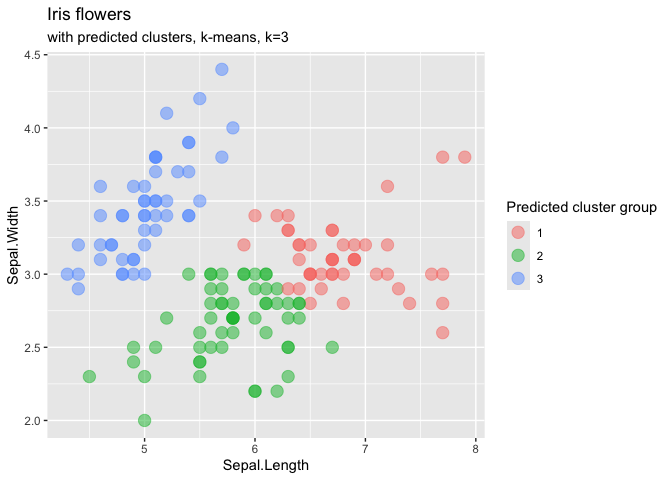
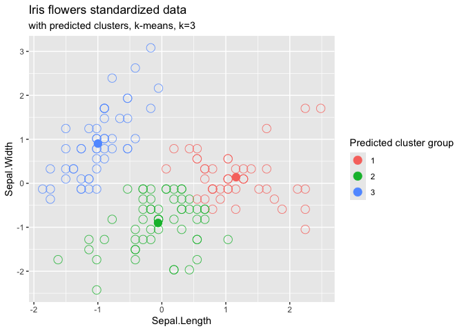

Clustering
================

## Clustering

For datasets where we do not have labels/ a clear output variable, we
use unsupervised learning algorithms. These refer to cases where we do
not necessarily want to predict some value but instead want to uncover
certain patterns and structures in the data.

A very common unsupervised learning task is to discover groups of
similar data, also known as clusters. The algorithm separates the data
points into different bins, but these bins do not have any original
labels. The algorithm has to figure out what data points have in common
and separate them based on this. For example, we might use clustering
when performing market segmentation. We might want to target certain
advertising campaigns based on the type of user, but we might not have a
predetermined notion of the user groups. In this case, we could apply
clustering and let the algorithm figure out on its own how to best
divide the users into groups.

We will use the iris dataset below.

``` r
library(readr)
library(dplyr)
library(ggplot2)
library(visdat)
library(tidyr)
library(ggthemes)
library(tibble)

iris <- as_tibble(iris)

glimpse(iris)
```

    ## Rows: 150
    ## Columns: 5
    ## $ Sepal.Length <dbl> 5.1, 4.9, 4.7, 4.6, 5.0, 5.4, 4.6, 5.0, 4.4, 4.9, 5.4, 4.…
    ## $ Sepal.Width  <dbl> 3.5, 3.0, 3.2, 3.1, 3.6, 3.9, 3.4, 3.4, 2.9, 3.1, 3.7, 3.…
    ## $ Petal.Length <dbl> 1.4, 1.4, 1.3, 1.5, 1.4, 1.7, 1.4, 1.5, 1.4, 1.5, 1.5, 1.…
    ## $ Petal.Width  <dbl> 0.2, 0.2, 0.2, 0.2, 0.2, 0.4, 0.3, 0.2, 0.2, 0.1, 0.2, 0.…
    ## $ Species      <fct> setosa, setosa, setosa, setosa, setosa, setosa, setosa, s…

Let’s plot the Iris dataset but without taking into account the Species
variable which indicates the flower type.

The question is how many distinct clusters - types of flowers there are
in the dataset and which flowers belong to which group.

First let’s plot the data that will be taken into account in the
clustering model.

``` r
iris %>% 
  ggplot(aes(x=Sepal.Length, y=Sepal.Width)) +
  geom_point(alpha=0.5)+
  labs(title="Iris flowers")
```

<!-- -->

We will use distance clustering. We assume that points which are closer
to each other are more similar, and therefore we will group the points
according to their position on the graph. We will perform our clustering
task according to the following criteria: points in the same cluster
should be close to each other; points in different clusters should be
far apart.

This is what is known as distance clustering. There are many different
choices for the calculation of a distance between two points. A common
choice however is to use the Euclidean distance.

## K-means clustering

The k-means is perhaps the simplest unsupervised learning algorithm. The
algorithm requires two arguments. The first one is the data set. The
second argument is a constant k which specifies the number of clusters
that the data should be separated into.

There are several strategies to compute an appropriate number k of
clusters. A simple and common one is based on the WSS criterion. WSS
stands for **Within-cluster Sum of Squares**, which is an overall
measure of variability within clusters.

We run a k-means clustering using different values of k, for instance
values going from 1 to 8. A plot is then produced showing WSS values
vs. k. The location of an elbow in the resulting plot is usually
considered a good indicator of the number of clusters to choose. K
values higher than the elbow value lead to minor WSS improvements.

``` r
# remove unnecessary columns:
iris_sepal <- iris %>% select(Sepal.Length, Sepal.Width)


# function to compute total within-cluster sum of squares (wss):
wss_func <- function(k) {
  kmeans(scale(iris_sepal), k, nstart = 10)$tot.withinss
}


# create tibble with k values and corresponding wss values:
k_values <- 1:8
wss_values <- purrr::map_dbl(k_values, wss_func)
wss_tib <- tibble::tibble(k = k_values, wss = wss_values)


# plot wss for k = 1 to k = 8:
wss_tib %>% ggplot(aes(x = k, y = wss)) +
  geom_line() +
  geom_point(size = 3) +
  scale_x_continuous(breaks = k_values) +
  labs(title = "Selection of k value for k-means algorithm",
       x = "Number of clusters (k)",
       y = "Total within-clusters sum of squares (wss)") +
  theme_minimal()  
```

<!-- -->

So 3 may be the right choice for k.

``` r
km3 <- kmeans(scale(iris_sepal), centers = 3, nstart = 10)

km3
```

    ## K-means clustering with 3 clusters of sizes 49, 56, 45
    ## 
    ## Cluster means:
    ##   Sepal.Length Sepal.Width
    ## 1  -0.99872072   0.9032290
    ## 2  -0.05880023  -0.9017619
    ## 3   1.16066951   0.1386766
    ## 
    ## Clustering vector:
    ##   [1] 1 1 1 1 1 1 1 1 1 1 1 1 1 1 1 1 1 1 1 1 1 1 1 1 1 1 1 1 1 1 1 1 1 1 1 1 1
    ##  [38] 1 1 1 1 2 1 1 1 1 1 1 1 1 3 3 3 2 3 2 3 2 3 2 2 2 2 2 2 3 2 2 2 2 3 2 2 2
    ##  [75] 3 3 3 3 2 2 2 2 2 2 2 3 3 2 2 2 2 2 2 2 2 2 2 2 2 2 3 2 3 3 3 3 2 3 2 3 3
    ## [112] 2 3 2 2 3 3 3 3 2 3 2 3 2 3 3 2 2 2 3 3 3 2 2 2 3 3 3 2 3 3 3 2 3 3 3 2 3
    ## [149] 3 2
    ## 
    ## Within cluster sum of squares by cluster:
    ## [1] 38.72457 34.32476 28.88194
    ##  (between_SS / total_SS =  65.8 %)
    ## 
    ## Available components:
    ## 
    ## [1] "cluster"      "centers"      "totss"        "withinss"     "tot.withinss"
    ## [6] "betweenss"    "size"         "iter"         "ifault"

## Standardizing/rescaling data

The calculation of distances between points is key in the k-means
algorithm. The data rescale ensures that these calculations are not
dominated by variables with wide ranges. With the scale() function, we
make sure that all the variables have a similar importance which does
not depend on units of measurement.

In the last row of the above code, we apply the scale() function to our
data. This function centers each column (i.e. the average of each column
is equal to 0) and reduces each column (i.e. the average is equal to 0,
and the SD is equal to 1 for each column).

``` r
#Which WSS value do you get ?

km3$tot.withinss
```

    ## [1] 101.9313

Code for accessing different elements from the km3 model.

``` r
km3$cluster # the predicted values
```

    ##   [1] 1 1 1 1 1 1 1 1 1 1 1 1 1 1 1 1 1 1 1 1 1 1 1 1 1 1 1 1 1 1 1 1 1 1 1 1 1
    ##  [38] 1 1 1 1 2 1 1 1 1 1 1 1 1 3 3 3 2 3 2 3 2 3 2 2 2 2 2 2 3 2 2 2 2 3 2 2 2
    ##  [75] 3 3 3 3 2 2 2 2 2 2 2 3 3 2 2 2 2 2 2 2 2 2 2 2 2 2 3 2 3 3 3 3 2 3 2 3 3
    ## [112] 2 3 2 2 3 3 3 3 2 3 2 3 2 3 3 2 2 2 3 3 3 2 2 2 3 3 3 2 3 3 3 2 3 3 3 2 3
    ## [149] 3 2

``` r
km3$centers # where the scaled cluster centers are located
```

    ##   Sepal.Length Sepal.Width
    ## 1  -0.99872072   0.9032290
    ## 2  -0.05880023  -0.9017619
    ## 3   1.16066951   0.1386766

``` r
km3$size # how many points are predicted of each cluster
```

    ## [1] 49 56 45

``` r
as.tibble(km3$cluster) %>% 
  count(value)
```

    ## Warning: `as.tibble()` was deprecated in tibble 2.0.0.
    ## ℹ Please use `as_tibble()` instead.
    ## ℹ The signature and semantics have changed, see `?as_tibble`.
    ## This warning is displayed once every 8 hours.
    ## Call `lifecycle::last_lifecycle_warnings()` to see where this warning was
    ## generated.

    ## # A tibble: 3 × 2
    ##   value     n
    ##   <int> <int>
    ## 1     1    49
    ## 2     2    56
    ## 3     3    45

Add the predictions to the iris dataset, so we can plot the result in a
scatterplot and see if the clustering makes sense for our data.

``` r
as.tibble(km3$centers) %>% 
  mutate(predicted_cluster=c(1,2,3))
```

    ## # A tibble: 3 × 3
    ##   Sepal.Length Sepal.Width predicted_cluster
    ##          <dbl>       <dbl>             <dbl>
    ## 1      -0.999        0.903                 1
    ## 2      -0.0588      -0.902                 2
    ## 3       1.16         0.139                 3

``` r
iris_predicted <- bind_cols(iris_sepal, tibble(predicted_cluster=km3$cluster))

iris_predicted
```

    ## # A tibble: 150 × 3
    ##    Sepal.Length Sepal.Width predicted_cluster
    ##           <dbl>       <dbl>             <int>
    ##  1          5.1         3.5                 1
    ##  2          4.9         3                   1
    ##  3          4.7         3.2                 1
    ##  4          4.6         3.1                 1
    ##  5          5           3.6                 1
    ##  6          5.4         3.9                 1
    ##  7          4.6         3.4                 1
    ##  8          5           3.4                 1
    ##  9          4.4         2.9                 1
    ## 10          4.9         3.1                 1
    ## # ℹ 140 more rows

Plotting the resulting clusters resulting from the k-means model with
k=3.

``` r
iris_predicted %>% 
  mutate(predicted_cluster=factor(predicted_cluster)) %>% 
  ggplot(aes(x=Sepal.Length, y=Sepal.Width, color=predicted_cluster)) +
  geom_point(alpha=0.5, size=4) +
  labs(title="Iris flowers",
       subtitle = "with predicted clusters, k-means, k=3",
       color="Predicted cluster group")
```

<!-- -->

And plotting the results on scaled/standardized data, with cluster
center points.

``` r
bind_cols(scale(iris_sepal), tibble(predicted_cluster=km3$cluster)) %>%
  mutate(predicted_cluster=factor(predicted_cluster)) %>% 
  ggplot(aes(x=Sepal.Length, y=Sepal.Width, color=predicted_cluster)) +
  geom_point(data=as.tibble(km3$centers) %>% 
               mutate(predicted_cluster=factor(c(1,2,3))), 
             shape=16, size=4,
             aes(x=Sepal.Length, y=Sepal.Width)) +
  geom_point(alpha=0.8, size=4, shape=1) +
  labs(title="Iris flowers standardized data",
       subtitle = "with predicted clusters, k-means, k=3",
       color="Predicted cluster group")
```

<!-- -->
