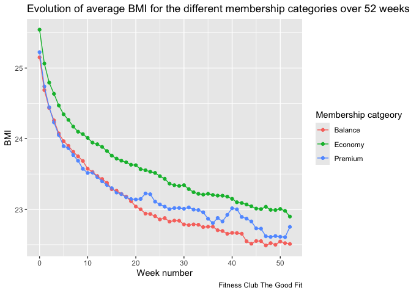

Inferential analysis
================

# Inferential analysis project

## Part 1: T-test on Swiss Cows data

``` r
library(readr)
library(ggplot2)
library(tidyr)
library(tidyverse)
library(infer)
```

``` r
swiss_cows_data <- read_csv("~/Documents/R/project4/swiss_cows_data.csv")

glimpse(swiss_cows_data)
```

    ## Rows: 50
    ## Columns: 3
    ## $ breed  <chr> "Brown_Swiss", "Brown_Swiss", "Brown_Swiss", "Brown_Swiss", "Br…
    ## $ num    <dbl> 1, 2, 3, 4, 5, 6, 7, 8, 9, 10, 11, 12, 13, 14, 15, 16, 17, 18, …
    ## $ weight <dbl> 656, 709, 699, 665, 667, 674, 679, 683, 688, 692, 698, 698, 703…

First let’s produce a summary table with sample size, arithmetic mean,
and standard deviation for each breed.

``` r
swiss_cows_data %>% 
  group_by(breed) %>% 
  summarise(sample_size=n(), mean_weight=mean(weight), sd_weight=sd(weight)) %>% 
  ungroup()
```

    ## # A tibble: 2 × 4
    ##   breed              sample_size mean_weight sd_weight
    ##   <chr>                    <int>       <dbl>     <dbl>
    ## 1 Brown_Swiss                 25        704.      24.5
    ## 2 Swiss_Red_Holstein          25        648.      23.5

In this part I focus on the first 3 cows of each breed, selected in the
tibble below.

``` r
cows_03 <- swiss_cows_data %>% 
  filter(num<=3)

cows_03
```

    ## # A tibble: 6 × 3
    ##   breed                num weight
    ##   <chr>              <dbl>  <dbl>
    ## 1 Brown_Swiss            1    656
    ## 2 Brown_Swiss            2    709
    ## 3 Brown_Swiss            3    699
    ## 4 Swiss_Red_Holstein     1    691
    ## 5 Swiss_Red_Holstein     2    636
    ## 6 Swiss_Red_Holstein     3    650

Let’s produce the summary table for the reduced sample.

``` r
cows_03%>% 
  group_by(breed) %>% 
  summarise(sample_size=n(), mean_weight=mean(weight), sd_weight=sd(weight)) %>% 
  ungroup()
```

    ## # A tibble: 2 × 4
    ##   breed              sample_size mean_weight sd_weight
    ##   <chr>                    <int>       <dbl>     <dbl>
    ## 1 Brown_Swiss                  3         688      28.2
    ## 2 Swiss_Red_Holstein           3         659      28.6

Now let’s do a t-test to compare the smaller sample mean to the full
sample mean.

``` r
my_test <- cows_03 %>% 
  t_test(formula = weight~ breed,
         order = c("Brown_Swiss", "Swiss_Red_Holstein"),
         conf_level = 0.95)


my_test
```

    ## # A tibble: 1 × 7
    ##   statistic  t_df p_value alternative estimate lower_ci upper_ci
    ##       <dbl> <dbl>   <dbl> <chr>          <dbl>    <dbl>    <dbl>
    ## 1      1.25  4.00   0.279 two.sided         29    -35.3     93.3

The last two elements lower_ci and upper_ci correspond to the lower and
upper limits of the 95% confidence interval for the difference in
average weight between the two breeds of cow. The CI contains 0 which
means that the small sample cow_03 does not provide enough evidence that
Swiss Browns are heavier.

The p-value of 0.2788521, being much higher than 0.05, confirms that the
difference between the small sample and full sample means is not
statistically significant at the 0.05 level (having chosen a confidence
level of 95%).

We can visualise the steps of the t-test process with the code below.

``` r
cows_03 %>% 
  specify(formula = weight ~ breed) %>%
  hypothesize(null = 'independence') %>%
  calculate(stat = "t") %>%
  visualise(method = "theoretical") +
  shade_p_value(obs_stat = my_test[1], direction = "both")
```

    ## Warning: The statistic is based on a difference or ratio; by default, for
    ## difference-based statistics, the explanatory variable is subtracted in the
    ## order "Brown_Swiss" - "Swiss_Red_Holstein", or divided in the order
    ## "Brown_Swiss" / "Swiss_Red_Holstein" for ratio-based statistics. To specify
    ## this order yourself, supply `order = c("Brown_Swiss", "Swiss_Red_Holstein")` to
    ## the calculate() function.

    ## Rather than setting `method = "theoretical"` with a simulation-based null
    ## distribution, the preferred method for visualizing theory-based distributions
    ## with infer is now to pass the output of `assume()` as the first argument to
    ## `visualize()`.

    ## Warning: Check to make sure the conditions have been met for the theoretical method.
    ## infer currently does not check these for you.

<!-- -->

The area of the red region under the density curse is equal to the
p-value obtained in the t-test, 0.2788521. The red line corresponds to
the value of the t-statistic 1.251831.

## Part 2: T-test using only the full sample

Here we redo the same exercise as above but for the full sample.

``` r
my_test_all <- swiss_cows_data %>% 
  t_test(formula = weight~ breed,
         order = c("Brown_Swiss", "Swiss_Red_Holstein"),
         conf_level = 0.95)


my_test_all
```

    ## # A tibble: 1 × 7
    ##   statistic  t_df  p_value alternative estimate lower_ci upper_ci
    ##       <dbl> <dbl>    <dbl> <chr>          <dbl>    <dbl>    <dbl>
    ## 1      8.17  47.9 1.26e-10 two.sided       55.4     41.7     69.0

We reproduce as well the density graph showing the resulting p-value and
t-test statistic.

``` r
swiss_cows_data %>% 
  specify(formula = weight ~ breed) %>%
  hypothesize(null = 'independence') %>%
  calculate(stat = "t") %>%
  visualise(method = "theoretical") +
  shade_p_value(obs_stat = my_test_all[1], direction = "both")
```

    ## Warning: The statistic is based on a difference or ratio; by default, for
    ## difference-based statistics, the explanatory variable is subtracted in the
    ## order "Brown_Swiss" - "Swiss_Red_Holstein", or divided in the order
    ## "Brown_Swiss" / "Swiss_Red_Holstein" for ratio-based statistics. To specify
    ## this order yourself, supply `order = c("Brown_Swiss", "Swiss_Red_Holstein")` to
    ## the calculate() function.

    ## Rather than setting `method = "theoretical"` with a simulation-based null
    ## distribution, the preferred method for visualizing theory-based distributions
    ## with infer is now to pass the output of `assume()` as the first argument to
    ## `visualize()`.

    ## Warning: Check to make sure the conditions have been met for the theoretical method.
    ## infer currently does not check these for you.

<!-- -->

The area of the red region under the density curse is equal to the
p-value obtained in the t-test, 1.2582823^{-10}. The red line
corresponds to the value of the t-statistic 8.165026. We can conclude
with 95% confidence that Swiss brown cows are heavier.

## Part 3: T-test on data from a fitness club

``` r
fitness_members <- read_csv("fitness_members.csv")

glimpse(fitness_members)
```

    ## Rows: 420
    ## Columns: 8
    ## $ id                  <chr> "000001", "000002", "000003", "000004", "000005", …
    ## $ recommendation_from <chr> NA, NA, NA, NA, NA, NA, NA, NA, NA, NA, NA, NA, NA…
    ## $ gender              <chr> "M", "F", "M", "M", "M", "M", "F", "M", "M", "M", …
    ## $ birth_date          <date> 1966-11-12, 1997-09-21, 1990-12-15, 1976-07-26, 1…
    ## $ registration_date   <date> 2018-01-02, 2018-01-05, 2018-01-05, 2018-01-06, 2…
    ## $ m_category          <chr> "Economy", "Balance", "Premium", "Economy", "Econo…
    ## $ height              <dbl> 181.8, 162.5, 182.2, 181.8, 177.8, 177.3, 167.6, 1…
    ## $ weight              <dbl> 73.9, 68.4, 82.5, 82.9, 78.0, 79.8, 73.8, 83.7, 71…

``` r
fitness_tracking <- read_csv("fitness_tracking.csv")

glimpse(fitness_tracking)
```

    ## Rows: 418
    ## Columns: 53
    ## $ id     <chr> "000001", "000002", "000003", "000004", "000005", "000006", "00…
    ## $ wk_001 <dbl> 72.7, 67.0, 80.8, 81.7, 76.4, 78.6, 72.4, 82.5, 69.9, 78.9, 64.…
    ## $ wk_002 <dbl> 71.8, 66.4, 80.0, 80.6, 75.7, 77.5, 71.1, 81.4, 68.3, 78.3, 64.…
    ## $ wk_003 <dbl> 70.9, 65.4, 79.5, 80.1, 75.4, 77.3, 70.7, 81.0, 68.1, 76.8, 63.…
    ## $ wk_004 <dbl> 70.7, 65.4, 78.9, 79.5, 74.7, 76.1, 69.9, 80.4, 67.4, 77.2, 62.…
    ## $ wk_005 <dbl> 70.3, 64.8, 77.9, 79.4, 74.8, 76.1, 69.4, 80.2, 67.1, 76.4, 62.…
    ## $ wk_006 <dbl> 70.4, 64.6, 78.3, 79.1, 73.8, 76.1, 69.6, 79.5, 66.5, 76.0, 62.…
    ## $ wk_007 <dbl> 69.9, 64.4, 78.3, 78.6, 73.1, 75.8, 69.2, 79.4, 65.9, 75.9, 62.…
    ## $ wk_008 <dbl> 69.9, 63.6, 77.6, 78.9, 73.8, 75.7, 68.9, 79.3, 66.4, 76.0, 61.…
    ## $ wk_009 <dbl> 69.4, 63.1, 76.6, 78.6, 73.4, 75.6, 68.5, 79.3, 65.8, 75.4, 61.…
    ## $ wk_010 <dbl> 69.0, 63.8, 77.1, 78.6, 73.6, 74.9, 67.9, 78.5, 65.6, 75.4, 61.…
    ## $ wk_011 <dbl> 69.1, 63.6, 76.4, 78.0, 73.1, 75.0, 68.1, 78.7, 65.4, 75.1, 60.…
    ## $ wk_012 <dbl> 68.8, 63.8, 76.6, 78.0, 73.1, 74.7, 68.1, 78.3, 65.2, 74.4, 61.…
    ## $ wk_013 <dbl> 68.8, 62.8, 76.5, 78.7, 73.7, 74.3, 68.1, 78.5, 65.0, 75.0, 60.…
    ## $ wk_014 <dbl> 68.5, 63.3, 76.3, 77.8, 73.1, 74.3, 67.7, 78.3, 64.9, 75.1, 60.…
    ## $ wk_015 <dbl> 68.5, 62.7, 76.2, 77.6, 72.3, 74.6, 67.9, 78.1, 65.1, 74.6, 60.…
    ## $ wk_016 <dbl> 68.7, 62.8, 76.1, 77.6, 71.9, 74.2, 67.0, 78.3, 64.6, 74.2, 60.…
    ## $ wk_017 <dbl> 68.4, 62.7, 76.1, 77.5, 72.6, 74.5, 67.3, 77.9, 64.2, 74.2, 60.…
    ## $ wk_018 <dbl> 68.6, 62.5, 75.7, 77.7, 72.5, 74.3, 66.8, 77.9, 64.1, 74.0, 60.…
    ## $ wk_019 <dbl> 67.9, 62.6, 76.2, 76.9, 72.4, 74.4, 67.0, 77.4, 64.4, 73.9, 60.…
    ## $ wk_020 <dbl> 68.2, 62.3, 75.4, 76.8, 72.0, 74.2, 66.8, 77.6, 64.2, 73.9, 59.…
    ## $ wk_021 <dbl> 68.1, 62.4, 75.1, 77.0, 72.2, 73.9, 66.8, 78.0, 63.5, 74.3, 59.…
    ## $ wk_022 <dbl> 67.7, 62.1, 75.4, 77.2, 72.2, 74.1, 66.7, 77.7, 64.0, 73.9, 60.…
    ## $ wk_023 <dbl> 67.4, 62.1, 75.7, 76.4, 71.6, 73.7, 66.7, 77.2, 64.2, 74.3, 60.…
    ## $ wk_024 <dbl> 67.6, 62.1, 75.3, 76.4, 72.2, 74.0, 66.6, 77.3, 64.2, 74.0, 59.…
    ## $ wk_025 <dbl> 68.2, 61.8, 75.1, 76.8, 71.7, 74.0, 66.9, 77.1, 64.2, 73.9, 59.…
    ## $ wk_026 <dbl> 67.3, 62.1, 74.7, 76.7, 71.6, 73.4, 66.7, 77.7, 63.9, 73.3, 59.…
    ## $ wk_027 <dbl> 67.5, 61.8, 74.8, 76.3, 71.2, 73.2, 65.9, 76.9, 63.9, 73.8, 59.…
    ## $ wk_028 <dbl> 67.8, 62.1, 75.0, 76.5, 71.8, 73.0, 66.0, 77.3, 63.2, 73.4, 59.…
    ## $ wk_029 <dbl> 67.1, 61.7, 74.7, 76.6, 71.5, 73.2, 65.9, 77.0, 63.4, 73.6, 59.…
    ## $ wk_030 <dbl> 67.0, 61.5, 74.7, 76.0, 71.3, 73.1, 65.8, 77.1, 63.6, 73.2, 59.…
    ## $ wk_031 <dbl> 66.8, 61.6, 74.7, 75.7, 71.4, 73.2, 66.1, 77.1, 63.8, 73.3, 59.…
    ## $ wk_032 <dbl> 67.3, 61.8, 74.8, 76.4, 70.9, 73.0, 65.9, 76.6, 63.0, 73.4, 59.…
    ## $ wk_033 <dbl> 67.3, 61.6, 74.5, 76.1, 71.3, 73.0, 66.2, 77.1, 63.2, 73.1, 58.…
    ## $ wk_034 <dbl> 67.5, 61.3, 73.9, 75.6, 71.1, 72.8, 66.0, 76.5, 63.5, 73.3, 59.…
    ## $ wk_035 <dbl> 66.9, 61.4, 74.6, 76.0, 71.4, 73.2, 65.9, 76.9, 63.3, 73.1, 59.…
    ## $ wk_036 <dbl> 67.1, 61.9, 74.6, 76.1, 71.0, 72.9, 65.7, 76.7, 63.0, 73.3, 59.…
    ## $ wk_037 <dbl> 67.3, 61.6, 73.9, 75.6, 71.0, 73.1, 65.4, 76.6, 63.0, 72.5, 58.…
    ## $ wk_038 <dbl> 67.2, 61.0, 74.0, 75.6, 71.2, 72.7, 65.8, 76.6, 62.4, 73.1, 59.…
    ## $ wk_039 <dbl> 67.2, 61.7, 73.8, 76.1, 71.3, 73.0, 65.8, 76.7, 62.9, 72.9, 58.…
    ## $ wk_040 <dbl> 66.7, 60.9, 73.9, 75.8, 71.4, 72.6, 65.7, 76.6, 62.7, 73.1, 59.…
    ## $ wk_041 <dbl> 66.7, 61.1, 74.1, 75.7, 71.2, 72.2, 65.6, 76.6, 62.6, 72.9, 58.…
    ## $ wk_042 <dbl> 66.6, 60.6, 73.9, 75.8, 70.8, 73.0, 65.1, 76.0, 63.2, 73.2, 58.…
    ## $ wk_043 <dbl> 67.3, 61.4, 74.0, 75.5, 70.5, 72.8, 65.2, 76.1, 62.5, 73.1, 58.…
    ## $ wk_044 <dbl> 66.6, 60.8, 73.3, 75.5, 71.0, 72.6, 65.8, 76.5, 62.1, 73.2, 58.…
    ## $ wk_045 <dbl> 66.9, 61.0, 73.8, 75.1, 70.7, 72.5, 65.4, 76.6, 62.3, 72.8, 58.…
    ## $ wk_046 <dbl> 66.9, 60.9, 73.9, 75.4, 70.4, 72.8, 64.8, 76.2, 63.2, 72.9, 58.…
    ## $ wk_047 <dbl> 66.3, 60.8, 73.7, 75.9, 71.1, 72.0, 64.9, 75.8, 62.7, 72.8, 58.…
    ## $ wk_048 <dbl> 66.3, 61.2, 73.7, 75.7, 70.4, 72.2, 64.8, 76.1, 62.3, 72.4, 58.…
    ## $ wk_049 <dbl> 66.4, 60.4, 73.8, 75.0, 70.6, 72.5, 65.0, 75.6, 63.0, 72.5, 58.…
    ## $ wk_050 <dbl> 66.7, 60.7, 74.3, 75.2, 70.3, 72.5, 64.9, 75.9, 62.2, 72.3, 58.…
    ## $ wk_051 <dbl> 66.5, 60.5, 73.8, 75.7, 70.4, 72.0, 65.2, 75.9, 62.5, 72.2, 58.…
    ## $ wk_052 <dbl> 66.3, 60.7, 73.9, 75.3, 70.5, 72.1, 65.1, 76.0, 62.4, 72.3, 58.…

Let’s perform a t-test to answer the question **Do we observe a
different evolution of BMI from week 0 to week 12 in the different
fitness club membership categories ?**

``` r
fitness_members %>% 
  left_join(fitness_tracking, by=c("id")) %>% 
  group_by(m_category) %>% 
  summarise(number_obs=n(), bmi0=mean(weight)/(mean(height)*mean(height))*10000)
```

    ## # A tibble: 3 × 3
    ##   m_category number_obs  bmi0
    ##   <chr>           <int> <dbl>
    ## 1 Balance           126  25.2
    ## 2 Economy           230  25.6
    ## 3 Premium            64  25.3

First some data manipulation to join the datasets together, calculate
BMI.

``` r
fit_data <- fitness_tracking %>% 
  left_join(fitness_members, by=c("id")) %>% 
  rename("wk_000"= "weight") %>% 
  select(id, wk_000, everything()) %>% 
  pivot_longer(cols = wk_000:wk_052, names_to = "week_number", values_to = "weight") %>% 
  mutate(week_number=str_replace(week_number, "wk_0", "")) %>% 
  mutate(bmi=weight/(height*height)*10000)

fit_data
```

    ## # A tibble: 22,154 × 10
    ##    id     recommendation_from gender birth_date registration_date m_category
    ##    <chr>  <chr>               <chr>  <date>     <date>            <chr>     
    ##  1 000001 <NA>                M      1966-11-12 2018-01-02        Economy   
    ##  2 000001 <NA>                M      1966-11-12 2018-01-02        Economy   
    ##  3 000001 <NA>                M      1966-11-12 2018-01-02        Economy   
    ##  4 000001 <NA>                M      1966-11-12 2018-01-02        Economy   
    ##  5 000001 <NA>                M      1966-11-12 2018-01-02        Economy   
    ##  6 000001 <NA>                M      1966-11-12 2018-01-02        Economy   
    ##  7 000001 <NA>                M      1966-11-12 2018-01-02        Economy   
    ##  8 000001 <NA>                M      1966-11-12 2018-01-02        Economy   
    ##  9 000001 <NA>                M      1966-11-12 2018-01-02        Economy   
    ## 10 000001 <NA>                M      1966-11-12 2018-01-02        Economy   
    ## # ℹ 22,144 more rows
    ## # ℹ 4 more variables: height <dbl>, week_number <chr>, weight <dbl>, bmi <dbl>

Visualize the data.

``` r
fit_data %>% 
  mutate(week_number=as.numeric(week_number)) %>% 
  group_by(m_category, week_number) %>% 
  summarise(mean_bmi=mean(bmi, na.rm=TRUE)) %>% 
  ggplot(aes(x=week_number, y=mean_bmi, color= m_category)) +
  geom_point()+
  geom_line()+
  labs(title="Evolution of average BMI for the different membership categories over 52 weeks",
       caption="Fitness Club The Good Fit",
       x="Week number",
       y="BMI",
       color="Membership catgeory")
```

    ## `summarise()` has grouped output by 'm_category'. You can override using the
    ## `.groups` argument.

<!-- -->

``` r
fit_data %>% 
  mutate(week_number=as.numeric(week_number)) %>% 
  group_by(m_category, week_number) %>% 
  summarise(mean_bmi=mean(bmi, na.rm=TRUE)) %>% 
  ungroup
```

    ## `summarise()` has grouped output by 'm_category'. You can override using the
    ## `.groups` argument.

    ## # A tibble: 159 × 3
    ##    m_category week_number mean_bmi
    ##    <chr>            <dbl>    <dbl>
    ##  1 Balance              0     25.2
    ##  2 Balance              1     24.7
    ##  3 Balance              2     24.4
    ##  4 Balance              3     24.3
    ##  5 Balance              4     24.1
    ##  6 Balance              5     24.0
    ##  7 Balance              6     23.9
    ##  8 Balance              7     23.8
    ##  9 Balance              8     23.7
    ## 10 Balance              9     23.7
    ## # ℹ 149 more rows

Now the t-test. We need to choose two categories at a time. The test
below is for Balance vs. Economy.

``` r
my_fit_test_be <- fit_data %>% 
  mutate(week_number=as.numeric(week_number)) %>% 
  group_by(m_category, week_number) %>% 
  summarise(mean_bmi=mean(bmi, na.rm=TRUE)) %>% 
  ungroup %>% 
  t_test(formula = mean_bmi ~ m_category,
         order = c("Balance", "Economy"),
         conf_level = 0.95)
```

    ## `summarise()` has grouped output by 'm_category'. You can override using the
    ## `.groups` argument.

``` r
my_fit_test_be
```

    ## # A tibble: 1 × 7
    ##   statistic  t_df   p_value alternative estimate lower_ci upper_ci
    ##       <dbl> <dbl>     <dbl> <chr>          <dbl>    <dbl>    <dbl>
    ## 1     -4.05  104. 0.0000978 two.sided     -0.472   -0.703   -0.241

``` r
my_fit_test_pe <- fit_data %>% 
  mutate(week_number=as.numeric(week_number)) %>% 
  group_by(m_category, week_number) %>% 
  summarise(mean_bmi=mean(bmi, na.rm=TRUE)) %>% 
  ungroup %>% 
  t_test(formula = mean_bmi ~ m_category,
         order = c("Premium", "Economy"),
         conf_level = 0.95)
```

    ## `summarise()` has grouped output by 'm_category'. You can override using the
    ## `.groups` argument.

``` r
my_fit_test_pe
```

    ## # A tibble: 1 × 7
    ##   statistic  t_df p_value alternative estimate lower_ci upper_ci
    ##       <dbl> <dbl>   <dbl> <chr>          <dbl>    <dbl>    <dbl>
    ## 1     -3.27  104. 0.00145 two.sided     -0.358   -0.575   -0.141

``` r
my_fit_test_pb <- fit_data %>% 
  mutate(week_number=as.numeric(week_number)) %>% 
  group_by(m_category, week_number) %>% 
  summarise(mean_bmi=mean(bmi, na.rm=TRUE)) %>% 
  ungroup %>% 
  t_test(formula = mean_bmi ~ m_category,
         order = c("Premium", "Balance"),
         conf_level = 0.95)
```

    ## `summarise()` has grouped output by 'm_category'. You can override using the
    ## `.groups` argument.

``` r
my_fit_test_pb
```

    ## # A tibble: 1 × 7
    ##   statistic  t_df p_value alternative estimate lower_ci upper_ci
    ##       <dbl> <dbl>   <dbl> <chr>          <dbl>    <dbl>    <dbl>
    ## 1      1.01  102.   0.317 two.sided      0.114   -0.111    0.339

The difference in BMI is significantly higher in Economy than in
Balance, and in Economy than in Premium.

## Part 4: Chi-squared test

When we compare the number of members in the Premium category to the
other categories Economic and Balance, do we observe a similar pattern
for female and male fitness members ?

First, let’s visualise the data.

Contingency tables.

``` r
fitness_members %>% 
  count(m_category, gender, name="freq")
```

    ## # A tibble: 6 × 3
    ##   m_category gender  freq
    ##   <chr>      <chr>  <int>
    ## 1 Balance    F         52
    ## 2 Balance    M         74
    ## 3 Economy    F         87
    ## 4 Economy    M        143
    ## 5 Premium    F         28
    ## 6 Premium    M         36

``` r
fitness_members %>% 
  count(m_category, gender, name="freq") %>% 
  pivot_wider(names_from=m_category, values_from=freq) %>% 
  mutate(total_members=Economy+Balance+Premium) %>% 
  mutate(Economy=round(Economy/total_members*100),
         Balance=round(Balance/total_members*100),
         Premium=round(Premium/total_members*100))
```

    ## # A tibble: 2 × 5
    ##   gender Balance Economy Premium total_members
    ##   <chr>    <dbl>   <dbl>   <dbl>         <int>
    ## 1 F           31      52      17           167
    ## 2 M           29      57      14           253

Grouped bar charts.

``` r
fitness_members %>% 
  count(m_category, gender, name="freq") %>% 
  ggplot(aes(x=m_category, y=freq, fill=m_category))+
  geom_col()+
  facet_wrap(vars(gender))+
  labs(title="Membership categories by gender",
       caption="Fitness Club the Good Fit",
       x="Memberhsip categories",
       y="Frequency")
```

<!-- -->

The code below is to order the levels of the ordinal variable
m_category.

``` r
fitness_members <- fitness_members %>%
  mutate(m_category = factor(m_category, levels = c("Economy", "Balance", "Premium")))
```

And the chi-squared test.

``` r
chi_test <- fitness_members %>% 
  chisq_test(formula= m_category ~ gender)

chi_test
```

    ## # A tibble: 1 × 3
    ##   statistic chisq_df p_value
    ##       <dbl>    <int>   <dbl>
    ## 1     0.904        2   0.636

``` r
fitness_members %>% 
  chisq_test(formula= gender ~ m_category)
```

    ## # A tibble: 1 × 3
    ##   statistic chisq_df p_value
    ##       <dbl>    <int>   <dbl>
    ## 1     0.904        2   0.636

And visualizing the p-value.

``` r
fitness_members %>%
  specify(formula = m_category ~ gender) %>%
  hypothesize(null = "independence") %>%
  assume(distribution = "Chisq") %>% 
  visualise() +
  shade_p_value(obs_stat = chi_test[1], direction = "both") +
  theme_minimal()
```

    ## Warning: Chi-Square usually corresponds to right-tailed tests. Proceed with
    ## caution.

<!-- -->
