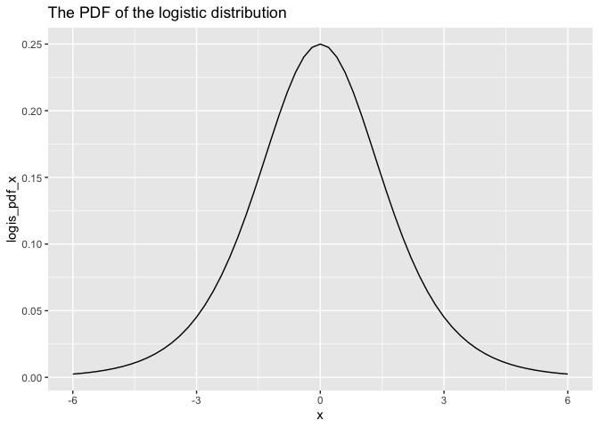

Intermediate Linear Regression
================

## Parallel slopes linear regression

``` r
library(readr)
library(dplyr)
library(ggplot2)
library(visdat)
library(tidyr)
library(ggthemes)

glimpse(mtcars)
```

    ## Rows: 32
    ## Columns: 11
    ## $ mpg  <dbl> 21.0, 21.0, 22.8, 21.4, 18.7, 18.1, 14.3, 24.4, 22.8, 19.2, 17.8,…
    ## $ cyl  <dbl> 6, 6, 4, 6, 8, 6, 8, 4, 4, 6, 6, 8, 8, 8, 8, 8, 8, 4, 4, 4, 4, 8,…
    ## $ disp <dbl> 160.0, 160.0, 108.0, 258.0, 360.0, 225.0, 360.0, 146.7, 140.8, 16…
    ## $ hp   <dbl> 110, 110, 93, 110, 175, 105, 245, 62, 95, 123, 123, 180, 180, 180…
    ## $ drat <dbl> 3.90, 3.90, 3.85, 3.08, 3.15, 2.76, 3.21, 3.69, 3.92, 3.92, 3.92,…
    ## $ wt   <dbl> 2.620, 2.875, 2.320, 3.215, 3.440, 3.460, 3.570, 3.190, 3.150, 3.…
    ## $ qsec <dbl> 16.46, 17.02, 18.61, 19.44, 17.02, 20.22, 15.84, 20.00, 22.90, 18…
    ## $ vs   <dbl> 0, 0, 1, 1, 0, 1, 0, 1, 1, 1, 1, 0, 0, 0, 0, 0, 0, 1, 1, 1, 1, 0,…
    ## $ am   <dbl> 1, 1, 1, 0, 0, 0, 0, 0, 0, 0, 0, 0, 0, 0, 0, 0, 0, 1, 1, 1, 0, 0,…
    ## $ gear <dbl> 4, 4, 4, 3, 3, 3, 3, 4, 4, 4, 4, 3, 3, 3, 3, 3, 3, 4, 4, 4, 3, 3,…
    ## $ carb <dbl> 4, 4, 1, 1, 2, 1, 4, 2, 2, 4, 4, 3, 3, 3, 4, 4, 4, 1, 2, 1, 1, 2,…

Linear regression including one continuous and one categorical variable.
First separately.

``` r
lm(formula= mpg  ~ disp, data=mtcars)
```

    ## 
    ## Call:
    ## lm(formula = mpg ~ disp, data = mtcars)
    ## 
    ## Coefficients:
    ## (Intercept)         disp  
    ##    29.59985     -0.04122

``` r
summary(lm(formula= mpg  ~ disp, data=mtcars))
```

    ## 
    ## Call:
    ## lm(formula = mpg ~ disp, data = mtcars)
    ## 
    ## Residuals:
    ##     Min      1Q  Median      3Q     Max 
    ## -4.8922 -2.2022 -0.9631  1.6272  7.2305 
    ## 
    ## Coefficients:
    ##              Estimate Std. Error t value Pr(>|t|)    
    ## (Intercept) 29.599855   1.229720  24.070  < 2e-16 ***
    ## disp        -0.041215   0.004712  -8.747 9.38e-10 ***
    ## ---
    ## Signif. codes:  0 '***' 0.001 '**' 0.01 '*' 0.05 '.' 0.1 ' ' 1
    ## 
    ## Residual standard error: 3.251 on 30 degrees of freedom
    ## Multiple R-squared:  0.7183, Adjusted R-squared:  0.709 
    ## F-statistic: 76.51 on 1 and 30 DF,  p-value: 9.38e-10

``` r
mtcars %>% 
  mutate(cyl=as.factor(cyl)) %>% 
  lm(formula = mpg  ~ cyl + 0)
```

    ## 
    ## Call:
    ## lm(formula = mpg ~ cyl + 0, data = .)
    ## 
    ## Coefficients:
    ##  cyl4   cyl6   cyl8  
    ## 26.66  19.74  15.10

``` r
summary(mtcars %>% 
  mutate(cyl=as.factor(cyl)) %>% 
  lm(formula = mpg  ~ cyl + 0))
```

    ## 
    ## Call:
    ## lm(formula = mpg ~ cyl + 0, data = .)
    ## 
    ## Residuals:
    ##     Min      1Q  Median      3Q     Max 
    ## -5.2636 -1.8357  0.0286  1.3893  7.2364 
    ## 
    ## Coefficients:
    ##      Estimate Std. Error t value Pr(>|t|)    
    ## cyl4  26.6636     0.9718   27.44  < 2e-16 ***
    ## cyl6  19.7429     1.2182   16.21 4.49e-16 ***
    ## cyl8  15.1000     0.8614   17.53  < 2e-16 ***
    ## ---
    ## Signif. codes:  0 '***' 0.001 '**' 0.01 '*' 0.05 '.' 0.1 ' ' 1
    ## 
    ## Residual standard error: 3.223 on 29 degrees of freedom
    ## Multiple R-squared:  0.9785, Adjusted R-squared:  0.9763 
    ## F-statistic: 440.9 on 3 and 29 DF,  p-value: < 2.2e-16

And now with both variables at the same time

``` r
mdl_mtcars_disp_cyl <- mtcars %>% 
  mutate(cyl=as.factor(cyl)) %>% 
  lm(formula= mpg  ~ disp + cyl +0)

mdl_mtcars_disp_cyl
```

    ## 
    ## Call:
    ## lm(formula = mpg ~ disp + cyl + 0, data = .)
    ## 
    ## Coefficients:
    ##     disp      cyl4      cyl6      cyl8  
    ## -0.02731  29.53477  24.74892  24.74268

``` r
summary(mdl_mtcars_disp_cyl)
```

    ## 
    ## Call:
    ## lm(formula = mpg ~ disp + cyl + 0, data = .)
    ## 
    ## Residuals:
    ##     Min      1Q  Median      3Q     Max 
    ## -4.8304 -1.5873 -0.5851  0.9753  6.3069 
    ## 
    ## Coefficients:
    ##      Estimate Std. Error t value Pr(>|t|)    
    ## disp -0.02731    0.01061  -2.574   0.0156 *  
    ## cyl4 29.53477    1.42662  20.703  < 2e-16 ***
    ## cyl6 24.74892    2.24180  11.040 1.04e-11 ***
    ## cyl8 24.74268    3.82835   6.463 5.31e-07 ***
    ## ---
    ## Signif. codes:  0 '***' 0.001 '**' 0.01 '*' 0.05 '.' 0.1 ' ' 1
    ## 
    ## Residual standard error: 2.95 on 28 degrees of freedom
    ## Multiple R-squared:  0.9827, Adjusted R-squared:  0.9802 
    ## F-statistic: 396.5 on 4 and 28 DF,  p-value: < 2.2e-16

Visualizing the data - with a single explanatory categorical variable,
the predictions are the emans for each category.

``` r
mtcars %>% 
  mutate(cyl=as.factor(cyl)) %>% 
  ggplot(aes(x=cyl, y=mpg))+
  geom_boxplot()+
  stat_summary(fun = mean, shape=15)+
  labs(title="Mpg distribution by type of cyl",
       subtitle="squares= sample means")
```

    ## Warning: Removed 3 rows containing missing values or values outside the scale range
    ## (`geom_segment()`).

<!-- -->

``` r
mtcars %>% 
  ggplot(aes(x=disp, y=mpg))+
  geom_point()+
  geom_smooth(method="lm", se=FALSE)
```

    ## `geom_smooth()` using formula = 'y ~ x'

<!-- -->

Visualizing both explanatory variables: the parallel slope model name
comes from the fact that the prediction for each category has its own
slope and all those slopes are parallel.

``` r
library(moderndive)


mtcars %>% 
  mutate(cyl=as.factor(cyl)) %>% 
  ggplot(aes(x=disp, y=mpg, color=cyl))+
  geom_point()+
  geom_parallel_slopes()
```

<!-- -->

Interpretation of the coefficients:

For each additional unit of **disp** the expected **mpg** value
decreases by 0.02731 (significant at 0.5).

For a car with **cyl6** with disp=0 the expected mpg value is of
24.74892 (= where the green line intersects the y axis).

The prediction workflow

``` r
# expand_grid from {tidyr} gives a combination of all inputs

explanatory_data <- expand_grid(disp=seq(100, 400, 70),
                                cyl=unique(mtcars$cyl)) %>% 
                        mutate(cyl=as.factor(cyl))

explanatory_data
```

    ## # A tibble: 15 × 2
    ##     disp cyl  
    ##    <dbl> <fct>
    ##  1   100 6    
    ##  2   100 4    
    ##  3   100 8    
    ##  4   170 6    
    ##  5   170 4    
    ##  6   170 8    
    ##  7   240 6    
    ##  8   240 4    
    ##  9   240 8    
    ## 10   310 6    
    ## 11   310 4    
    ## 12   310 8    
    ## 13   380 6    
    ## 14   380 4    
    ## 15   380 8

Next, add predictions to the explanatory dataframe.

``` r
prediction_data <- explanatory_data %>% 
  mutate(mpg = predict(mdl_mtcars_disp_cyl, explanatory_data))

prediction_data
```

    ## # A tibble: 15 × 3
    ##     disp cyl     mpg
    ##    <dbl> <fct> <dbl>
    ##  1   100 6      22.0
    ##  2   100 4      26.8
    ##  3   100 8      22.0
    ##  4   170 6      20.1
    ##  5   170 4      24.9
    ##  6   170 8      20.1
    ##  7   240 6      18.2
    ##  8   240 4      23.0
    ##  9   240 8      18.2
    ## 10   310 6      16.3
    ## 11   310 4      21.1
    ## 12   310 8      16.3
    ## 13   380 6      14.4
    ## 14   380 4      19.2
    ## 15   380 8      14.4

Show that predictions for unseen data lie along the parallel slopes.

``` r
library(moderndive)


mtcars %>% 
  mutate(cyl=as.factor(cyl)) %>% 
  ggplot(aes(x=disp, y=mpg, color=cyl)) +
  geom_point()+
  geom_parallel_slopes()+
  geom_point(data=prediction_data, size=3, shape=15, 
             aes(x=disp, y=mpg, color=cyl))
```

<!-- -->

Code for accessing the predicted coefficients:

``` r
coefficients(mdl_mtcars_disp_cyl)
```

    ##        disp        cyl4        cyl6        cyl8 
    ## -0.02730864 29.53476781 24.74892158 24.74268194

Final prediction step. Calculate predictions manually based on intercept
(different intercept per cyl) and slope (one single slope).

``` r
explanatory_data %>% 
  mutate(intercept= case_when(cyl==4  ~ coefficients(mdl_mtcars_disp_cyl)[2],
                              cyl==6 ~  coefficients(mdl_mtcars_disp_cyl)[3],
                              cyl==8 ~ coefficients(mdl_mtcars_disp_cyl)[4])) %>% 
  mutate(mpg_predicted = intercept + disp* coefficients(mdl_mtcars_disp_cyl)[1])
```

    ## # A tibble: 15 × 4
    ##     disp cyl   intercept mpg_predicted
    ##    <dbl> <fct>     <dbl>         <dbl>
    ##  1   100 6          24.7          22.0
    ##  2   100 4          29.5          26.8
    ##  3   100 8          24.7          22.0
    ##  4   170 6          24.7          20.1
    ##  5   170 4          29.5          24.9
    ##  6   170 8          24.7          20.1
    ##  7   240 6          24.7          18.2
    ##  8   240 4          29.5          23.0
    ##  9   240 8          24.7          18.2
    ## 10   310 6          24.7          16.3
    ## 11   310 4          29.5          21.1
    ## 12   310 8          24.7          16.3
    ## 13   380 6          24.7          14.4
    ## 14   380 4          29.5          19.2
    ## 15   380 8          24.7          14.4

Assessing model performance

Coefficient of determination: R-squared - the bigger the better.
Adjusted R-squared includes a penalty for additional explanatory
variables (to guard against overfitting).

RSE (residual standard error): the typical size of the residuals. The
smaller, the better. **Sigma** is the name of this variable in the
glance table.

This is for the composed model.

``` r
library(broom)

glance(mdl_mtcars_disp_cyl)
```

    ## # A tibble: 1 × 12
    ##   r.squared adj.r.squared sigma statistic  p.value    df logLik   AIC   BIC
    ##       <dbl>         <dbl> <dbl>     <dbl>    <dbl> <dbl>  <dbl> <dbl> <dbl>
    ## 1     0.983         0.980  2.95      396. 3.30e-24     4  -77.9  166.  173.
    ## # ℹ 3 more variables: deviance <dbl>, df.residual <int>, nobs <int>

This is for the two simple models.

``` r
glance(lm(formula= mpg  ~ disp, data=mtcars))
```

    ## # A tibble: 1 × 12
    ##   r.squared adj.r.squared sigma statistic  p.value    df logLik   AIC   BIC
    ##       <dbl>         <dbl> <dbl>     <dbl>    <dbl> <dbl>  <dbl> <dbl> <dbl>
    ## 1     0.718         0.709  3.25      76.5 9.38e-10     1  -82.1  170.  175.
    ## # ℹ 3 more variables: deviance <dbl>, df.residual <int>, nobs <int>

``` r
glance(mtcars %>% 
  mutate(cyl=as.factor(cyl)) %>% 
  lm(formula = mpg  ~ cyl + 0))
```

    ## # A tibble: 1 × 12
    ##   r.squared adj.r.squared sigma statistic  p.value    df logLik   AIC   BIC
    ##       <dbl>         <dbl> <dbl>     <dbl>    <dbl> <dbl>  <dbl> <dbl> <dbl>
    ## 1     0.979         0.976  3.22      441. 2.80e-24     3  -81.3  171.  176.
    ## # ℹ 3 more variables: deviance <dbl>, df.residual <int>, nobs <int>

## Models for each category

Specify interactions between explanatory variables

``` r
# implicit

mtcars <- mtcars %>% 
  mutate(cyl=as.factor(cyl))

lm(mpg ~ disp* cyl, data=mtcars)
```

    ## 
    ## Call:
    ## lm(formula = mpg ~ disp * cyl, data = mtcars)
    ## 
    ## Coefficients:
    ## (Intercept)         disp         cyl6         cyl8    disp:cyl6    disp:cyl8  
    ##     40.8720      -0.1351     -21.7900     -18.8392       0.1387       0.1155

``` r
#explicit

lm(mpg ~ disp + cyl + disp:cyl, data=mtcars)
```

    ## 
    ## Call:
    ## lm(formula = mpg ~ disp + cyl + disp:cyl, data = mtcars)
    ## 
    ## Coefficients:
    ## (Intercept)         disp         cyl6         cyl8    disp:cyl6    disp:cyl8  
    ##     40.8720      -0.1351     -21.7900     -18.8392       0.1387       0.1155

For easier to understand coefficients, new formula: intercept for each
cyl type and intercept coefficients for each cyl type.

``` r
mdl_interact_disp_cyl <- lm(formula = mpg ~ cyl + cyl:disp + 0, data=mtcars)

mdl_interact_disp_cyl
```

    ## 
    ## Call:
    ## lm(formula = mpg ~ cyl + cyl:disp + 0, data = mtcars)
    ## 
    ## Coefficients:
    ##      cyl4       cyl6       cyl8  cyl4:disp  cyl6:disp  cyl8:disp  
    ## 40.871955  19.081987  22.032799  -0.135142   0.003605  -0.019634

This is the same as splitting the dataset into 3 categories (for each
cyl category) and running separately 3 different models.

Interpretation: the expected increase in mpg from increases in disp is
largest for cyl 6 (largest interaction coefficient).

Making predictions

``` r
explanatory_data <- expand_grid(disp=seq(100, 400, 100),
                                cyl=unique(mtcars$cyl))

explanatory_data
```

    ## # A tibble: 12 × 2
    ##     disp cyl  
    ##    <dbl> <fct>
    ##  1   100 6    
    ##  2   100 4    
    ##  3   100 8    
    ##  4   200 6    
    ##  5   200 4    
    ##  6   200 8    
    ##  7   300 6    
    ##  8   300 4    
    ##  9   300 8    
    ## 10   400 6    
    ## 11   400 4    
    ## 12   400 8

``` r
prediction_data<- explanatory_data %>% 
  mutate(mpg=predict(mdl_interact_disp_cyl, explanatory_data))

prediction_data
```

    ## # A tibble: 12 × 3
    ##     disp cyl       mpg
    ##    <dbl> <fct>   <dbl>
    ##  1   100 6      19.4  
    ##  2   100 4      27.4  
    ##  3   100 8      20.1  
    ##  4   200 6      19.8  
    ##  5   200 4      13.8  
    ##  6   200 8      18.1  
    ##  7   300 6      20.2  
    ##  8   300 4       0.329
    ##  9   300 8      16.1  
    ## 10   400 6      20.5  
    ## 11   400 4     -13.2  
    ## 12   400 8      14.2

Plotting predictions

``` r
mtcars %>% 
  ggplot(aes(x=disp, y=mpg, color=cyl)) +
  geom_point() +
  geom_smooth(method="lm", se=FALSE) +
  geom_point(data=prediction_data, size=3, shape=15)
```

    ## `geom_smooth()` using formula = 'y ~ x'

<!-- -->

## Simpson’s Paradox

The trend/slope of a model on the whole dataset is very different from
the trends shown by models on subsets of the dataset –\> this is why it
is advisable to plot the data. The choice of model depends on the
question to answer.

In the model above, overall there is a negative relationship between
disp and mpg, however for cars with cyl6 the relationship is close to
nonexistent (when disp changes mpg stays the same or increases
slightly).

## Multiple Linear Regression (two or more numerical independent vars)

We’ll look at disp and hp.

First visualizing:

2D color plot with response=color

``` r
mtcars %>% 
  ggplot(aes(x=disp, y=hp, color=mpg)) +
  geom_point()+
  labs(title="Linear regrression with two continuous variables") +
  scale_color_viridis_c(option="plasma")
```

<!-- -->

Modeling: obtain one intercept and one slope coefficient for each
variable.

``` r
mdl_multi_mpg <- lm(data=mtcars,
                    formula = mpg ~ disp + hp)

mdl_multi_mpg
```

    ## 
    ## Call:
    ## lm(formula = mpg ~ disp + hp, data = mtcars)
    ## 
    ## Coefficients:
    ## (Intercept)         disp           hp  
    ##    30.73590     -0.03035     -0.02484

Prediction flow

``` r
explanatory_data <- expand_grid(disp=seq(100, 400, 100),
                                hp=seq(50, 300, 100))

explanatory_data
```

    ## # A tibble: 12 × 2
    ##     disp    hp
    ##    <dbl> <dbl>
    ##  1   100    50
    ##  2   100   150
    ##  3   100   250
    ##  4   200    50
    ##  5   200   150
    ##  6   200   250
    ##  7   300    50
    ##  8   300   150
    ##  9   300   250
    ## 10   400    50
    ## 11   400   150
    ## 12   400   250

``` r
prediction_data<- explanatory_data %>% 
  mutate(mpg=predict(mdl_multi_mpg, explanatory_data))

prediction_data
```

    ## # A tibble: 12 × 3
    ##     disp    hp   mpg
    ##    <dbl> <dbl> <dbl>
    ##  1   100    50  26.5
    ##  2   100   150  24.0
    ##  3   100   250  21.5
    ##  4   200    50  23.4
    ##  5   200   150  20.9
    ##  6   200   250  18.5
    ##  7   300    50  20.4
    ##  8   300   150  17.9
    ##  9   300   250  15.4
    ## 10   400    50  17.4
    ## 11   400   150  14.9
    ## 12   400   250  12.4

Plotting the predictions

``` r
mtcars %>% 
  ggplot(aes(x=disp, y=hp, color=mpg)) +
  geom_point() +
  labs(title="Linear regrression with two continuous variables") +
  scale_color_viridis_c(option="plasma") +
  geom_point(data=prediction_data, shape=15, size=3)
```

<!-- -->

We can include an interaction in the model

``` r
mdl_multi_inter_mpg <- lm(data=mtcars,
                    formula = mpg ~ disp * hp)

mdl_multi_inter_mpg
```

    ## 
    ## Call:
    ## lm(formula = mpg ~ disp * hp, data = mtcars)
    ## 
    ## Coefficients:
    ## (Intercept)         disp           hp      disp:hp  
    ##    39.67426     -0.07337     -0.09789      0.00029

Predicting and plotting the results are the same.

``` r
prediction_data<- explanatory_data %>% 
  mutate(mpg=predict(mdl_multi_inter_mpg, explanatory_data))

prediction_data
```

    ## # A tibble: 12 × 3
    ##     disp    hp   mpg
    ##    <dbl> <dbl> <dbl>
    ##  1   100    50  28.9
    ##  2   100   150  22.0
    ##  3   100   250  15.1
    ##  4   200    50  23.0
    ##  5   200   150  19.0
    ##  6   200   250  15.0
    ##  7   300    50  17.1
    ##  8   300   150  16.0
    ##  9   300   250  14.9
    ## 10   400    50  11.2
    ## 11   400   150  13.0
    ## 12   400   250  14.9

``` r
mtcars %>% 
  ggplot(aes(x=disp, y=hp, color=mpg)) +
  geom_point() +
  labs(title="Linear regrression with two continuous variables",
       subtitle = "with interaction term") +
  scale_color_viridis_c(option="plasma") +
  geom_point(data=prediction_data, shape=15, size=3)
```

<!-- -->

Visualizing the data when there are more than 2 explanatory variables.

``` r
mtcars %>% 
  ggplot(aes(x=disp, y=hp, color=mpg)) +
  geom_point() +
  labs(title="Linear regrression with two continuous variables",
       subtitle = "with interaction term") +
  scale_color_viridis_c(option="plasma") +
  facet_wrap(vars(cyl)) 
```

<!-- -->

``` r
# no interactions

lm(mpg~disp + hp + cyl + 0, data=mtcars)
```

    ## 
    ## Call:
    ## lm(formula = mpg ~ disp + hp + cyl + 0, data = mtcars)
    ## 
    ## Coefficients:
    ##     disp        hp      cyl4      cyl6      cyl8  
    ## -0.02604  -0.02114  31.14773  27.10054  28.71580

``` r
# two-way interactions -- or use mpg ~ (disp + hp + cyl)^2

lm(mpg~disp + hp + cyl + disp:hp + disp:cyl + hp:cyl + 0, data=mtcars)
```

    ## 
    ## Call:
    ## lm(formula = mpg ~ disp + hp + cyl + disp:hp + disp:cyl + hp:cyl + 
    ##     0, data = mtcars)
    ## 
    ## Coefficients:
    ##       disp          hp        cyl4        cyl6        cyl8     disp:hp  
    ## -7.177e-02   2.397e-02   3.813e+01   9.920e+00  -1.927e+01  -6.628e-04  
    ##  disp:cyl6   disp:cyl8     hp:cyl6     hp:cyl8  
    ##  1.448e-01   1.905e-01   6.600e-02   1.752e-01

``` r
# three-way interactions -- or use mpg ~ disp * hp * cyl

lm(mpg~disp + hp + cyl + disp:hp + disp:cyl + hp:cyl + disp:hp:cyl + 0, data=mtcars)
```

    ## 
    ## Call:
    ## lm(formula = mpg ~ disp + hp + cyl + disp:hp + disp:cyl + hp:cyl + 
    ##     disp:hp:cyl + 0, data = mtcars)
    ## 
    ## Coefficients:
    ##         disp            hp          cyl4          cyl6          cyl8  
    ##     0.070395      0.232494     23.534625     21.186579    -13.611732  
    ##      disp:hp     disp:cyl6     disp:cyl8       hp:cyl6       hp:cyl8  
    ##    -0.002636     -0.075806      0.030392     -0.248241     -0.060818  
    ## disp:hp:cyl6  disp:hp:cyl8  
    ##     0.002703      0.002059

## Multiple logistic regression

Using the same dataset we’ll aim to estimate the type of vs based on
continuous variables mpg and disp.

``` r
mtcars %>% 
  select(vs, mpg, disp) %>% 
  head()
```

    ##                   vs  mpg disp
    ## Mazda RX4          0 21.0  160
    ## Mazda RX4 Wag      0 21.0  160
    ## Datsun 710         1 22.8  108
    ## Hornet 4 Drive     1 21.4  258
    ## Hornet Sportabout  0 18.7  360
    ## Valiant            1 18.1  225

For writing our model we’ll need to use the gml function and set the
family attribute to **binominal**.

``` r
# with no interactions
glm(vs ~ mpg + disp, data=mtcars, family=binomial)
```

    ## 
    ## Call:  glm(formula = vs ~ mpg + disp, family = binomial, data = mtcars)
    ## 
    ## Coefficients:
    ## (Intercept)          mpg         disp  
    ##     0.38791      0.13232     -0.01611  
    ## 
    ## Degrees of Freedom: 31 Total (i.e. Null);  29 Residual
    ## Null Deviance:       43.86 
    ## Residual Deviance: 22.28     AIC: 28.28

``` r
# with interactions use * instead of + between the variables

glm(vs ~ mpg * disp, data=mtcars, family=binomial)
```

    ## 
    ## Call:  glm(formula = vs ~ mpg * disp, family = binomial, data = mtcars)
    ## 
    ## Coefficients:
    ## (Intercept)          mpg         disp     mpg:disp  
    ##    3.725413    -0.059120    -0.046435     0.001718  
    ## 
    ## Degrees of Freedom: 31 Total (i.e. Null);  28 Residual
    ## Null Deviance:       43.86 
    ## Residual Deviance: 21.57     AIC: 29.57

For predictions everything is the same as before, just do not forget to
set type=“response” in the call to predict.

Visualising the data

``` r
mtcars %>% 
  ggplot(aes(x=mpg, y=disp, color=vs)) +
  geom_point() +
  scale_color_gradient2(midpoint=0.5) + # can only use this with 1-0 variables like vs
labs(title="Predicting vs based on mpg and disp")
```

<!-- -->

Fit the model

``` r
mdl_logistic_vs_disp_mpg <- glm(data=mtcars, formula = vs~ mpg + disp, family = binomial)
mdl_logistic_vs_disp_mpg
```

    ## 
    ## Call:  glm(formula = vs ~ mpg + disp, family = binomial, data = mtcars)
    ## 
    ## Coefficients:
    ## (Intercept)          mpg         disp  
    ##     0.38791      0.13232     -0.01611  
    ## 
    ## Degrees of Freedom: 31 Total (i.e. Null);  29 Residual
    ## Null Deviance:       43.86 
    ## Residual Deviance: 22.28     AIC: 28.28

Make predictions for unseen points

``` r
explanatory_data <- expand_grid(mpg=seq(10, 35, 3),
                                disp=seq(50, 500, 15))

explanatory_data %>% 
  head()
```

    ## # A tibble: 6 × 2
    ##     mpg  disp
    ##   <dbl> <dbl>
    ## 1    10    50
    ## 2    10    65
    ## 3    10    80
    ## 4    10    95
    ## 5    10   110
    ## 6    10   125

**Do not forget to set type=“response”!**

``` r
prediction_data <- explanatory_data%>%
  mutate(vs = predict(mdl_logistic_vs_disp_mpg, explanatory_data, type="response"))

prediction_data %>% 
  head()
```

    ## # A tibble: 6 × 3
    ##     mpg  disp    vs
    ##   <dbl> <dbl> <dbl>
    ## 1    10    50 0.712
    ## 2    10    65 0.660
    ## 3    10    80 0.604
    ## 4    10    95 0.545
    ## 5    10   110 0.485
    ## 6    10   125 0.425

Extend the plot with the predictions

``` r
mtcars %>% 
  ggplot(aes(x=mpg, y=disp, color=vs)) +
  geom_point() +
  scale_color_gradient2(midpoint=0.5) + # can only use this with 1-0 variables like vs
labs(title="Predicting vs based on mpg and disp",
     subtitle="with many prediction points overlayed in square shapes") +
  geom_point(data=prediction_data, size=3, shape=15)
```

<!-- -->

Drawing the confusion matrix

``` r
actual_response <- mtcars$vs

predicted_response <- round(fitted(mdl_logistic_vs_disp_mpg))

outcomes <- table(actual_response, predicted_response)

outcomes
```

    ##                predicted_response
    ## actual_response  0  1
    ##               0 14  4
    ##               1  2 12

``` r
library(yardstick)
```

    ## 
    ## Attaching package: 'yardstick'

    ## The following object is masked from 'package:readr':
    ## 
    ##     spec

``` r
autoplot(conf_mat(outcomes))
```

<!-- -->

Get summary statistics

``` r
summary(conf_mat(outcomes), event_level = "second")
```

    ## # A tibble: 13 × 3
    ##    .metric              .estimator .estimate
    ##    <chr>                <chr>          <dbl>
    ##  1 accuracy             binary         0.812
    ##  2 kap                  binary         0.625
    ##  3 sens                 binary         0.75 
    ##  4 spec                 binary         0.875
    ##  5 ppv                  binary         0.857
    ##  6 npv                  binary         0.778
    ##  7 mcc                  binary         0.630
    ##  8 j_index              binary         0.625
    ##  9 bal_accuracy         binary         0.812
    ## 10 detection_prevalence binary         0.438
    ## 11 precision            binary         0.857
    ## 12 recall               binary         0.75 
    ## 13 f_meas               binary         0.8

## The logistic distribution

``` r
gaussian_dist <- tibble(x=seq(-4, 4, 0.20),
                        gauss_pdf_x=dnorm(x))

gaussian_dist
```

    ## # A tibble: 41 × 2
    ##        x gauss_pdf_x
    ##    <dbl>       <dbl>
    ##  1  -4      0.000134
    ##  2  -3.8    0.000292
    ##  3  -3.6    0.000612
    ##  4  -3.4    0.00123 
    ##  5  -3.2    0.00238 
    ##  6  -3      0.00443 
    ##  7  -2.8    0.00792 
    ##  8  -2.6    0.0136  
    ##  9  -2.4    0.0224  
    ## 10  -2.2    0.0355  
    ## # ℹ 31 more rows

``` r
gaussian_dist %>% 
  ggplot(aes(x, gauss_pdf_x)) +
  geom_line() +
  labs(title="The PDF of the normal distribution")
```

<!-- -->

for the CDF

``` r
gaussian_dist %>% 
  mutate(gauss_cdf_x=pnorm(x)) %>% 
  ggplot(aes(x, gauss_cdf_x)) +
  geom_line() +
  labs(title="The CDF of the normal distribution")
```

<!-- -->

When x has its minimum possible value (minus infinity), the CDF will be
0, when x has its maximum possible value, the CDF will be 1. The CDF is
a transformation from the values of x to probabilities. When x=1, the
CDF is 0.84, meaning that the probability that x is less than 1 is 84%.

To get from probabilities back to x values we use the inverse CDF

``` r
gaussian_icdf <- 
  tibble(p= seq(0.001, 0.999, 0.001),
          gauss_inv_cdf_p = qnorm(p)) 

gaussian_icdf %>% 
  ggplot(aes(p, gauss_inv_cdf_p)) +
  geom_line()+
  labs(title="The inverse CDF of the normal distribution")
```

<!-- -->

PDF …..dnorm() … dlogis()…… d is for differentiate because you
differentiate the CDF to get the PDF

CDF …..pnorm()…..plogis()……p is backwards q, so the inverse of the
inverse CDF

Inverse CDF ….qnorm()….qlogis()……q for quintile

``` r
logistic_dist <- tibble(x=seq(-6, 6, 0.20),
                        logis_pdf_x=dlogis(x))
logistic_dist %>% 
  ggplot(aes(x, logis_pdf_x)) +
  geom_line() +
  labs(title="The PDF of the logistic distribution")
```

<!-- -->

``` r
logistic_dist %>% 
  mutate(logis_cdf_x=plogis(x)) %>% 
  ggplot(aes(x, logis_cdf_x)) +
  geom_line() +
  labs(title="The CDF of the logistic distribution",
       substitle="also called logistic function")
```

<!-- -->

``` r
logistic_icdf <- 
  tibble(p= seq(0.001, 0.999, 0.001),
          logis_inv_cdf_p = qlogis(p)) 

logistic_icdf %>% 
  ggplot(aes(p, logis_inv_cdf_p)) +
  geom_line()+
  labs(title="The inverse CDF of the logistic distribution",
       subtitle = "also called logit function")
```

<!-- -->
