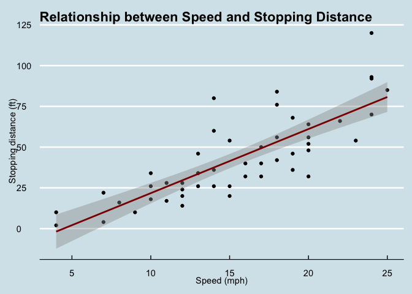
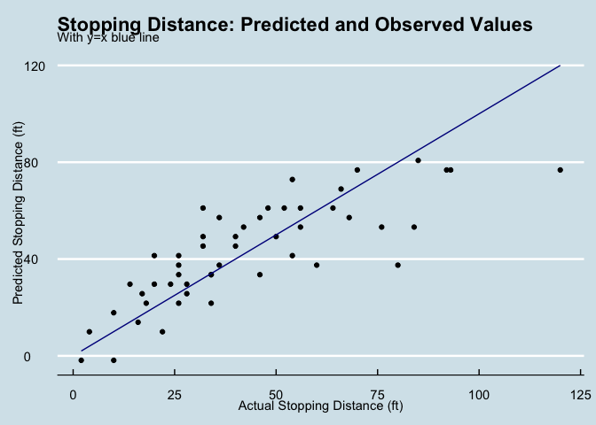
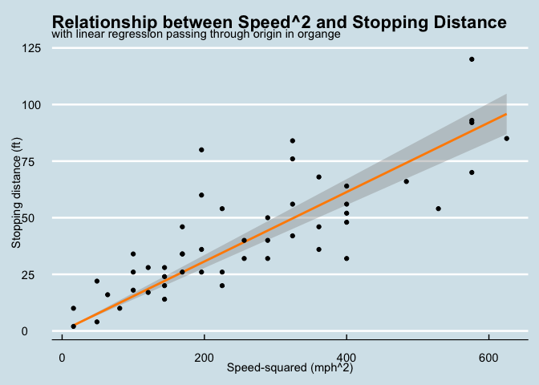
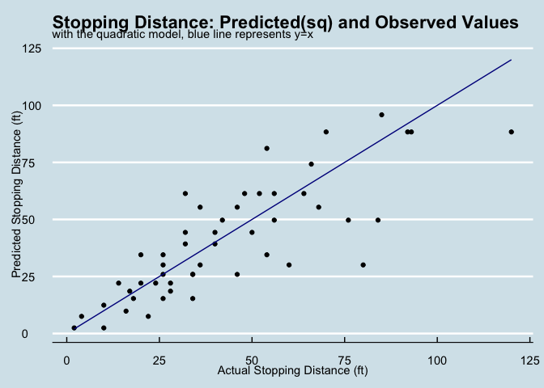
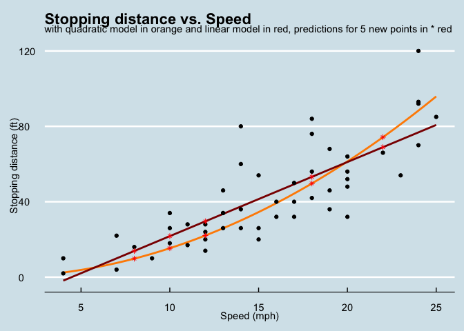

Linear Regression
================

## Linear Regression

``` r
library(readr)
library(dplyr)
library(ggplot2)
library(visdat)
library(tidyr)
library(ggthemes)
```

This is the most simple and classic machine learning algorithm: linear
regression. Here build the model with the goal to predict the stopping
distance (ft) for a given speed value (mph).

``` r
glimpse(cars)
```

    ## Rows: 50
    ## Columns: 2
    ## $ speed <dbl> 4, 4, 7, 7, 8, 9, 10, 10, 10, 11, 11, 12, 12, 12, 12, 13, 13, 13…
    ## $ dist  <dbl> 2, 10, 4, 22, 16, 10, 18, 26, 34, 17, 28, 14, 20, 24, 28, 26, 34…

A linear regression model tries to establish a linear relationship
between an independent variable and one or several dependent variables.
Here the independent variable = speed and the dependent variable =
stopping distance. That is, we want to find coefficients β0 and β1 such
that we can write: dist= β0 + β1\*speed.

If we could figure out the values of these coefficients, then giving a
new value for speed we could use the formula to predict a value for
dist.

Before building a model, it is a good idea to take a visual look at the
data. This can reveal some information already about the type of
relationship to be expected between the variables.

``` r
cars %>% 
  ggplot(mapping = aes(x=speed, y=dist)) +
  geom_point() +
  geom_smooth(method='lm', formula = y ~ x, se = TRUE, color="darkred") +
  labs(title="Relationship between Speed and Stopping Distance",
       x="Speed (mph)",
       y="Stopping distance (ft)")+
  theme_economist()
```

<!-- -->

From this plot, we can already tell there seems to be a linear
relationship between the two variables: the higher the speed, the higher
the distance. This gives us the reassurance that a linear regression
model is appropriate in this situation. To build a linear regression
model in R we can use the special function lm().

``` r
cars_lm <- lm(dist ~ speed, data = cars)

cars_lm
```

    ## 
    ## Call:
    ## lm(formula = dist ~ speed, data = cars)
    ## 
    ## Coefficients:
    ## (Intercept)        speed  
    ##     -17.579        3.932

This tells us that the relationship predicted by our model is dist =
-17.5790949 + -17.5790949\*speed.

To see if our model is any good, we can compare the values predicted by
the model versus the actual values. We save these values in a new column
of the dataset named predicted.

``` r
cars$predicted <- cars_lm$fitted.values

head(cars)
```

    ##   speed dist predicted
    ## 1     4    2 -1.849460
    ## 2     4   10 -1.849460
    ## 3     7    4  9.947766
    ## 4     7   22  9.947766
    ## 5     8   16 13.880175
    ## 6     9   10 17.812584

We can now plot the predicted values against the true values to get a
visual idea of how well our model did.

``` r
ggplot(data = cars, 
       mapping = aes(x = dist, y = predicted)) +
  geom_point() +
  geom_line(data=cars, aes(x=dist, y=dist), color="darkblue", alpha=1)+
  labs(title = "Stopping Distance: Predicted and Observed Values",
       subtitle = "With y=x blue line",
       x = "Actual Stopping Distance (ft)",
       y = "Predicted Stopping Distance (ft)") +
  theme_economist()
```

<!-- -->

**Comments on this graph**: If the model were to predict the true values
exactly, then all the points would lie on the line y=x. We can see that
our points tend to be not too far from this line, except for the higher
values of speed & distance.

Now we can check how well the model fits the data by calling the summary
function.

``` r
summary(cars_lm)
```

    ## 
    ## Call:
    ## lm(formula = dist ~ speed, data = cars)
    ## 
    ## Residuals:
    ##     Min      1Q  Median      3Q     Max 
    ## -29.069  -9.525  -2.272   9.215  43.201 
    ## 
    ## Coefficients:
    ##             Estimate Std. Error t value Pr(>|t|)    
    ## (Intercept) -17.5791     6.7584  -2.601   0.0123 *  
    ## speed         3.9324     0.4155   9.464 1.49e-12 ***
    ## ---
    ## Signif. codes:  0 '***' 0.001 '**' 0.01 '*' 0.05 '.' 0.1 ' ' 1
    ## 
    ## Residual standard error: 15.38 on 48 degrees of freedom
    ## Multiple R-squared:  0.6511, Adjusted R-squared:  0.6438 
    ## F-statistic: 89.57 on 1 and 48 DF,  p-value: 1.49e-12

We can see that the p-value of our model is 1.489836e-12. We check
whether the p-value is smaller than 0.05, and we can conclude that in
this case our model is statistically significant.

The null hypothesis here would be that there is no linear relationship
between our variables. Or in other words, that the coefficient β1
corresponding to the variable speed is zero. The alternative hypothesis
is that there is a linear relationship between speed and dist. In our
case, since the p-value is less than the significance level (\< 0.05),
we can safely reject the null hypothesis.

Below is some code on how to access different elements from the
summary() function of the linear model.

``` r
summary(cars_lm)$coefficients
```

    ##               Estimate Std. Error   t value     Pr(>|t|)
    ## (Intercept) -17.579095  6.7584402 -2.601058 1.231882e-02
    ## speed         3.932409  0.4155128  9.463990 1.489836e-12

``` r
summary(cars_lm)$coefficients["speed", "Pr(>|t|)"]
```

    ## [1] 1.489836e-12

``` r
summary(cars_lm)$coefficients["(Intercept)", "Pr(>|t|)"]
```

    ## [1] 0.01231882

``` r
summary(cars_lm)$coefficients["speed",]
```

    ##     Estimate   Std. Error      t value     Pr(>|t|) 
    ## 3.932409e+00 4.155128e-01 9.463990e+00 1.489836e-12

``` r
summary(cars_lm)$r.squared
```

    ## [1] 0.6510794

``` r
summary(cars_lm)$adj.r.squared
```

    ## [1] 0.6438102

``` r
summary(cars_lm)$fstatistic
```

    ##    value    numdf    dendf 
    ## 89.56711  1.00000 48.00000

``` r
#define function to extract overall p-value of model
overall_p <- function(cars_lm) {
    f <- summary(cars_lm)$fstatistic
    p <- pf(f[1],f[2],f[3],lower.tail=F)
    attributes(p) <- NULL
    return(p)
}

overall_p(cars_lm)
```

    ## [1] 1.489836e-12

Now that we have our model and we’re reasonably confident in it, we can
use it to predict new values. Let’s suppose that we have 5 new
observations with the following values:

``` r
cars_new <- tibble(speed = c(10, 12, 18, 8, 22))

cars_new
```

    ## # A tibble: 5 × 1
    ##   speed
    ##   <dbl>
    ## 1    10
    ## 2    12
    ## 3    18
    ## 4     8
    ## 5    22

We can use the predict() function to predict the distance variable for
each of these new observations using the regression model cars.lm that
we just built.

``` r
predict(object = cars_lm, newdata = cars_new)
```

    ##        1        2        3        4        5 
    ## 21.74499 29.60981 53.20426 13.88018 68.93390

But we saw above that the relationship between speed and stopping
distance may in fact be quadratic. So let’s redo the exercise for a
quadratic relationship.

First we create a new column equal to speed squared.

``` r
cars$speed^2
```

    ##  [1]  16  16  49  49  64  81 100 100 100 121 121 144 144 144 144 169 169 169 169
    ## [20] 196 196 196 196 225 225 225 256 256 289 289 289 324 324 324 324 361 361 361
    ## [39] 400 400 400 400 400 484 529 576 576 576 576 625

Then, plot the new linear relationship between speed-squared and
stopping distance.

``` r
cars %>% 
  ggplot(mapping = aes(x=speed^2, y=dist)) +
  geom_smooth(method='lm', formula = y ~ -1 + I(x), se = TRUE, color="darkorange") +
  geom_point() +
  labs(title="Relationship between Speed^2 and Stopping Distance",
       subtitle="with linear regression passing through origin in organge",
       x="Speed-squared (mph^2)",
       y="Stopping distance (ft)") +
  theme_economist()
```

<!-- -->

Now fitting the new quadratic model with the constraint that the
intercept should be 0.

``` r
cars_lm_squared <- lm(dist ~ -1 + I(speed^2), data = cars) # with intercept =0

cars_lm_squared
```

    ## 
    ## Call:
    ## lm(formula = dist ~ -1 + I(speed^2), data = cars)
    ## 
    ## Coefficients:
    ## I(speed^2)  
    ##     0.1534

Let’s save the newly predicted values.

``` r
cars$predicted_squared <- cars_lm_squared$fitted.values

head(cars)
```

    ##   speed dist predicted predicted_squared
    ## 1     4    2 -1.849460          2.453980
    ## 2     4   10 -1.849460          2.453980
    ## 3     7    4  9.947766          7.515314
    ## 4     7   22  9.947766          7.515314
    ## 5     8   16 13.880175          9.815920
    ## 6     9   10 17.812584         12.423274

Let’s visualize predictions of the stopping distance against the actual
stopping distance.

``` r
ggplot(data = cars, 
       mapping = aes(x = dist, y = predicted_squared)) +
  geom_point() +
  geom_line(data=cars, aes(x=dist, y=dist), color="darkblue", alpha=1)+
  labs(title = "Stopping Distance: Predicted(sq) and Observed Values",
       subtitle = "with the quadratic model, blue line represents y=x",
       x = "Actual Stopping Distance (ft)",
       y = "Predicted Stopping Distance (ft)") +
  theme_economist()
```

<!-- -->

Check model statistics.

``` r
summary(cars_lm_squared)
```

    ## 
    ## Call:
    ## lm(formula = dist ~ -1 + I(speed^2), data = cars)
    ## 
    ## Residuals:
    ##     Min      1Q  Median      3Q     Max 
    ## -29.350  -7.988   1.325   8.080  49.939 
    ## 
    ## Coefficients:
    ##            Estimate Std. Error t value Pr(>|t|)    
    ## I(speed^2) 0.153374   0.007122   21.54   <2e-16 ***
    ## ---
    ## Signif. codes:  0 '***' 0.001 '**' 0.01 '*' 0.05 '.' 0.1 ' ' 1
    ## 
    ## Residual standard error: 15.61 on 49 degrees of freedom
    ## Multiple R-squared:  0.9044, Adjusted R-squared:  0.9025 
    ## F-statistic: 463.8 on 1 and 49 DF,  p-value: < 2.2e-16

And compute predicted values for stopping distance in ft.

``` r
predict(object = cars_lm_squared, newdata = cars_new)
```

    ##        1        2        3        4        5 
    ## 15.33738 22.08582 49.69310  9.81592 74.23290

The graph below plots the original dataset and the two linear models
built and tested.

``` r
cars_new
```

    ## # A tibble: 5 × 1
    ##   speed
    ##   <dbl>
    ## 1    10
    ## 2    12
    ## 3    18
    ## 4     8
    ## 5    22

``` r
cars_predicted <- tibble(predicted = predict(object = cars_lm, newdata = cars_new))

cars_predicted
```

    ## # A tibble: 5 × 1
    ##   predicted
    ##       <dbl>
    ## 1      21.7
    ## 2      29.6
    ## 3      53.2
    ## 4      13.9
    ## 5      68.9

``` r
cars_predicted_sq <- tibble(predicted_sq = predict(object = cars_lm_squared, newdata = cars_new))

new_tibble <- bind_cols(cars_new, cars_predicted, cars_predicted_sq)
```

``` r
cars %>% ggplot(aes(x = speed, y = dist)) +
  geom_smooth(method='lm', formula = y ~ -1 + I(x^2), se = FALSE, color="darkorange") +
  geom_smooth(method='lm', formula = y ~ x, se = FALSE, color="darkred") +
  geom_point() +
  geom_point(data=new_tibble, aes(x=speed, y=predicted), shape=8, alpha=1, color="red") +
  geom_point(data=new_tibble, aes(x=speed, y=predicted_sq), shape=8, alpha=1, color="red") +
  #xlim(-5, 35) +
  #ylim(-5, 150) +
  labs(title = "Stopping distance vs. Speed",
       subtitle = "with quadratic model in orange and linear model in red, predictions for 5 new points in * red",
       x = "Speed (mph)",
       y = "Stopping distance (ft)") +
  theme_economist()
```

<!-- -->
