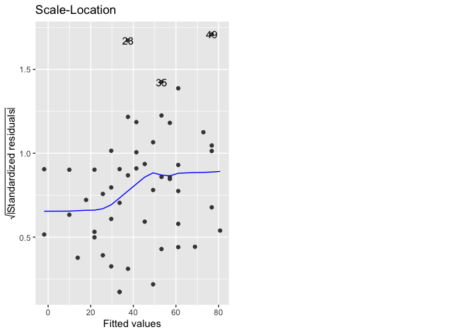
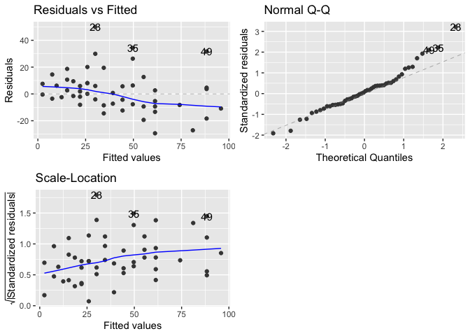

Linear Regression
================

## Linear Regression

``` r
library(readr)
library(dplyr)
library(ggplot2)
library(visdat)
library(tidyr)
library(ggthemes)
```

This is the most simple and classic machine learning algorithm: linear
regression. Here build the model with the goal to predict the stopping
distance (ft) for a given speed value (mph).

``` r
glimpse(cars)
```

    ## Rows: 50
    ## Columns: 2
    ## $ speed <dbl> 4, 4, 7, 7, 8, 9, 10, 10, 10, 11, 11, 12, 12, 12, 12, 13, 13, 13…
    ## $ dist  <dbl> 2, 10, 4, 22, 16, 10, 18, 26, 34, 17, 28, 14, 20, 24, 28, 26, 34…

A linear regression model tries to establish a linear relationship
between an independent variable and one or several dependent variables.
Here the independent variable = speed and the dependent variable =
stopping distance. That is, we want to find coefficients β0 and β1 such
that we can write: dist= β0 + β1\*speed.

If we could figure out the values of these coefficients, then giving a
new value for speed we could use the formula to predict a value for
dist.

First a few descriptive statistics.

``` r
cars %>% 
  summarise_all(mean)
```

    ##   speed  dist
    ## 1  15.4 42.98

Or even better:

``` r
summary(cars)
```

    ##      speed           dist       
    ##  Min.   : 4.0   Min.   :  2.00  
    ##  1st Qu.:12.0   1st Qu.: 26.00  
    ##  Median :15.0   Median : 36.00  
    ##  Mean   :15.4   Mean   : 42.98  
    ##  3rd Qu.:19.0   3rd Qu.: 56.00  
    ##  Max.   :25.0   Max.   :120.00

There is a strong positive correlation between the two variables.

``` r
cars %>% 
  summarise(correlation=cor(speed, dist, method="pearson"))
```

    ##   correlation
    ## 1   0.8068949

Before building a model, it is a good idea to take a visual look at the
data. This can reveal some information already about the type of
relationship to be expected between the variables.

``` r
cars %>% 
  ggplot(mapping = aes(x=speed, y=dist)) +
  geom_point() +
  geom_smooth(method='lm', formula = y ~ x, se = TRUE, color="darkred") +
  labs(title="Relationship between Speed and Stopping Distance",
       subtitle="with a linear model in dark red",
       x="Speed (mph)",
       y="Stopping distance (ft)")+
  theme_economist()
```

<!-- -->

From this plot, we can already tell there seems to be a linear
relationship between the two variables: the higher the speed, the higher
the distance. This gives us the reassurance that a linear regression
model is appropriate in this situation. To build a linear regression
model in R we can use the special function lm().

``` r
cars_lm <- lm(dist ~ speed, data = cars) # the first variable is the dependent one/the response variable, the one to predict

cars_lm
```

    ## 
    ## Call:
    ## lm(formula = dist ~ speed, data = cars)
    ## 
    ## Coefficients:
    ## (Intercept)        speed  
    ##     -17.579        3.932

This tells us that the relationship predicted by our model is dist =
-17.5790949 + -17.5790949\*speed.

This means that for every 1 additional mph, the stopping distance
increases by nearly 4 ft (-17.5790949 to be precise).

To see if our model is any good, we can compare the values predicted by
the model versus the actual values. We save these values in a new column
of the dataset named predicted.

``` r
cars$predicted <- cars_lm$fitted.values

head(cars)
```

    ##   speed dist predicted
    ## 1     4    2 -1.849460
    ## 2     4   10 -1.849460
    ## 3     7    4  9.947766
    ## 4     7   22  9.947766
    ## 5     8   16 13.880175
    ## 6     9   10 17.812584

We can now plot the predicted values against the true values to get a
visual idea of how well our model did.

``` r
ggplot(data = cars, 
       mapping = aes(x = dist, y = predicted)) +
  geom_point() +
  geom_line(data=cars, aes(x=dist, y=dist), color="darkblue", alpha=1)+
  labs(title = "Stopping Distance: Predicted and Observed Values",
       subtitle = "With y=x blue line",
       x = "Actual Stopping Distance (ft)",
       y = "Predicted Stopping Distance (ft)") +
  theme_economist()
```

<!-- -->

**Comments on this graph**: If the model were to predict the true values
exactly, then all the points would lie on the line y=x. We can see that
our points tend to be not too far from this line, except for the higher
values of speed & distance.

Now we can check how well the model fits the data by calling the summary
function.

``` r
summary(cars_lm)
```

    ## 
    ## Call:
    ## lm(formula = dist ~ speed, data = cars)
    ## 
    ## Residuals:
    ##     Min      1Q  Median      3Q     Max 
    ## -29.069  -9.525  -2.272   9.215  43.201 
    ## 
    ## Coefficients:
    ##             Estimate Std. Error t value Pr(>|t|)    
    ## (Intercept) -17.5791     6.7584  -2.601   0.0123 *  
    ## speed         3.9324     0.4155   9.464 1.49e-12 ***
    ## ---
    ## Signif. codes:  0 '***' 0.001 '**' 0.01 '*' 0.05 '.' 0.1 ' ' 1
    ## 
    ## Residual standard error: 15.38 on 48 degrees of freedom
    ## Multiple R-squared:  0.6511, Adjusted R-squared:  0.6438 
    ## F-statistic: 89.57 on 1 and 48 DF,  p-value: 1.49e-12

We can see that the p-value of our model is 1.489836e-12. We check
whether the p-value is smaller than 0.05, and we can conclude that in
this case our model is statistically significant.

The null hypothesis here would be that there is no linear relationship
between our variables. Or in other words, that the coefficient β1
corresponding to the variable speed is zero. The alternative hypothesis
is that there is a linear relationship between speed and dist. In our
case, since the p-value is less than the significance level (\< 0.05),
we can safely reject the null hypothesis.

The coefficient of determination (R-squared) = the proportion of the
variance in the response variable that is predictable from the
explanatory variable. 1=perfect fit to the data, 0=model is no better
than randomness. In summary it appears as multiple r-squared. For a
simple linear regression, R-squared= correlation squared.

Residual standard error (RSE) = difference between predicted value and
observed value = how much the predictions are typically wrong by, same
measurement unit as the response variable. The model above is wrong by
about 15 ft. This measure appears as sigma in the glance()-generated
model-level values tibble. It is a measure of accuracy for regression
models.

Another related measure is root mean-square error (RMSE), with a
slightly different calculations. Quantifies how inaccurate the
predictions are

Below is some code on how to access different elements from the
summary() function of the linear model.

``` r
summary(cars_lm)$coefficients
```

    ##               Estimate Std. Error   t value     Pr(>|t|)
    ## (Intercept) -17.579095  6.7584402 -2.601058 1.231882e-02
    ## speed         3.932409  0.4155128  9.463990 1.489836e-12

``` r
summary(cars_lm)$coefficients["speed", "Pr(>|t|)"]
```

    ## [1] 1.489836e-12

``` r
summary(cars_lm)$coefficients["(Intercept)", "Pr(>|t|)"]
```

    ## [1] 0.01231882

``` r
summary(cars_lm)$coefficients["speed",]
```

    ##     Estimate   Std. Error      t value     Pr(>|t|) 
    ## 3.932409e+00 4.155128e-01 9.463990e+00 1.489836e-12

``` r
summary(cars_lm)$r.squared
```

    ## [1] 0.6510794

``` r
summary(cars_lm)$adj.r.squared
```

    ## [1] 0.6438102

``` r
summary(cars_lm)$fstatistic
```

    ##    value    numdf    dendf 
    ## 89.56711  1.00000 48.00000

``` r
#define function to extract overall p-value of model
overall_p <- function(cars_lm) {
    f <- summary(cars_lm)$fstatistic
    p <- pf(f[1],f[2],f[3],lower.tail=F)
    attributes(p) <- NULL
    return(p)
}

overall_p(cars_lm)
```

    ## [1] 1.489836e-12

And additional code to access model elements.

``` r
coefficients(cars_lm) # another way to access the coefficients
```

    ## (Intercept)       speed 
    ##  -17.579095    3.932409

``` r
fitted(cars_lm) # model predicted values on the original dataset
```

    ##         1         2         3         4         5         6         7         8 
    ## -1.849460 -1.849460  9.947766  9.947766 13.880175 17.812584 21.744993 21.744993 
    ##         9        10        11        12        13        14        15        16 
    ## 21.744993 25.677401 25.677401 29.609810 29.609810 29.609810 29.609810 33.542219 
    ##        17        18        19        20        21        22        23        24 
    ## 33.542219 33.542219 33.542219 37.474628 37.474628 37.474628 37.474628 41.407036 
    ##        25        26        27        28        29        30        31        32 
    ## 41.407036 41.407036 45.339445 45.339445 49.271854 49.271854 49.271854 53.204263 
    ##        33        34        35        36        37        38        39        40 
    ## 53.204263 53.204263 53.204263 57.136672 57.136672 57.136672 61.069080 61.069080 
    ##        41        42        43        44        45        46        47        48 
    ## 61.069080 61.069080 61.069080 68.933898 72.866307 76.798715 76.798715 76.798715 
    ##        49        50 
    ## 76.798715 80.731124

``` r
residuals(cars_lm) # actual response minus predicted values
```

    ##          1          2          3          4          5          6          7 
    ##   3.849460  11.849460  -5.947766  12.052234   2.119825  -7.812584  -3.744993 
    ##          8          9         10         11         12         13         14 
    ##   4.255007  12.255007  -8.677401   2.322599 -15.609810  -9.609810  -5.609810 
    ##         15         16         17         18         19         20         21 
    ##  -1.609810  -7.542219   0.457781   0.457781  12.457781 -11.474628  -1.474628 
    ##         22         23         24         25         26         27         28 
    ##  22.525372  42.525372 -21.407036 -15.407036  12.592964 -13.339445  -5.339445 
    ##         29         30         31         32         33         34         35 
    ## -17.271854  -9.271854   0.728146 -11.204263   2.795737  22.795737  30.795737 
    ##         36         37         38         39         40         41         42 
    ## -21.136672 -11.136672  10.863328 -29.069080 -13.069080  -9.069080  -5.069080 
    ##         43         44         45         46         47         48         49 
    ##   2.930920  -2.933898 -18.866307  -6.798715  15.201285  16.201285  43.201285 
    ##         50 
    ##   4.268876

We can use the {broom} package to do some further data manipulations on
the model results.

``` r
library(broom)

tidy(cars_lm) # obtain a tibble with the estimation results
```

    ## # A tibble: 2 × 5
    ##   term        estimate std.error statistic  p.value
    ##   <chr>          <dbl>     <dbl>     <dbl>    <dbl>
    ## 1 (Intercept)   -17.6      6.76      -2.60 1.23e- 2
    ## 2 speed           3.93     0.416      9.46 1.49e-12

``` r
augment(cars_lm) # observation-level results, fitted are the fitted values and .resid contains the residuals
```

    ## # A tibble: 50 × 8
    ##     dist speed .fitted .resid   .hat .sigma  .cooksd .std.resid
    ##    <dbl> <dbl>   <dbl>  <dbl>  <dbl>  <dbl>    <dbl>      <dbl>
    ##  1     2     4   -1.85   3.85 0.115    15.5 0.00459       0.266
    ##  2    10     4   -1.85  11.8  0.115    15.4 0.0435        0.819
    ##  3     4     7    9.95  -5.95 0.0715   15.5 0.00620      -0.401
    ##  4    22     7    9.95  12.1  0.0715   15.4 0.0255        0.813
    ##  5    16     8   13.9    2.12 0.0600   15.5 0.000645      0.142
    ##  6    10     9   17.8   -7.81 0.0499   15.5 0.00713      -0.521
    ##  7    18    10   21.7   -3.74 0.0413   15.5 0.00133      -0.249
    ##  8    26    10   21.7    4.26 0.0413   15.5 0.00172       0.283
    ##  9    34    10   21.7   12.3  0.0413   15.4 0.0143        0.814
    ## 10    17    11   25.7   -8.68 0.0341   15.5 0.00582      -0.574
    ## # ℹ 40 more rows

``` r
glance(cars_lm) # model-level results
```

    ## # A tibble: 1 × 12
    ##   r.squared adj.r.squared sigma statistic  p.value    df logLik   AIC   BIC
    ##       <dbl>         <dbl> <dbl>     <dbl>    <dbl> <dbl>  <dbl> <dbl> <dbl>
    ## 1     0.651         0.644  15.4      89.6 1.49e-12     1  -207.  419.  425.
    ## # ℹ 3 more variables: deviance <dbl>, df.residual <int>, nobs <int>

``` r
#to access the R-squared value
glance(cars_lm) %>% 
  pull(r.squared)
```

    ## [1] 0.6510794

Now that we have our model and we’re reasonably confident in it, we can
use it to predict new values. Let’s suppose that we have 5 new
observations with the following values:

``` r
cars_new <- tibble(speed = c(10, 12, 18, 8, 22))

cars_new
```

    ## # A tibble: 5 × 1
    ##   speed
    ##   <dbl>
    ## 1    10
    ## 2    12
    ## 3    18
    ## 4     8
    ## 5    22

We can use the predict() function to predict the distance variable for
each of these new observations using the regression model cars.lm that
we just built.

``` r
predict(object = cars_lm, newdata = cars_new)
```

    ##        1        2        3        4        5 
    ## 21.74499 29.60981 53.20426 13.88018 68.93390

But we saw above that the relationship between speed and stopping
distance may in fact be quadratic. So let’s redo the exercise for a
quadratic relationship.

First we create a new column equal to speed squared.

``` r
cars$speed^2
```

    ##  [1]  16  16  49  49  64  81 100 100 100 121 121 144 144 144 144 169 169 169 169
    ## [20] 196 196 196 196 225 225 225 256 256 289 289 289 324 324 324 324 361 361 361
    ## [39] 400 400 400 400 400 484 529 576 576 576 576 625

Then, plot the new linear relationship between speed-squared and
stopping distance.

``` r
cars %>% 
  ggplot(mapping = aes(x=speed^2, y=dist)) +
  geom_smooth(method='lm', formula = y ~ x + 0, se = TRUE, color="darkorange") + #alternative code y ~ -1 + I(x)
  geom_point() +
  labs(title="Relationship between Speed^2 and Stopping Distance",
       subtitle="with linear regression passing through origin in organge",
       x="Speed-squared (mph^2)",
       y="Stopping distance (ft)") +
  theme_economist()
```

<!-- -->

Now fitting the new quadratic model with the constraint that the
intercept should be 0.

``` r
cars_lm_squared <- lm(dist ~ -1 + I(speed^2), data = cars) # with intercept =0

cars_lm_squared
```

    ## 
    ## Call:
    ## lm(formula = dist ~ -1 + I(speed^2), data = cars)
    ## 
    ## Coefficients:
    ## I(speed^2)  
    ##     0.1534

Let’s save the newly predicted values.

``` r
cars$predicted_squared <- cars_lm_squared$fitted.values

head(cars)
```

    ##   speed dist predicted predicted_squared
    ## 1     4    2 -1.849460          2.453980
    ## 2     4   10 -1.849460          2.453980
    ## 3     7    4  9.947766          7.515314
    ## 4     7   22  9.947766          7.515314
    ## 5     8   16 13.880175          9.815920
    ## 6     9   10 17.812584         12.423274

Let’s visualize predictions of the stopping distance against the actual
stopping distance.

``` r
ggplot(data = cars, 
       mapping = aes(x = dist, y = predicted_squared)) +
  geom_point() +
  geom_line(data=cars, aes(x=dist, y=dist), color="darkblue", alpha=1)+ # or use geom_abline(color="darkblue", alpha=1)+
  labs(title = "Stopping Distance: Predicted(sq) and Observed Values",
       subtitle = "with the quadratic model, blue line represents y=x",
       x = "Actual Stopping Distance (ft)",
       y = "Predicted Stopping Distance (ft)") +
  theme_economist()
```

<!-- -->

Check model statistics.

``` r
summary(cars_lm_squared)
```

    ## 
    ## Call:
    ## lm(formula = dist ~ -1 + I(speed^2), data = cars)
    ## 
    ## Residuals:
    ##     Min      1Q  Median      3Q     Max 
    ## -29.350  -7.988   1.325   8.080  49.939 
    ## 
    ## Coefficients:
    ##            Estimate Std. Error t value Pr(>|t|)    
    ## I(speed^2) 0.153374   0.007122   21.54   <2e-16 ***
    ## ---
    ## Signif. codes:  0 '***' 0.001 '**' 0.01 '*' 0.05 '.' 0.1 ' ' 1
    ## 
    ## Residual standard error: 15.61 on 49 degrees of freedom
    ## Multiple R-squared:  0.9044, Adjusted R-squared:  0.9025 
    ## F-statistic: 463.8 on 1 and 49 DF,  p-value: < 2.2e-16

And compute predicted values for stopping distance in ft.

``` r
predict(object = cars_lm_squared, newdata = cars_new)
```

    ##        1        2        3        4        5 
    ## 15.33738 22.08582 49.69310  9.81592 74.23290

The graph below plots the original dataset and the two linear models
built and tested.

``` r
cars_new
```

    ## # A tibble: 5 × 1
    ##   speed
    ##   <dbl>
    ## 1    10
    ## 2    12
    ## 3    18
    ## 4     8
    ## 5    22

``` r
cars_predicted <- tibble(predicted = predict(object = cars_lm, newdata = cars_new))

cars_predicted
```

    ## # A tibble: 5 × 1
    ##   predicted
    ##       <dbl>
    ## 1      21.7
    ## 2      29.6
    ## 3      53.2
    ## 4      13.9
    ## 5      68.9

``` r
cars_predicted_sq <- tibble(predicted_sq = predict(object = cars_lm_squared, newdata = cars_new))

new_tibble <- bind_cols(cars_new, cars_predicted, cars_predicted_sq)
```

``` r
cars %>% ggplot(aes(x = speed, y = dist)) +
  geom_smooth(method='lm', formula = y ~ -1 + I(x^2), se = FALSE, color="darkorange") +
  geom_smooth(method='lm', formula = y ~ x, se = FALSE, color="darkred") +
  geom_point() +
  geom_point(data=new_tibble, aes(x=speed, y=predicted), shape=8, alpha=1, color="red") +
  geom_point(data=new_tibble, aes(x=speed, y=predicted_sq), shape=8, alpha=1, color="red") +
  xlim(0, 25) +
  ylim(0, 125) +
  labs(title = "Stopping distance vs. Speed",
       subtitle = "with quadratic model in orange and linear model in red, predictions for 5 new points in * red",
       x = "Speed (mph)",
       y = "Stopping distance (ft)") +
  theme_economist()
```

    ## Warning: Removed 2 rows containing missing values or values outside the scale range
    ## (`geom_smooth()`).

<!-- -->

``` r
  #coord_fixed() # to have coordinates on the same scale, here that does not work
```

Other possible transformations to the linear regression: square root
(sqrt()) vs square root – when the data are right-skewed (agglomeration
of most dots in the lower left hand quadrant). Applying the square root
transformation makes the data more spread out. To see the predictions in
the original scale we need to apply back transformations (^2).

``` r
cars %>% 
  ggplot(aes(x=sqrt(speed), y=dist))+
  geom_point()+
  geom_smooth(method='lm', se=TRUE)+
  theme_economist()+
  labs(title="Another model for the relationship stopping distance & speed")
```

    ## `geom_smooth()` using formula = 'y ~ x'

<!-- -->

``` r
cars_squared <- lm(dist ~ sqrt(speed), data=cars)

cars_squared
```

    ## 
    ## Call:
    ## lm(formula = dist ~ sqrt(speed), data = cars)
    ## 
    ## Coefficients:
    ## (Intercept)  sqrt(speed)  
    ##      -65.82        28.19

``` r
summary(cars_squared)
```

    ## 
    ## Call:
    ## lm(formula = dist ~ sqrt(speed), data = cars)
    ## 
    ## Residuals:
    ##     Min      1Q  Median      3Q     Max 
    ## -28.258 -10.969  -2.978  10.518  47.709 
    ## 
    ## Coefficients:
    ##             Estimate Std. Error t value Pr(>|t|)    
    ## (Intercept)  -65.819     12.555  -5.242 3.51e-06 ***
    ## sqrt(speed)   28.192      3.199   8.812 1.34e-11 ***
    ## ---
    ## Signif. codes:  0 '***' 0.001 '**' 0.01 '*' 0.05 '.' 0.1 ' ' 1
    ## 
    ## Residual standard error: 16.09 on 48 degrees of freedom
    ## Multiple R-squared:  0.618,  Adjusted R-squared:   0.61 
    ## F-statistic: 77.65 on 1 and 48 DF,  p-value: 1.345e-11

``` r
explanatory_data <- tibble(speed=seq(2, 5, 0.5) ^2) # generate some speeds

explanatory_data
```

    ## # A tibble: 7 × 1
    ##   speed
    ##   <dbl>
    ## 1  4   
    ## 2  6.25
    ## 3  9   
    ## 4 12.2 
    ## 5 16   
    ## 6 20.2 
    ## 7 25

``` r
prediction_data <- explanatory_data %>% 
  mutate(dist= predict(cars_squared, explanatory_data)) # add predictions

prediction_data
```

    ## # A tibble: 7 × 2
    ##   speed  dist
    ##   <dbl> <dbl>
    ## 1  4    -9.44
    ## 2  6.25  4.66
    ## 3  9    18.8 
    ## 4 12.2  32.9 
    ## 5 16    46.9 
    ## 6 20.2  61.0 
    ## 7 25    75.1

``` r
cars %>% 
  ggplot(aes(x=sqrt(speed), y=dist))+
  geom_point()+
  geom_smooth(method="lm") +
  geom_point(data=prediction_data, aes(x=sqrt(speed), y=dist), color="green", size=3)+
  theme_economist()+
  labs(title="Model results")
```

    ## `geom_smooth()` using formula = 'y ~ x'

<!-- -->

Plotting all models in the original coordinates.

``` r
cars %>% ggplot(aes(x = speed, y = dist)) +
  geom_smooth(method='lm', formula = y ~ -1 + I(x^2), se = FALSE, color="darkorange") +
  geom_smooth(method='lm', formula = y ~ x, se = FALSE, color="darkred") +
  geom_smooth(method='lm', formula = y ~ sqrt(x), se = FALSE, color="cornflowerblue") +
  geom_point() +
  geom_point(data=new_tibble, aes(x=speed, y=predicted), shape=8, alpha=1, color="red") +
  geom_point(data=new_tibble, aes(x=speed, y=predicted_sq), shape=8, alpha=1, color="red") +
  xlim(0, 25) +
  ylim(0, 125) +
  labs(title = "Stopping distance vs. Speed",
       subtitle = "quadratic model=orange; linear model =red; sqrt model=blue; predictions for 5 new points in * red",
       x = "Speed (mph)",
       y = "Stopping distance (ft)") +
  theme_economist()
```

    ## Warning: Removed 2 rows containing missing values or values outside the scale range
    ## (`geom_smooth()`).

    ## Warning: Removed 6 rows containing missing values or values outside the scale range
    ## (`geom_smooth()`).

<!-- -->

## Analyzing residuals

Using {ggfortify} to autoplot residuals

In general we hope residuals are normally distributed and have a mean
value of 0.

Diagnostic plots:

### Residuals vs fitted values with smooth loess curve

If assumption respected, the trend line should follow the y=0 horizontal
line. Shows whether residuals get positive or negative when the fitted
values change.

### Q-Q plot: do residuals follow a normal distribution?

Standardized residuals (residuals divided by their standard deviation)
vs. Theoretical Quantiles from the normal distribution. If the residuals
from the model are normally distributed, then the points will track the
line on the Q-Q plot.

The model may not be a good fit for part of the data points.

### Scale-location

Square root of standardized residuals vs the fitted values. In a good
model the size of the residuals shouldn’t change much as the fitted
values change.

Shows whether the size of the residuals gets bigger or smaller as fitted
values change. There should be no trend line, we’re aiming for a loess
curve that follows y=0 or a nearly horizontal line.

``` r
library(ggfortify)

autoplot(cars_lm, which=1)
```

<!-- -->

Here the residuals are above 0 when the fitted values are small or big,
and below zero in the middle.

``` r
autoplot(cars_lm, which=2)
```

<!-- -->

Do residuals follow a normal distribution (are they tracking along the
dotted line)? Mostly yes, but residuals are larger than expected for
high values of stopping distance.

``` r
autoplot(cars_lm, which=3)
```

<!-- -->

Here residuals get bigger as the fitted values increase.

``` r
cars_lm_squared %>% 
  autoplot(which=1:3)
```

<!-- -->

## Types of outliers

- extreme explanatory variable values (the biggest and the smallest)

``` r
cars %>% 
  mutate(has_extreme_speed = speed < 5 | speed > 24) %>% 
  ggplot(aes(x=speed, y=dist)) +
  geom_point(aes(color=has_extreme_speed)) +
  geom_smooth(method="lm") +
  theme_economist()+
  labs(title="Speed-stopping distance relationship, possible outliers",
       subtitle="extreme speed values")
```

    ## `geom_smooth()` using formula = 'y ~ x'

<!-- -->

- when the point lies a long way from model predictions

``` r
cars %>% 
  mutate(has_extreme_speed = speed < 5 | speed > 24,
         has_extreme_dist = dist>100) %>% 
  ggplot(aes(x=speed, y=dist)) +
  geom_point(aes(color=has_extreme_speed,
                 shape=has_extreme_dist), size=3) +
  geom_smooth(method="lm") +
  theme_economist()+
  labs(title="Speed-stopping distance relationship, possible outliers",
       subtitle="extreme speed values")
```

    ## `geom_smooth()` using formula = 'y ~ x'

<!-- -->

Leverage is a measure of how extreme the outliers are based on
explanatory variables (the first type of outliers).

Here we can see that the two blue points in the lower left quadrant have
higher leverage than the blue points in the upper right quadrant.

``` r
# calculating leverage in R
hatvalues(cars_lm)
```

    ##          1          2          3          4          5          6          7 
    ## 0.11486131 0.11486131 0.07150365 0.07150365 0.05997080 0.04989781 0.04128467 
    ##          8          9         10         11         12         13         14 
    ## 0.04128467 0.04128467 0.03413139 0.03413139 0.02843796 0.02843796 0.02843796 
    ##         15         16         17         18         19         20         21 
    ## 0.02843796 0.02420438 0.02420438 0.02420438 0.02420438 0.02143066 0.02143066 
    ##         22         23         24         25         26         27         28 
    ## 0.02143066 0.02143066 0.02011679 0.02011679 0.02011679 0.02026277 0.02026277 
    ##         29         30         31         32         33         34         35 
    ## 0.02186861 0.02186861 0.02186861 0.02493431 0.02493431 0.02493431 0.02493431 
    ##         36         37         38         39         40         41         42 
    ## 0.02945985 0.02945985 0.02945985 0.03544526 0.03544526 0.03544526 0.03544526 
    ##         43         44         45         46         47         48         49 
    ## 0.03544526 0.05179562 0.06216058 0.07398540 0.07398540 0.07398540 0.07398540 
    ##         50 
    ## 0.08727007

``` r
#alternative way to calculate leverage --> .hat

cars_lm %>% 
  augment() %>% 
  arrange(desc(.hat))
```

    ## # A tibble: 50 × 8
    ##     dist speed .fitted .resid   .hat .sigma .cooksd .std.resid
    ##    <dbl> <dbl>   <dbl>  <dbl>  <dbl>  <dbl>   <dbl>      <dbl>
    ##  1     2     4   -1.85   3.85 0.115    15.5 0.00459      0.266
    ##  2    10     4   -1.85  11.8  0.115    15.4 0.0435       0.819
    ##  3    85    25   80.7    4.27 0.0873   15.5 0.00404      0.291
    ##  4    70    24   76.8   -6.80 0.0740   15.5 0.00843     -0.459
    ##  5    92    24   76.8   15.2  0.0740   15.4 0.0421       1.03 
    ##  6    93    24   76.8   16.2  0.0740   15.3 0.0479       1.09 
    ##  7   120    24   76.8   43.2  0.0740   14.1 0.340        2.92 
    ##  8     4     7    9.95  -5.95 0.0715   15.5 0.00620     -0.401
    ##  9    22     7    9.95  12.1  0.0715   15.4 0.0255       0.813
    ## 10    54    23   72.9  -18.9  0.0622   15.3 0.0532      -1.27 
    ## # ℹ 40 more rows

Influence = it shows how much the model would change if we reran it
without an observation. The influence of each observation is based on
size of the residuals and the leverage. We use Cook’s distance, which is
saved as .cooksd in the augmented results table. The bigger the number,
the bigger the influence. It turn out that the highest influence point
here is the one depicted as a triangle in the above graph.

``` r
augment(cars_lm) %>% 
  arrange(desc(.cooksd))
```

    ## # A tibble: 50 × 8
    ##     dist speed .fitted .resid   .hat .sigma .cooksd .std.resid
    ##    <dbl> <dbl>   <dbl>  <dbl>  <dbl>  <dbl>   <dbl>      <dbl>
    ##  1   120    24   76.8    43.2 0.0740   14.1  0.340       2.92 
    ##  2    80    14   37.5    42.5 0.0214   14.2  0.0856      2.80 
    ##  3    32    20   61.1   -29.1 0.0354   14.9  0.0681     -1.92 
    ##  4    54    23   72.9   -18.9 0.0622   15.3  0.0532     -1.27 
    ##  5    84    18   53.2    30.8 0.0249   14.9  0.0526      2.03 
    ##  6    93    24   76.8    16.2 0.0740   15.3  0.0479      1.09 
    ##  7    10     4   -1.85   11.8 0.115    15.4  0.0435      0.819
    ##  8    92    24   76.8    15.2 0.0740   15.4  0.0421      1.03 
    ##  9    36    19   57.1   -21.1 0.0295   15.2  0.0295     -1.40 
    ## 10    76    18   53.2    22.8 0.0249   15.2  0.0288      1.50 
    ## # ℹ 40 more rows

Let’s check what is the influence on the regression line of removing the
observation point with the highest influence.

``` r
# dataset without highest influence point

cleaned_cars <- cars %>% 
  filter(dist!=120) 

cars %>% 
    mutate(has_extreme_dist = dist>100) %>% 
  ggplot(aes(x=speed, y=dist)) +
  geom_point(aes(shape=has_extreme_dist), size=3)+
  geom_smooth(method="lm", color="darkred", se=FALSE) +
  geom_smooth(data=cleaned_cars, method="lm", color="cornflowerblue", se=FALSE)+
  labs(title="Speed vs stopping distance",
       subtitle="with and without the observation with the highest influence")
```

    ## `geom_smooth()` using formula = 'y ~ x'
    ## `geom_smooth()` using formula = 'y ~ x'

<!-- -->

With autoplot it is also possible to plot measures related to the most
influential observations.

``` r
autoplot(cars_lm, which=4:6)
```

<!-- -->

## Linear Regression with a categorical variable

``` r
glimpse(mtcars)
```

    ## Rows: 32
    ## Columns: 11
    ## $ mpg  <dbl> 21.0, 21.0, 22.8, 21.4, 18.7, 18.1, 14.3, 24.4, 22.8, 19.2, 17.8,…
    ## $ cyl  <dbl> 6, 6, 4, 6, 8, 6, 8, 4, 4, 6, 6, 8, 8, 8, 8, 8, 8, 4, 4, 4, 4, 8,…
    ## $ disp <dbl> 160.0, 160.0, 108.0, 258.0, 360.0, 225.0, 360.0, 146.7, 140.8, 16…
    ## $ hp   <dbl> 110, 110, 93, 110, 175, 105, 245, 62, 95, 123, 123, 180, 180, 180…
    ## $ drat <dbl> 3.90, 3.90, 3.85, 3.08, 3.15, 2.76, 3.21, 3.69, 3.92, 3.92, 3.92,…
    ## $ wt   <dbl> 2.620, 2.875, 2.320, 3.215, 3.440, 3.460, 3.570, 3.190, 3.150, 3.…
    ## $ qsec <dbl> 16.46, 17.02, 18.61, 19.44, 17.02, 20.22, 15.84, 20.00, 22.90, 18…
    ## $ vs   <dbl> 0, 0, 1, 1, 0, 1, 0, 1, 1, 1, 1, 0, 0, 0, 0, 0, 0, 1, 1, 1, 1, 0,…
    ## $ am   <dbl> 1, 1, 1, 0, 0, 0, 0, 0, 0, 0, 0, 0, 0, 0, 0, 0, 0, 1, 1, 1, 0, 0,…
    ## $ gear <dbl> 4, 4, 4, 3, 3, 3, 3, 4, 4, 4, 4, 3, 3, 3, 3, 3, 3, 4, 4, 4, 3, 3,…
    ## $ carb <dbl> 4, 4, 1, 1, 2, 1, 4, 2, 2, 4, 4, 3, 3, 3, 4, 4, 4, 1, 2, 1, 1, 2,…

First visualize.

``` r
mtcars %>% 
  ggplot(aes(mpg)) +
  geom_histogram(bins=6) +
  facet_wrap(vars(cyl)) +
  labs(title = "Rlationship between mpg and cyl, a categorical variable",
       x="mpg")
```

<!-- -->

Summary statistics

``` r
mtcars %>% 
  mutate(cyl=as.factor(cyl)) %>% 
  group_by(cyl) %>% 
  summarize(mean_mpg_cyl =mean(mpg))
```

    ## # A tibble: 3 × 2
    ##   cyl   mean_mpg_cyl
    ##   <fct>        <dbl>
    ## 1 4             26.7
    ## 2 6             19.7
    ## 3 8             15.1

Now linear regression

``` r
mtcars %>% 
  mutate(cyl=as.factor(cyl)) %>% 
  lm(formula = mpg ~ cyl) # notice here the intercept is the mean value for cyl4, 26-6 =19 the mean value for cyl6
```

    ## 
    ## Call:
    ## lm(formula = mpg ~ cyl, data = .)
    ## 
    ## Coefficients:
    ## (Intercept)         cyl6         cyl8  
    ##      26.664       -6.921      -11.564

If we force the intercept to be 0 then the LM coefficients for the
factor independent variable are nothing but the by group means.

``` r
mtcars_lm_cyl <- lm(formula = mpg ~ cyl, data=mtcars)
```

``` r
mtcars %>% 
  mutate(cyl=as.factor(cyl)) %>% 
  lm(formula = mpg ~ cyl + 0) ## all coefficients should be given
```

    ## 
    ## Call:
    ## lm(formula = mpg ~ cyl + 0, data = .)
    ## 
    ## Coefficients:
    ##  cyl4   cyl6   cyl8  
    ## 26.66  19.74  15.10

``` r
mtcars %>% 
  mutate(cyl=as.factor(cyl)) %>% 
  ggplot(aes(y=mpg, x=cyl))+
  geom_point(alpha=0.6)+
  geom_smooth(method='lm', formula = (y ~ x), se = TRUE)+ # this does not work
  geom_abline(intercept=coefficients(mtcars_lm_cyl)[1], slope=coefficients(mtcars_lm_cyl)[2], color="blue")
```

<!-- -->

## Logistic regression

When the dependent variable is categorical. Predictions are
probabilities of vs being 1 or 0.

Some descriptive statistics.

``` r
mtcars %>% 
  group_by(vs) %>% 
  count()
```

    ## # A tibble: 2 × 2
    ## # Groups:   vs [2]
    ##      vs     n
    ##   <dbl> <int>
    ## 1     0    18
    ## 2     1    14

``` r
mtcars %>% 
  group_by(vs) %>% 
  summarise(mpg_mean=mean(mpg), mpg_sd=sd(mpg))
```

    ## # A tibble: 2 × 3
    ##      vs mpg_mean mpg_sd
    ##   <dbl>    <dbl>  <dbl>
    ## 1     0     16.6   3.86
    ## 2     1     24.6   5.38

Build a linear model.

``` r
mtcars_lm_vs <- lm(vs ~ mpg, data=mtcars)

mtcars_lm_vs
```

    ## 
    ## Call:
    ## lm(formula = vs ~ mpg, data = mtcars)
    ## 
    ## Coefficients:
    ## (Intercept)          mpg  
    ##    -0.67817      0.05553

Visualizing the linear model – the model predicts negative probabilities
and probabilities greater than one in the corners, which are impossible

``` r
mtcars %>% 
  ggplot(aes(x=mpg, y=vs))+
  geom_point(alpha=0.6)+
  geom_abline(intercept=coefficients(mtcars_lm_vs)[1], slope=coefficients(mtcars_lm_vs)[2], color="blue")+
  xlim(0, 35)+
  ylim(-0.2, 1.2)
```

<!-- -->

the code above is equivalent to running a generalized linear model with
family=gaussian (family of distributions used for the residuals)

``` r
glm(formula = vs ~ mpg, data=mtcars, family = gaussian())
```

    ## 
    ## Call:  glm(formula = vs ~ mpg, family = gaussian(), data = mtcars)
    ## 
    ## Coefficients:
    ## (Intercept)          mpg  
    ##    -0.67817      0.05553  
    ## 
    ## Degrees of Freedom: 31 Total (i.e. Null);  30 Residual
    ## Null Deviance:       7.875 
    ## Residual Deviance: 4.403     AIC: 33.34

The solution is to use a logistic regression.

``` r
mtcars_bin_vs <- glm(formula = vs ~ mpg, data = mtcars, family = binomial())

mtcars_bin_vs
```

    ## 
    ## Call:  glm(formula = vs ~ mpg, family = binomial(), data = mtcars)
    ## 
    ## Coefficients:
    ## (Intercept)          mpg  
    ##     -8.8331       0.4304  
    ## 
    ## Degrees of Freedom: 31 Total (i.e. Null);  30 Residual
    ## Null Deviance:       43.86 
    ## Residual Deviance: 25.53     AIC: 29.53

Let’s add the new prediction line to the plot: now the predicted
probabilities lie between 0 and 1. When mpg values are small, vs values
are predicted close to 0, and vice-versa.

``` r
mtcars %>% 
  ggplot(aes(x=mpg, y=vs))+
  geom_point(alpha=0.6)+
  geom_abline(intercept=coefficients(mtcars_lm_vs)[1], slope=coefficients(mtcars_lm_vs)[2], color="blue")+
  geom_smooth(method = "glm", se=FALSE, method.args=list(family=binomial), color="orange")+
  xlim(0, 35)+
  ylim(-0.2, 1.2)
```

    ## `geom_smooth()` using formula = 'y ~ x'

<!-- -->

Let’s make some predictions

``` r
# create an explanatory tibble/ new unseen data

explanatory_data <- tibble(mpg=seq(10, 27, 5))

# generate predictions for the unseen points

prediction_data <- explanatory_data %>% 
  mutate(vs=predict(mtcars_bin_vs, explanatory_data, type="response")) # note need to set type to response

prediction_data
```

    ## # A tibble: 4 × 2
    ##     mpg     vs
    ##   <dbl>  <dbl>
    ## 1    10 0.0107
    ## 2    15 0.0850
    ## 3    20 0.444 
    ## 4    25 0.873

``` r
mtcars %>% 
  ggplot(aes(x=mpg, y=vs))+
  geom_point(alpha=0.6)+
  geom_abline(intercept=coefficients(mtcars_lm_vs)[1], slope=coefficients(mtcars_lm_vs)[2], color="blue")+
  geom_smooth(method = "glm", se=FALSE, method.args=list(family=binomial), color="orange")+
  geom_point(data=prediction_data, color="green")+
  xlim(0, 35)+
  ylim(-0.2, 1.2)
```

    ## `geom_smooth()` using formula = 'y ~ x'

<!-- -->

But better still we can calculate the most likely outcome for each of
the unseen points. All values with predicted probability above 0.5
become vs=1. one disadvantage is that it lacks precision.

``` r
prediction_data <- prediction_data %>% 
  mutate(most_likely_outcome = round(vs)) 


prediction_data
```

    ## # A tibble: 4 × 3
    ##     mpg     vs most_likely_outcome
    ##   <dbl>  <dbl>               <dbl>
    ## 1    10 0.0107                   0
    ## 2    15 0.0850                   0
    ## 3    20 0.444                    0
    ## 4    25 0.873                    1

``` r
mtcars %>% 
  ggplot(aes(x=mpg, y=vs))+
  geom_point(alpha=0.6)+
  geom_abline(intercept=coefficients(mtcars_lm_vs)[1], slope=coefficients(mtcars_lm_vs)[2], color="blue")+
  geom_smooth(method = "glm", se=FALSE, method.args=list(family=binomial), color="orange")+
  geom_point(data=prediction_data, color="green", aes(y=most_likely_outcome))+
  xlim(0, 35)+
  ylim(-0.2, 1.2)
```

    ## `geom_smooth()` using formula = 'y ~ x'

<!-- -->

Odds ratio = probability of something happening divided by the
probability that it doesn’t.

``` r
prediction_data %>% 
  mutate(odds_ratio = vs/(1-vs))
```

    ## # A tibble: 4 × 4
    ##     mpg     vs most_likely_outcome odds_ratio
    ##   <dbl>  <dbl>               <dbl>      <dbl>
    ## 1    10 0.0107                   0     0.0108
    ## 2    15 0.0850                   0     0.0928
    ## 3    20 0.444                    0     0.799 
    ## 4    25 0.873                    1     6.87

We can visualize the odds ratio in a separate plot. In the top right the
chance of vs=1 is about 7 times the chance of vs=0.

``` r
prediction_data %>% 
  mutate(odds_ratio = vs/(1-vs)) %>% 
  ggplot(aes(x= mpg, y=odds_ratio)) +
  geom_line() +
  geom_hline(yintercept = 1, linetype="dotted")+
  labs(title="Odds ratio for the 4 unseen points", 
       subtitle = "At the dotted line vs-predicted values are just as likely 0 or 1")
```

<!-- -->

Log odds ratio = they change linearly with the explanatory variable.
This is the same as the predicted values from the logistic model

``` r
prediction_data %>% 
  mutate(odds_ratio = vs/(1-vs)) %>% 
  ggplot(aes(x= mpg, y=odds_ratio)) +
  geom_line() +
  geom_hline(yintercept = 1, linetype="dotted")+
  labs(title="Log odds ratio for the 4 unseen points", 
       subtitle = "with a logarithmic y scale") +
  scale_y_log10()
```

<!-- -->

``` r
prediction_data %>% 
  mutate(odds_ratio = vs/(1-vs),
         log_odds_ratio = log(odds_ratio),
         log_odds_ratio2 = predict(mtcars_bin_vs, explanatory_data)) 
```

    ## # A tibble: 4 × 6
    ##     mpg     vs most_likely_outcome odds_ratio log_odds_ratio log_odds_ratio2
    ##   <dbl>  <dbl>               <dbl>      <dbl>          <dbl>           <dbl>
    ## 1    10 0.0107                   0     0.0108         -4.53           -4.53 
    ## 2    15 0.0850                   0     0.0928         -2.38           -2.38 
    ## 3    20 0.444                    0     0.799          -0.225          -0.225
    ## 4    25 0.873                    1     6.87            1.93            1.93

## Evaluating logistic regression models

With confusion matrices

``` r
# this is the model to evaluate
mtcars_bin_vs
```

    ## 
    ## Call:  glm(formula = vs ~ mpg, family = binomial(), data = mtcars)
    ## 
    ## Coefficients:
    ## (Intercept)          mpg  
    ##     -8.8331       0.4304  
    ## 
    ## Degrees of Freedom: 31 Total (i.e. Null);  30 Residual
    ## Null Deviance:       43.86 
    ## Residual Deviance: 25.53     AIC: 29.53

``` r
# this is the original data on vs
actual_response <- mtcars$vs

actual_response
```

    ##  [1] 0 0 1 1 0 1 0 1 1 1 1 0 0 0 0 0 0 1 1 1 1 0 0 0 0 1 0 1 0 0 0 1

``` r
# the most likely outcome predicted for the original data points

predicted_response <- round(fitted(mtcars_bin_vs))

predicted_response
```

    ##           Mazda RX4       Mazda RX4 Wag          Datsun 710      Hornet 4 Drive 
    ##                   1                   1                   1                   1 
    ##   Hornet Sportabout             Valiant          Duster 360           Merc 240D 
    ##                   0                   0                   0                   1 
    ##            Merc 230            Merc 280           Merc 280C          Merc 450SE 
    ##                   1                   0                   0                   0 
    ##          Merc 450SL         Merc 450SLC  Cadillac Fleetwood Lincoln Continental 
    ##                   0                   0                   0                   0 
    ##   Chrysler Imperial            Fiat 128         Honda Civic      Toyota Corolla 
    ##                   0                   1                   1                   1 
    ##       Toyota Corona    Dodge Challenger         AMC Javelin          Camaro Z28 
    ##                   1                   0                   0                   0 
    ##    Pontiac Firebird           Fiat X1-9       Porsche 914-2        Lotus Europa 
    ##                   0                   1                   1                   1 
    ##      Ford Pantera L        Ferrari Dino       Maserati Bora          Volvo 142E 
    ##                   0                   0                   0                   1

``` r
# bring actual and predicted value together in a table

confusion_matrix <- table(actual_response, predicted_response)

confusion_matrix
```

    ##                predicted_response
    ## actual_response  0  1
    ##               0 15  3
    ##               1  3 11

We can use the {yardstick} package to easily visualize confustion
matrices

``` r
library(yardstick)
```

    ## 
    ## Attaching package: 'yardstick'

    ## The following object is masked from 'package:readr':
    ## 
    ##     spec

``` r
confusion <- conf_mat(confusion_matrix)

confusion
```

    ##                predicted_response
    ## actual_response  0  1
    ##               0 15  3
    ##               1  3 11

``` r
autoplot(confusion)
```

<!-- -->

Performance metrics

``` r
summary(confusion)#, event_level = "second") use this when dependent variable only takes 0 and 1 values
```

    ## # A tibble: 13 × 3
    ##    .metric              .estimator .estimate
    ##    <chr>                <chr>          <dbl>
    ##  1 accuracy             binary         0.812
    ##  2 kap                  binary         0.619
    ##  3 sens                 binary         0.833
    ##  4 spec                 binary         0.786
    ##  5 ppv                  binary         0.833
    ##  6 npv                  binary         0.786
    ##  7 mcc                  binary         0.619
    ##  8 j_index              binary         0.619
    ##  9 bal_accuracy         binary         0.810
    ## 10 detection_prevalence binary         0.562
    ## 11 precision            binary         0.833
    ## 12 recall               binary         0.833
    ## 13 f_meas               binary         0.833

``` r
#accuracy =total correct predictions/total observations

summary(confusion) %>% 
  slice(1)
```

    ## # A tibble: 1 × 3
    ##   .metric  .estimator .estimate
    ##   <chr>    <chr>          <dbl>
    ## 1 accuracy binary         0.812

``` r
summary(confusion) %>% 
  slice(11)
```

    ## # A tibble: 1 × 3
    ##   .metric   .estimator .estimate
    ##   <chr>     <chr>          <dbl>
    ## 1 precision binary         0.833

``` r
summary(confusion) %>% 
  slice(12)
```

    ## # A tibble: 1 × 3
    ##   .metric .estimator .estimate
    ##   <chr>   <chr>          <dbl>
    ## 1 recall  binary         0.833
