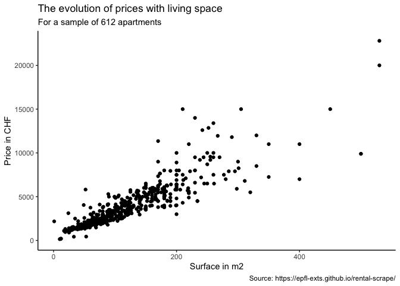
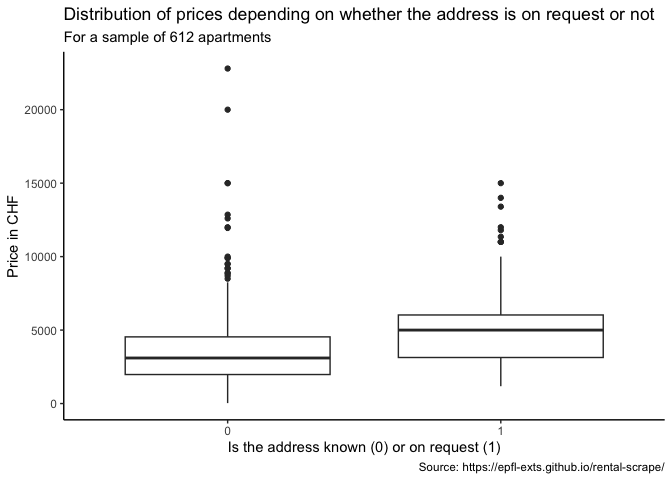
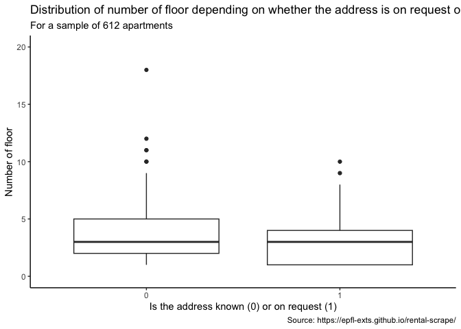

FDS Final Project: Report \#1
================

# Final project 1

The data doesn’t come to you as a dataset, it comes to you as a website.

    https://epfl-exts.github.io/rental-scrape/

Your first challenge is to write the code needed to scrape the data
contained in it. To help you see what the end goal is, we placed a
sample extract of the final dataset in your repository. The file has
only 5 rows and is called sample\_scraped\_rental.csv.

``` r
library(tibble)
library(rvest)
library(dplyr)
library(httr)
library(stringr) 
library(lubridate)
library(ggplot2)
library(knitr)
library(infer)
library(purrr)
library(httr)
library(magrittr)
library(leaflet)
```

## Part 1

Get the full dataset out of the site. Your code should end up with a
tibble of a bit more than 600 rows and 9 columns. Make sure you take the
time to convert each column to the right type and not all character.

Reading the data. I use the tools for scraping non-table data for each
of the 9 variables. Then I bind the columns into a tibble and generate a
row id with rowid\_to\_column()as maybe next time I will have more
observations to scrape.

``` r
request<-GET("https://epfl-exts.github.io/rental-scrape/")

content <- httr::content(request, as = "parsed")

location <- content %>%
  rvest::html_nodes(css=".address p") %>% 
  rvest::html_text()

living_space <- content %>% 
  rvest::html_nodes(css=".living-space strong") %>% 
  rvest::html_text() %>% 
  str_remove(" m2")

floor <- content %>% 
  rvest::html_nodes(css=".floor strong") %>% 
  rvest::html_text()

usable_surface<- content %>% 
  rvest::html_nodes(css=".usable-surface strong") %>% 
  rvest::html_text() %>% 
  str_remove(" m2")

price <- content %>% 
  rvest::html_nodes(css=".price strong") %>% 
  rvest::html_text()

price_w_currency<-content %>% 
  rvest::html_nodes(css=".price .float-right") %>% 
  rvest::html_text() 

objet_type <- content %>% 
  rvest::html_nodes(css=".object-type") %>% 
  rvest::html_text()

rooms<- content %>% 
  rvest::html_nodes(css=".rooms strong") %>% 
  rvest::html_text()

availability <- content %>% 
  rvest::html_nodes(css=".availability strong") %>% 
  rvest::html_text() %>% 
  parse_date_time(orders = "dmy")
```

    ## Warning: 402 failed to parse.

``` r
data <-bind_cols(location=location, 
                 price=price,   
                 price_w_currency=price_w_currency, 
                 objet_type=objet_type, 
                 rooms=rooms, 
                 living_space=living_space, 
                 floor=floor, 
                 availability=availability, 
                 usable_surface=usable_surface) %>%  
  rowid_to_column(var="id") %>% 
  mutate(price=as.numeric(price), 
         rooms=as.numeric(rooms), 
         floor=as.numeric(floor),
         living_space=as.numeric(living_space),
         usable_surface=as.numeric(usable_surface)) %>% 
  mutate(currency=str_replace(price_w_currency,"\\d\\d+" , "")) %>% 
  select(id, location, price, currency, objet_type, rooms, living_space, floor, availability, usable_surface) %>% 
  mutate(currency=str_trim(currency))
```

    ## Warning: NAs introduced by coercion

    ## Warning: NAs introduced by coercion
    
    ## Warning: NAs introduced by coercion
    
    ## Warning: NAs introduced by coercion
    
    ## Warning: NAs introduced by coercion

``` r
glimpse(data)
```

    ## Observations: 612
    ## Variables: 10
    ## $ id             <int> 1, 2, 3, 4, 5, 6, 7, 8, 9, 10, 11, 12, 13, 14, ...
    ## $ location       <chr> "Rue de la Terrassière 58, 1207 Genève", "Addre...
    ## $ price          <dbl> 1900, 4500, 2100, 5500, 2340, 2895, 1980, NA, 3...
    ## $ currency       <chr> "CHF", "CHF", "CHF", "CHF", "CHF", "CHF", "CHF"...
    ## $ objet_type     <chr> "Apartment", "Apartment", "Apartment", "Single ...
    ## $ rooms          <dbl> 3.0, 4.0, 4.0, 6.0, 4.0, 4.5, 4.0, 5.0, 4.0, 4....
    ## $ living_space   <dbl> 63, 185, NA, 170, 73, NA, 73, 150, 117, 75, 104...
    ## $ floor          <dbl> 4, NA, 50, 3, 1, 2, 11, 6, 5, 2, 6, 8, NA, NA, ...
    ## $ availability   <dttm> 2018-10-01, 2018-08-01, 2018-08-01, NA, 2018-0...
    ## $ usable_surface <dbl> NA, NA, NA, NA, NA, NA, NA, NA, NA, NA, NA, NA,...

## Part 2

Create a scatterplot showing how prices evolve with living space of the
flat.

``` r
data %>% 
  ggplot(mapping = aes(x=living_space, y=price))+
  geom_point()+
  labs(title = "The evolution of prices with living space",
       subtitle = "For a sample of 612 apartments",
       caption="Source: https://epfl-exts.github.io/rental-scrape/",
       x= "Surface in m2", y="Price in CHF")+
  theme_classic()
```

    ## Warning: Removed 106 rows containing missing values (geom_point).

<!-- -->

## Part 3

Create a bar plot showing the number of properties by postcode. Is this
agency more “active” in certain areas?

``` r
data %>% 
  mutate(code=str_extract(location, "[1-9][0-9][0-9][0-9]")) %>% 
  mutate(code=as.numeric(code)) %>% 
  count(code, name="number_properties") %>% 
  ggplot(mapping=aes(x=code, y=number_properties, label=code))+
  geom_bar(stat="identity", fill="light blue")+
  geom_text(size = 3, position = position_stack(vjust = 0.7), angle=90)+
  theme(axis.text.y = element_text(angle = 0, hjust = 1))+
  labs(title = "Number of advertised properties by postcode",
       subtitle = "For a sample of 612 apartments",
       caption="Source: https://epfl-exts.github.io/rental-scrape/",
       x= "postal code", y="number of properties")
```

<!-- -->

## Part 4

Create a more complex scatterplot, showing how prices evolve with living
space of the flat by postcode and by floor. You can use colors and/or
facets to make the categories visible.

``` r
data %>% 
  mutate(code=str_extract(location, "[1-9][0-9][0-9][0-9]")) %>% 
  mutate(code=as.numeric(code)) %>%
  filter(floor<=6) %>% 
  ggplot(mapping = aes(x=living_space, y=price))+
  geom_jitter(aes(color=code), alpha=0.5)+
  facet_wrap(vars(floor), ncol= 3)+
  labs(title = "Price of flat over living space",
       subtitle = "Separated by floor using facets and postcodes using colors",
       caption = "Showing only floors 1 to 6",
       x="Surface in m2",
       y="Price in CHF")+
  theme_light()
```

    ## Warning: Removed 58 rows containing missing values (geom_point).

<!-- -->

Can you conclude anything from it? Put your thoughts below your plot.
Don’t over think this: this is not so much about the quality of your
analysis than checking that you can put a report together. For example,
integrate the most expensive and least expensive mean postcode/floor
combo in your text with inline code.

``` r
mexp_f<-data %>% 
  mutate(code=str_extract(location, "[1-9][0-9][0-9][0-9]")) %>% 
  mutate(code=as.numeric(code)) %>%
  filter(floor<=6) %>%
  group_by(floor, code) %>% 
  summarise(mean_price=mean(price, na.rm = TRUE), max_price=max(price, na.rm=TRUE), min_price=min(price, na.rm = TRUE)) %>% 
  arrange(desc(mean_price)) %>% 
  filter(mean_price==max(mean_price)) %>% 
  ungroup() %>% 
  top_n(1) %>% 
  pull(floor)
```

    ## Selecting by min_price

``` r
mexp_p<-data %>% 
  mutate(code=str_extract(location, "[1-9][0-9][0-9][0-9]")) %>% 
  mutate(code=as.numeric(code)) %>%
  filter(floor<=6) %>%
  group_by(floor, code) %>% 
  summarise(mean_price=mean(price, na.rm = TRUE), max_price=max(price, na.rm=TRUE), min_price=min(price, na.rm = TRUE)) %>% 
  arrange(desc(mean_price)) %>% 
  filter(mean_price==max(mean_price)) %>% 
  ungroup() %>% 
  top_n(1) %>% 
  pull(code)
```

    ## Selecting by min_price

``` r
lexp_f<-data %>% 
  mutate(code=str_extract(location, "[1-9][0-9][0-9][0-9]")) %>% 
  mutate(code=as.numeric(code)) %>%
  filter(floor<=6) %>%
  group_by(floor, code) %>% 
  summarise(mean_price=mean(price, na.rm = TRUE), max_price=max(price, na.rm=TRUE), min_price=min(price, na.rm = TRUE)) %>% 
  arrange(mean_price) %>% 
  filter(mean_price==min(mean_price)) %>% 
  ungroup() %>% 
  top_n(1) %>% 
  pull(floor)
```

    ## Selecting by min_price

``` r
lexp_p<-data %>% 
  mutate(code=str_extract(location, "[1-9][0-9][0-9][0-9]")) %>% 
  mutate(code=as.numeric(code)) %>%
  filter(floor<=6) %>%
  group_by(floor, code) %>% 
  summarise(mean_price=mean(price, na.rm = TRUE), max_price=max(price, na.rm=TRUE), min_price=min(price, na.rm = TRUE)) %>% 
  arrange(mean_price) %>% 
  filter(mean_price==min(mean_price)) %>% 
  ungroup() %>% 
  top_n(1) %>% 
  pull(code)
```

    ## Selecting by min_price

Generally the price increases with living surface. It seems to be a bit
less expensive to live on the 1st and 4th floors on average. In the
dataset there are more apartments available on the 1st, 2nd and 3rd
floors. For surfaces with more than 100-150 m2 there is quite a bit more
variability in the data, meaning the high prices for larger apartments
depend on other factors than surface. Not all post codes are equally
represented in the distribution by floors. The highest mean price was
for floor 2 and postcode 1292 and the lowest mean price was for floor 1
and code 1226.

## Part 5

Can you see any trends for listings with addresses only available on
demand? Are they more expensive or less? Bigger living space? Higher
floor?

Boxplot or violin plots work really well to compare distributions of
values between groups. So use one for each of the three questions above.

I first create a new variable req which takes on value 1 if the address
is on request and 0 otherwise.

``` r
data %>% 
  mutate(req= if_else(str_detect(location, "Address on request"), "1", "0")) %>% 
  ggplot(mapping = aes(x=req, y=price))+
  geom_boxplot()+
  labs(title = "Distribution of prices depending on whether the address is on request or not", 
       subtitle = "For a sample of 612 apartments",
       caption="Source: https://epfl-exts.github.io/rental-scrape/",
       x="Is the address known (0) or on request (1)", 
       y="Price in CHF")+
  theme_classic()
```

    ## Warning: Removed 15 rows containing non-finite values (stat_boxplot).

<!-- -->

The boxplot by price suggests that indeed prices are on average higher
for properties for which the address is listed as on request. The median
of the “on request” boxplot falls outside the inter-quartile range of
the “known-address” boxplot. There is less variation in price between
properties with the address on request also. The highest prices were
nevertheless for properties for which the address is known.

``` r
data %>% 
  mutate(req= if_else(str_detect(location, "Address on request"), "1", "0")) %>% 
  ggplot(mapping = aes(x=req, y=living_space))+
  geom_boxplot()+
  labs(title = "Distribution of living space (m2) depending on whether the address is on request or not", 
       subtitle = "For a sample of 612 apartments",
       caption="Source: https://epfl-exts.github.io/rental-scrape/",
       x="Is the address known (0) or on request (1)", 
       y="Surface of living space in m2")+
  theme_classic()
```

    ## Warning: Removed 93 rows containing non-finite values (stat_boxplot).

<!-- -->
Similarly the mean surface of living was bigger for properties listed
with the address on request. The median of the “on request” boxplot is
above the inter-quartile range of the “known-address” boxplot. The
biggest living surface was however for a property listed with a full
address.

``` r
data %>% 
  mutate(req= if_else(str_detect(location, "Address on request"), "1", "0")) %>% 
  ggplot(mapping = aes(x=req, y=floor))+
  geom_boxplot()+
  labs(title = "Distribution of number of floor depending on whether the address is on request or not", 
       subtitle = "For a sample of 612 apartments",
       caption="Source: https://epfl-exts.github.io/rental-scrape/",
       x="Is the address known (0) or on request (1)", 
       y="Number of floor")+
  theme_classic()+
  ylim(0, 20)
```

    ## Warning: Removed 223 rows containing non-finite values (stat_boxplot).

<!-- -->

There doesn’t seem to be a significant difference by level of the floor,
though the distribution of “on request” properties is more skewed
towards lower than 4 floor levels.

## Part 6

In this question, use the same groups as above: flats for which
addresses are only available on demand versus other flats. Make a table
summarising group size, median, average, standard-deviation, minimum and
maximum of variable price per square-meter (expressed in CHF/\(m^2\)).
Then use a t-test to compare the average price per square-meter for
these 2 groups of flats.

First the summarising table below.

``` r
data %>% 
  mutate(req= if_else(str_detect(location, "Address on request"), "1", "0")) %>%
  mutate(ppsqm=price/living_space) %>%  
  group_by(req) %>% 
  summarise(no_obs=n(), 
            median_ppsqm=median(ppsqm, na.rm = TRUE),
            mean_ppsqm=mean(ppsqm, na.rm = TRUE),
            std_ppsqm=sd(ppsqm, na.rm = TRUE), 
            min_ppsqm=min(ppsqm, na.rm = TRUE),
            max_ppsqm=max(ppsqm, na.rm = TRUE)) %>% 
  kable()
```

| req    |  no\_obs |  median\_ppsqm |  mean\_ppsqm |    std\_ppsqm |   min\_ppsqm |                                                                                                                                                                                                                                  max\_ppsqm |
| :----- | -------: | -------------: | -----------: | ------------: | -----------: | ------------------------------------------------------------------------------------------------------------------------------------------------------------------------------------------------------------------------------------------: |
| 0      |      460 |       33.18466 |     39.81016 |    109.191737 |     8.301887 |                                                                                                                                                                                                                                  2180.00000 |
| 1      |      152 |       33.33333 |     34.22823 |      9.459612 |    17.500000 |                                                                                                                                                                                                                                    71.42857 |
| I note | that the | "address on re | quest" group | is smaller an | d with lower | variance. This needs to be factored in when writing the t-test below. Otherwise the two groups have very similar medians but quite different means. The difference in means may be explained by some outliers in the “address known” group. |

Now the t-test.

``` r
data %>% 
  mutate(req= if_else(str_detect(location, "Address on request"), "1", "0")) %>%
  mutate(ppsqm=price/living_space) %>%
  mutate(req=factor(req, levels=c("0", "1"))) %>% 
  t_test(ppsqm ~ req, order = c("0", "1"), var.equal=FALSE)
```

    ## # A tibble: 1 x 6
    ##   statistic  t_df p_value alternative lower_ci upper_ci
    ##       <dbl> <dbl>   <dbl> <chr>          <dbl>    <dbl>
    ## 1     0.997  408.   0.319 two.sided      -5.42     16.6

The t-test cannot reject the null hypothesis that the difference in
means between the two groups is not significant (the p-value is quite
high, and above the 0.05 significance level and 0 is included in the
confidence interval). In other words, based on the available sample,
there is no significant difference in price per square meter between
properties listed with and without a known address.

## Part 7

Same questions as above (i.e. summary table and t-test) regarding
variable price (expressed in CHF). What is your conclusion?

``` r
data %>% 
  mutate(req= if_else(str_detect(location, "Address on request"), "1", "0")) %>%
  group_by(req) %>% 
  summarise(no_obs=n(), median_p=median(price, na.rm = TRUE), mean_p=mean(price, na.rm = TRUE), std_p=sd(price, na.rm = TRUE), min_p=min(price, na.rm = TRUE), max_p=max(price, na.rm = TRUE))
```

    ## # A tibble: 2 x 7
    ##   req   no_obs median_p mean_p std_p min_p max_p
    ##   <chr>  <int>    <dbl>  <dbl> <dbl> <dbl> <dbl>
    ## 1 0        460     3100  3658. 2531.    30 22800
    ## 2 1        152     5000  5204. 2734.  1180 15000

``` r
data %>% 
  mutate(req= if_else(str_detect(location, "Address on request"), "1", "0")) %>%
  mutate(req=factor(req, levels=c("0", "1"))) %>% 
  t_test(price ~ req, order = c("0", "1"), var.equal=FALSE)
```

    ## # A tibble: 1 x 6
    ##   statistic  t_df       p_value alternative lower_ci upper_ci
    ##       <dbl> <dbl>         <dbl> <chr>          <dbl>    <dbl>
    ## 1     -6.06  233. 0.00000000552 two.sided     -2048.   -1043.

First looking at the standard statistics by group (with and without a
listed address) I note that both the median and the mean are quite
different between the two groups. There is a similar variance in both
groups.

The t-test confirms that indeed the null hypothesis can be rejected.
This time the difference between the two groups is statistically
significant. the p-value is smaller than 0.05 and 0 is not included in
the confidence interval. The price of “address on request” properties is
higher than when the address is known.

This is result does not hold when looking at price per square meter,
which means that maybe “address on request” properties have a larger
living surface. This was also confirmed under point 5.

## Part 8

Convert a subset of 30 addresses to latitude and longitude using an API
and plot them on a map using {ggmap} (or {leaflet} if you cannot get
{ggmap} to work).

I first create a new dataset in which I filter out addresses that are on
request. Then I modify my location variable to remove whitespace and
insert + signs in between the address elements as this is the format
that the API requires. I also remove some “,” from the location
variable.

Based on this data I create a vector of the 30 addresses which I use to
obtain latitude and longitude data from the API.

Because in my sample the API reads one of the addresses in Carouge as
being just a bit South of Nigeria, I limit the latitude and longitude
limits of the leaflet map to center on Geneva :-)

``` r
data8 <- data %>% 
  mutate(req= if_else(str_detect(location, "Address on request"), "1", "0")) %>%
  filter(req=="0") %>% 
  mutate(location= str_replace_all(location, " ", "+")) %>% 
  mutate(location= str_replace_all(location, ",", "")) %>% 
  sample_n(30)

addy_str<- data8 %>% 
  pull(location)

longt <- str_glue("https://geocode.xyz/{addy_str}?json=1") %>% 
  map(GET) %>% 
  keep(~status_code(.)==200) %>% 
  map(httr::content, as="parsed") %>% 
  map(magrittr::extract, c("longt", "latt"))

# As I got blocked before, I'm doing this in two steps now
longlat_tib<- longt %>% 
  map(flatten_df) %>% 
  bind_rows() %>% 
  mutate(longt=as.numeric(longt)) %>% 
  mutate(latt=as.numeric(latt))


#data8 %>% 
  #bind_cols(longlat_tib) %>% 
  #leaflet() %>% 
  #addTiles() %>% 
  #addMarkers(lng = ~ longt, lat = ~ latt, label = ~id, popup = ~location) %>% 
  #setView(6.1, 46.2, zoom=11)
```
