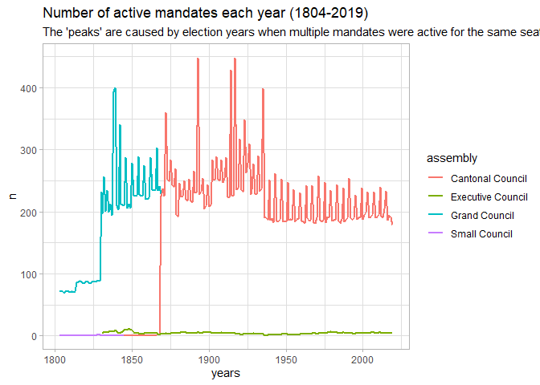
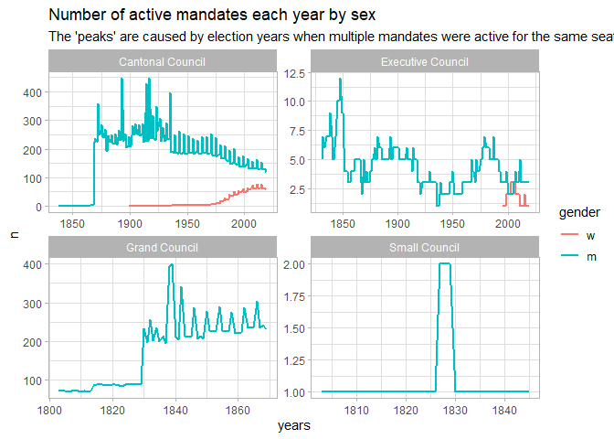
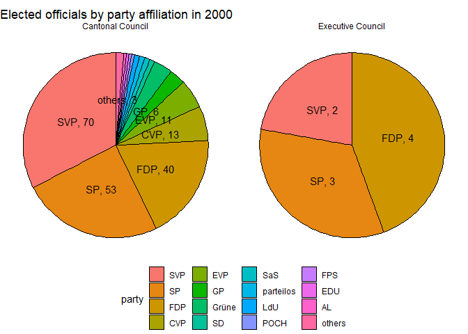
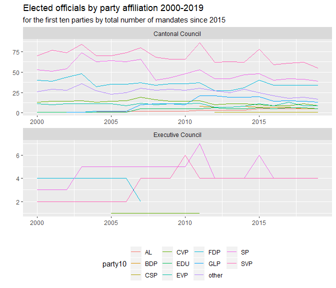
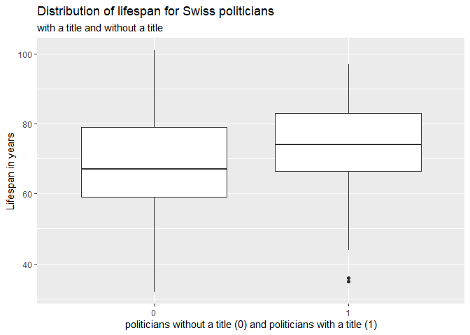
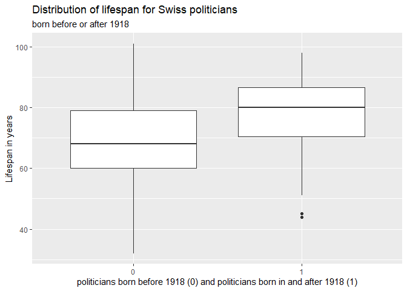
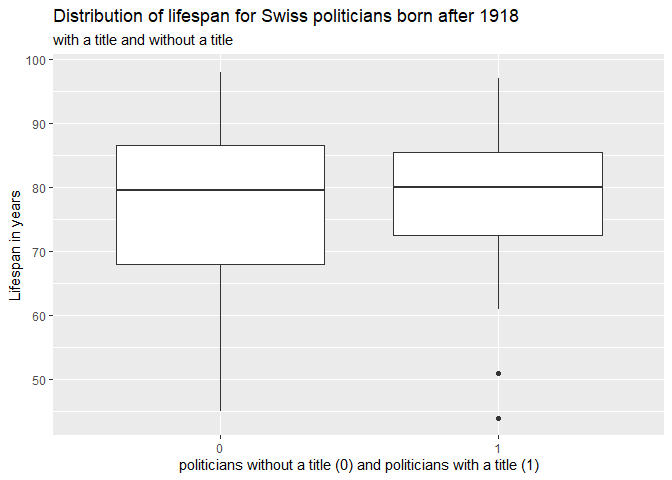
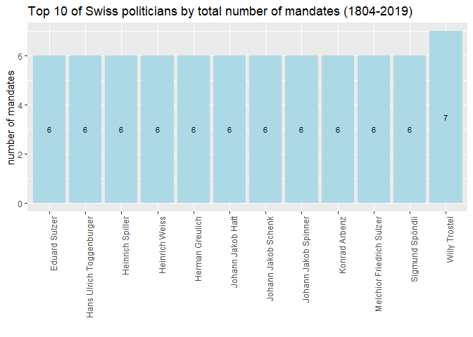

R Notebook
================

# Final Report Project 2

Reading the data and loading libraries.

``` r
library(DBI)
library(RSQLite)
library(dplyr)
library(tidyr)
library(ggplot2)
library(janitor)
library(purrr)
library(tibble)
library(stringr)
library(infer)
library(lubridate)
library(leaflet)
library(httr)
library(magrittr)
library(purrr)

politicians <- dbConnect(RSQLite::SQLite(), "zh_politicians.db")

dbListTables(politicians)
```

    ## [1] "ADDRESSES"    "AFFILIATIONS" "MANDATES"     "PERSONS"

``` r
mandates_tbl<-tbl(politicians, "MANDATES") %>% 
  collect()
addresses_tbl<-tbl(politicians, "ADDRESSES") %>% 
  collect()
affiliations_tbl<-tbl(politicians, "AFFILIATIONS") %>% 
  collect()
persons_tbl<-tbl(politicians, "PERSONS") %>% 
  collect()

dbDisconnect(politicians)
```

## Part 1

The MANDATES table has information about when people were elected, when
their mandate ended and on which assembly they sat.

Using a line plot, show how the number of people with an active mandate
changed over the years. You will have one line per assembly.

First some data cleaning. One observation has start year set at 0. The
name of the person with start year 0 (ID 15150) is Johann Heinrich
Furrer. He also has no birthdate. I googled his name and Grand Conseil
and no results came up so I’ll drop this observation. There are 183 rows
with mandate end year 0. Seems that they probably all still hold the
mandate as the start date is sufficiently recent. So I’ll set these
values to 2019.

``` r
mandates_tbl <- mandates_tbl %>% 
  clean_names() %>% 
  mutate(mandate_end_year=as.numeric(mandate_end_year)) %>% 
  mutate(mandate_start_year=as.numeric(mandate_start_year))

mandates_tbl %>% 
  filter(mandate_start_year==0) 
```

    ## # A tibble: 1 x 9
    ##      id person_id assembly mandate_start_d~ mandate_start_m~
    ##   <int>     <int> <chr>               <int>            <int>
    ## 1  5609     15150 Grand C~                0                0
    ## # ... with 4 more variables: mandate_start_year <dbl>,
    ## #   mandate_end_day <int>, mandate_end_month <int>, mandate_end_year <dbl>

``` r
persons_tbl %>% 
  filter(ID==15150)
```

    ## # A tibble: 1 x 8
    ##      ID LASTNAME FIRSTNAME TITLE GENDER YEAR_OF_BIRTH YEAR_OF_DEATH
    ##   <int> <chr>    <chr>     <chr> <chr>          <int> <chr>        
    ## 1 15150 Furrer   Johann H~ ""    m                  0 ""           
    ## # ... with 1 more variable: ACTIVITY <chr>

``` r
mandates_tbl %>% 
  filter(mandate_end_year==0)
```

    ## # A tibble: 183 x 9
    ##       id person_id assembly mandate_start_d~ mandate_start_m~
    ##    <int>     <int> <chr>               <int>            <int>
    ##  1  1793      5507 Executi~                9                5
    ##  2  1801      7870 Cantona~               18                8
    ##  3  1804      7874 Cantona~                9                5
    ##  4  1806      7876 Cantona~                3               11
    ##  5  1809      7882 Cantona~                9                5
    ##  6  1810      7884 Cantona~               16                6
    ##  7  1811      7885 Cantona~               18                5
    ##  8  1813      7889 Cantona~               11                1
    ##  9  1814      7890 Cantona~               17                8
    ## 10  1816      7893 Cantona~                3               11
    ## # ... with 173 more rows, and 4 more variables: mandate_start_year <dbl>,
    ## #   mandate_end_day <int>, mandate_end_month <int>, mandate_end_year <dbl>

``` r
mandates_tbl <- mandates_tbl %>% 
  filter(mandate_start_year!=0) %>%  
  mutate(mandate_end_year=replace(mandate_end_year, mandate_end_year==0, "2019"))
```

Then I create a nested variable “years” listing all the years of active
mandate. Then I unnest years.

``` r
long_mand<- mandates_tbl %>% 
  mutate(years=map2(mandate_start_year, mandate_end_year, seq)) %>%   select(person_id, assembly, years) %>% 
  unnest(years)
  
long_mand %>% 
  count(assembly, years, name="people") %>% 
  ggplot(mapping = aes(x=years, y=people, color=assembly))+
  geom_line(size=1)+
  labs(title = "Number of active mandates each year (1804-2019)",
       subtitle = "The 'peaks' are caused by election years when multiple mandates were active for the same seat",
       y="n")+
  theme_light()
```

<!-- -->

Don’t bother working on exact dates: you can base your “active” years
just on years, even if this creates some “dents” in the line (i.e. when
looking only at active years, not precise dates, some mandates are
double counted on election years since the old mandates end and the new
mandates start).

## Part 2

Expand on the plot you just produced. This time you want to show facet
charts with one chart per assembly. In each chart, have one line for men
and one line for women.

To do this I first need to find a dataset including sex-disaggregated
information. This is in the “persons” table. I first do some data
cleaning. A count of “gender” shows that there are 4040 men, 249 women
and 5 persons with no data. I filter the persons\_tbl to have a look at
the 5 persons. They can all be replaced with “m” given their names and
birthdates/start of mandate. I then rename id with person\_id for
clarity.

``` r
persons_tbl %>% 
  count(GENDER)
```

    ## # A tibble: 3 x 2
    ##   GENDER     n
    ##   <chr>  <int>
    ## 1 ""         5
    ## 2 m       4040
    ## 3 w        249

``` r
persons_tbl %>% 
  filter(GENDER=="") 
```

    ## # A tibble: 5 x 8
    ##      ID LASTNAME FIRSTNAME TITLE GENDER YEAR_OF_BIRTH YEAR_OF_DEATH
    ##   <int> <chr>    <chr>     <chr> <chr>          <int> <chr>        
    ## 1  9253 Derrer   Kaspar    ""    ""              1860 ""           
    ## 2  9291 Gagg     Eugen     ""    ""              1863 1917         
    ## 3 14171 Fehr     Jakob     ""    ""              1828 ""           
    ## 4 14784 Kleinert Hans Jak~ ""    ""                 0 ""           
    ## 5 15358 Spiller  Hans Jac~ ""    ""              1768 ""           
    ## # ... with 1 more variable: ACTIVITY <chr>

``` r
persons_tbl <- persons_tbl %>% 
  clean_names() %>% 
  mutate(person_id=id) %>%
  mutate(gender= replace(gender, gender=="", "m")) %>% 
  select(person_id, everything(), -id)
```

Then I join the two datasets and I unnest the years. This operation was
slow on my computer so I keep it separate for the rest. I then plot the
chart with “free” scales as the smaller councils have much fewer
mandates than the Cantonal Council.

``` r
data2 <- left_join(mandates_tbl, persons_tbl, by=c("person_id")) %>% 
  select(person_id, assembly, mandate_start_year, mandate_end_year, lastname, firstname, gender) %>% 
  mutate(years=map2(mandate_start_year, mandate_end_year, seq)) %>%   unnest(years)

data2%>% 
  mutate(gender= replace(gender, is.na(gender), "m"),
         gender=factor(gender, levels=c("w", "m"))) %>% 
  select(person_id, gender, assembly, years) %>% 
  count(assembly, years, gender, name="people") %>% 
  ggplot(mapping = aes(x=years, y=people, color=gender))+
  geom_line(size=1)+
  facet_wrap(vars(assembly), scales="free")+
  labs(title = "Number of active mandates each year by sex",
       subtitle = "The 'peaks' are caused by election years when multiple mandates were active for the same seat",
       y="n")+
  theme_light()
```

<!-- -->

## Part 3

Create a new plot showing the proportion of elected politicians from
each party in year 2000. You want to show this by assembly, so use one
facet with one pie chart per assembly. Also show your result in a table.

For this I need to find data on party affiliation. This in the
affiliations file. I will do some data cleaning and then join this
dataset with mandates.

``` r
affiliations_tbl <- affiliations_tbl %>% 
  clean_names()

data3 <-
  left_join(mandates_tbl, affiliations_tbl, by=c("person_id")) %>% 
  select(mandate_id, person_id, party, assembly, mandate_start_year, mandate_end_year, affiliation_start_year, affiliation_end_year) %>% 
  filter(mandate_start_year<=2000) %>% 
  filter(mandate_end_year>=2000) %>% 
  mutate(party=str_replace(party, "NA", "others")) %>%
  mutate(party=if_else(party=="", "others", party)) %>% 
  count(assembly, party, name="number_of_elected_politicians") %>% 
  arrange(assembly, desc(number_of_elected_politicians)) %>%    mutate(party=factor(party, levels = c("SVP", "SP", "FDP", "CVP", "EVP", "GP", "Grüne", "SD", "SaS", "parteilos", "LdU", "POCH", "FPS", "EDU", "AL", "others")))

data3 %>% 
  group_by(assembly) %>% 
  mutate(tot_by_ass=sum(number_of_elected_politicians)) %>% 
  ungroup() %>% 
  mutate(share=number_of_elected_politicians/tot_by_ass) %>%
  mutate(lab=str_c(party, number_of_elected_politicians, sep = ", ")) %>% 
  ggplot(aes(x="", y=share, fill=party, label=lab))+
  geom_col(color="black")+
    coord_polar("y")+
  geom_text(position = position_stack(vjust = 0.5), check_overlap = TRUE)+
  facet_wrap(vars(assembly)) + 
  theme_void()+
  theme(legend.position="bottom", legend.direction="horizontal")+
  labs(title = "Elected officials by party affiliation in 2000")
```

<!-- -->

## Part 4

Have another look at the composition of the assemblies: this time use a
line chart to show how it changed over the years.

``` r
data4 <- left_join(mandates_tbl, affiliations_tbl, by=c("person_id")) %>% 
  select(mandate_id, person_id, party, assembly, mandate_start_year, mandate_end_year, affiliation_start_year, affiliation_end_year) %>% 
  mutate(years=map2(mandate_start_year, mandate_end_year, seq)) %>%   unnest(years) 

list10 <- data4 %>% 
  select(mandate_id, person_id, party, assembly, years) %>% 
  mutate(party=str_replace(party, "NA", "other")) %>%
  mutate(party=if_else(party=="", "other", party)) %>%
  count(assembly, party, years, name="people") %>% 
  filter(years>=2015) %>% 
  count(party, name="num") %>% 
  arrange(desc(num)) %>% 
  head(10) %>% 
  pull(party) # creating a list of the top 10 parties by number of mandates during the entire period. This includes an unidentified party name. Thus the list is of 9 parties and "other".


data4 %>% 
  mutate(party10=if_else(party %in% list10, party, "other")) %>%
  mutate(party10=replace(party10, party10=="", "other")) %>% 
  select(mandate_id, person_id, party10, assembly, years) %>% 
  count(assembly, party10, years, name="people") %>%
  filter(assembly=="Cantonal Council" | assembly=="Executive Council") %>% 
  filter(years>=2000) %>% 
  ggplot(mapping = aes(x=years, y=people, color=party10))+
  geom_line()+
  facet_wrap(vars(assembly), ncol = 1, scales="free")+
  theme(legend.position="bottom", legend.direction="horizontal")+
  labs(title = "Elected officials by party affiliation 2000-2019",
       subtitle = "for the first ten parties by total number of mandates since 2015", 
       x="", y="")
```

<!-- -->

I focused my chart on data from 2000 onwards and only for the Cantonal
and the Executive Council. Prior to 1925 data by party affiliation is
not very good. Most delegates end up in the “other” category because of
missing data. Similarly party affiliation is not known for the Grand and
Small Council mandates. 10 parties are included (all others become
“other”), those with most total mandates for the 2015-2019 period.

## Part 5

For the politicians that have a YEAR\_OF\_DEATH in the data, find the
average life span. Does it change if you go by a TITLE? Use first a
plot, and then a statistical test to assess if the average life span is
different for politicians having a TITLE compared to those without any
TITLE.

We only ask you to compare TITLE vs. no TITLE, there is no need to
analyse every possible title.

I first do some data cleaning. First I filter out all those with missing
year of death. Then I set year of death as a numeric variable. Then I
remove the one case when the year of birth was 0 as this is not possible
and create a life span variable, whic I further use to remove some
outliers in the data such as three people with life spans of 2,3 and 175
years, none of whih are humanly possible, so must be due to data entry
typos. Finally I create a variable tnt (title, no title) which takes on
1 if the person has a title and 0 if the person has no title.

``` r
ave_lfspan <- persons_tbl %>% 
  filter(year_of_death!="") %>%
  mutate(year_of_death=as.numeric(year_of_death)) %>% 
  filter(year_of_birth!=0) %>% 
  mutate(lfspan=year_of_death-year_of_birth) %>% 
  filter(lfspan>=4,  lfspan<=101) %>%
  summarise(ave_lfspan=mean(lfspan)) %>% 
  pull(ave_lfspan)

persons_tbl %>% 
  filter(year_of_death!="") %>%
  mutate(year_of_death=as.numeric(year_of_death)) %>% 
  filter(year_of_birth!=0) %>% 
  mutate(lfspan=year_of_death-year_of_birth) %>% 
  filter(lfspan>=4,  lfspan<=101) %>%
  mutate(tnt=if_else(title!="", "1", "0")) %>% 
  group_by(tnt) %>% 
  summarise(ave_lfspan=mean(lfspan))
```

    ## # A tibble: 2 x 2
    ##   tnt   ave_lfspan
    ##   <chr>      <dbl>
    ## 1 0           68.3
    ## 2 1           73.8

The overall average lifespan is 70.2413793.Those without a title have a
mean lifespan of 68 and those with a title of 74. There seems to be a
difference, but is it statistically significant?

First a boxplot of the difference in distributions below.

``` r
persons_tbl %>% 
  filter(year_of_death!="") %>%
  mutate(year_of_death=as.numeric(year_of_death)) %>% 
  filter(year_of_birth!=0) %>% 
  mutate(lfspan=year_of_death-year_of_birth) %>% 
  filter(lfspan>=4,  lfspan<=101) %>%
  mutate(tnt=if_else(title!="", "1", "0")) %>% 
  ggplot(mapping = aes(x=tnt, y=lfspan))+
  geom_boxplot()+
  labs(title = "Distribution of lifespan for Swiss politicians",
       subtitle= "with a title and without a title",
       x="politicians without a title (0) and politicians with a title (1)",
       y="Lifespan in years")
```

<!-- -->

At first glance there seems to be a difference in the median value of
the two lifespan distributions but none of the medians falls outisde the
interquartile range of the other distributions. Thus the difference may
not be statistically significant. Also politicins without a title seem
to have a longer spread of lifespan as the no-title group is almost
twice as large as the title group (356 as compared to 195).

Now a t-test of significance.

``` r
persons_tbl %>% 
  filter(year_of_death!="") %>%
  mutate(year_of_death=as.numeric(year_of_death)) %>% 
  filter(year_of_birth!=0) %>% 
  mutate(lfspan=year_of_death-year_of_birth) %>% 
  filter(lfspan>=4,  lfspan<=101) %>%
  mutate(tnt=if_else(title!="", "1", "0")) %>%
  mutate(tnt=factor(tnt, levels=c("0", "1"))) %>% 
  t_test(lfspan ~ tnt, order = c("0", "1"), var.equal=FALSE)
```

    ## # A tibble: 1 x 6
    ##   statistic  t_df    p_value alternative lower_ci upper_ci
    ##       <dbl> <dbl>      <dbl> <chr>          <dbl>    <dbl>
    ## 1     -4.93  417. 0.00000116 two.sided      -7.71    -3.32

The t-test confirm that the difference between the two groups is
statistically significant as the p-value is very small (significant at
0.05), zero is not contained in the confidence interval. It seems that
people without a title lived on average 5 years less than those with a
title.

## Part 6

Create a new variable which splits the politicians into 2 subgroups: one
subgroup of politicians who were BORN\_BEFORE\_1918 (i.e. for which
YEAR\_OF\_BIRTH \< 1918), and another subgroup of politicians who were
BORN\_AFTER\_1918 (i.e. for which YEAR\_OF\_BIRTH \>= 1918). Reply to
the questions asked in the previous part (i.e. graphical comparison and
statistical test) for each of the 2 subgroups.

``` r
persons_tbl %>% 
  filter(year_of_death!="") %>%
  mutate(year_of_death=as.numeric(year_of_death)) %>% 
  filter(year_of_birth!=0) %>% 
  mutate(lfspan=year_of_death-year_of_birth) %>% 
  filter(lfspan>=4,  lfspan<=101) %>%
  mutate(y_1918=if_else(year_of_birth>=1918, "1", "0")) %>% 
  ggplot(mapping = aes(x=y_1918, y=lfspan))+
  geom_boxplot()+
  labs(title = "Distribution of lifespan for Swiss politicians",
       subtitle= "born before or after 1918",
       x="politicians born before 1918 (0) and politicians born in and after 1918 (1)",
       y="Lifespan in years")
```

<!-- -->

The boxplot suggests that there is a difference between the before 1918
group and after the 1918 group. The median for the after group also
falls outside the interquartile range of the before group. Swiss
politicians seem to have lived significantly longer after 1918. The
before group also has a wider spread of lifespan.

Now the t-test to check for statistical significance.

``` r
persons_tbl %>% 
  filter(year_of_death!="") %>%
  mutate(year_of_death=as.numeric(year_of_death)) %>% 
  filter(year_of_birth!=0) %>% 
  mutate(lfspan=year_of_death-year_of_birth) %>% 
  filter(lfspan>=4,  lfspan<=101) %>%
  mutate(y_1918=if_else(year_of_birth>=1918, "1", "0")) %>%
  mutate(y_1918=factor(y_1918, levels=c("0", "1"))) %>% 
  t_test(lfspan ~ y_1918, order = c("0", "1"), var.equal=FALSE)
```

    ## # A tibble: 1 x 6
    ##   statistic  t_df       p_value alternative lower_ci upper_ci
    ##       <dbl> <dbl>         <dbl> <chr>          <dbl>    <dbl>
    ## 1     -6.17  119. 0.00000000983 two.sided      -11.5    -5.92

The assumption is confirmed by the t-test. As the p-value is very low
(significant at 0.05) and 0 is not included in the confidence interval
we can reject the null hypothesis that there is no differece in means
between the two groups. After 1918 Swiss politicians lived on average a
little over 6 years longer.

Having discovered this new source of difference in the dataset, I wonder
if title still make a difference for the lifespan of the post 1918
generation.

``` r
persons_tbl %>% 
  filter(year_of_death!="") %>%
  mutate(year_of_death=as.numeric(year_of_death)) %>% 
  filter(year_of_birth!=0) %>% 
  mutate(lfspan=year_of_death-year_of_birth) %>% 
  filter(lfspan>=4,  lfspan<=101) %>%
  mutate(y_1918=if_else(year_of_birth>=1918, "1", "0")) %>%
  filter(y_1918=="1") %>% 
  mutate(tnt=if_else(title!="", "1", "0")) %>% 
  ggplot(mapping = aes(x=tnt, y=lfspan))+
  geom_boxplot()+
  labs(title = "Distribution of lifespan for Swiss politicians born after 1918",
       subtitle= "with a title and without a title",
       x="politicians without a title (0) and politicians with a title (1)",
       y="Lifespan in years")
```

<!-- -->

The boxplot suggests there may not be a significant difference anymore
between politicians with a title and those without.

So I’ll do the t-test to check.

``` r
persons_tbl %>% 
  filter(year_of_death!="") %>%
  mutate(year_of_death=as.numeric(year_of_death)) %>% 
  filter(year_of_birth!=0) %>% 
  mutate(lfspan=year_of_death-year_of_birth) %>% 
  filter(lfspan>=4,  lfspan<=101) %>%
  mutate(y_1918=if_else(year_of_birth>=1918, "1", "0")) %>%
  filter(y_1918=="1") %>% 
  mutate(tnt=if_else(title!="", "1", "0")) %>%
  mutate(tnt=factor(tnt, levels=c("0", "1"))) %>% 
  t_test(lfspan ~ tnt, order = c("0", "1"), var.equal=FALSE)
```

    ## # A tibble: 1 x 6
    ##   statistic  t_df p_value alternative lower_ci upper_ci
    ##       <dbl> <dbl>   <dbl> <chr>          <dbl>    <dbl>
    ## 1    -0.237  81.0   0.813 two.sided      -5.73     4.51

The t-test confirms (p-value above 0.05 and 0 included in confidence
interval) that we can no longer reject the null hypothesis that there is
no difference in the average life span of politicians with a title as
compared to those without a title if looking only at those born after
1918. The difference recorded before under question 5 was most likely
due to differences between the pre-1918 and post-1918 groups.

## Part 7

Which politicians have had the most mandates? Create a top 10 horizontal
bar chart.

``` r
mandates_tbl %>% 
  left_join(persons_tbl, by=c("person_id")) %>% 
  select(person_id, assembly, mandate_start_year, mandate_end_year, lastname, firstname, gender) %>% 
  mutate(lab=str_c(firstname, lastname, sep = " ")) %>%
  mutate(person_id=as.character(person_id)) %>%
  count(person_id, lab, name="no_mandates") %>% 
  arrange(desc(no_mandates)) %>% 
  top_n(10) %>%
  arrange(no_mandates)%>% 
  ggplot(mapping = aes(x=lab, y=no_mandates, label=no_mandates))+
  geom_bar(stat="identity", fill="light blue")+
  geom_text(size = 3, position = position_stack(vjust = 0.5))+
  theme(axis.text.x = element_text(angle = 90, hjust = 1))+
  labs(title = "Top 10 of Swiss politicians by total number of mandates (1804-2019)", 
       x="", 
       y="number of mandates")
```

    ## Selecting by no_mandates

<!-- -->

## Part 8

Do some politicians have multiple mandates at the same time? You will
need to find a way to check if some mandates started before the previous
one of the same politician ended.

My strategy: use lubridate to convert start of mandate data into a date.
Same for end of the mandate. Then create new variable equal to the end
date of the previous mandate using lag) and filter the mandates where
tha start date is smaller than the previus end date.

The answer is yes, some politicians have multiple mandates at the same
time (33 distinct person\_id’s).

``` r
mandates_tbl %>% 
  summarise(count=sum(is.na(mandate_start_month)))
```

    ## # A tibble: 1 x 1
    ##   count
    ##   <int>
    ## 1     0

``` r
# Checked that no missing data

id_more_mandates <- mandates_tbl %>% 
  count(person_id) %>% 
  filter(n >1) %>% 
  pull(person_id) # these are the politicians with more than one mandate, but are these mandates overlapping?

mandates_tbl %>% 
  unite(mandate_start_date, mandate_start_day, mandate_start_month, mandate_start_year, sep = "-", remove = FALSE) %>% 
  mutate(mandate_start_date= parse_date_time(mandate_start_date, orders="dmy")) %>% 
  unite(mandate_end_date, mandate_end_day, mandate_end_month, mandate_end_year, sep = "-", remove = FALSE) %>% 
  mutate(mandate_end_date= parse_date_time(mandate_end_date, orders="dmy")) %>% 
  select(id, person_id, assembly, mandate_start_date, mandate_end_date) %>%
  filter(person_id %in% id_more_mandates) %>% 
  group_by(person_id) %>% 
  arrange(person_id, mandate_start_date) %>% 
  mutate(end_date_prev=lag(mandate_end_date)) %>% 
  filter(mandate_start_date< end_date_prev) 
```

    ## Warning: 3 failed to parse.

    ## Warning: 188 failed to parse.

    ## # A tibble: 47 x 6
    ## # Groups:   person_id [33]
    ##       id person_id assembly mandate_start_date  mandate_end_date   
    ##    <int>     <int> <chr>    <dttm>              <dttm>             
    ##  1   600      2991 Cantona~ 1999-12-30 00:00:00 2003-05-18 00:00:00
    ##  2  2461      9111 Executi~ 1922-12-11 00:00:00 1935-04-28 00:00:00
    ##  3  4295     13419 Executi~ 1882-08-21 00:00:00 1901-09-02 00:00:00
    ##  4  4348     13520 Grand C~ 1869-04-14 00:00:00 1869-06-13 00:00:00
    ##  5  4358     13530 Executi~ 1879-05-18 00:00:00 1893-05-14 00:00:00
    ##  6  4514     13830 Executi~ 1832-03-20 00:00:00 1839-09-09 00:00:00
    ##  7  4515     13830 Grand C~ 1838-03-20 00:00:00 1839-09-09 00:00:00
    ##  8  4512     13830 Executi~ 1845-04-03 00:00:00 1848-06-27 00:00:00
    ##  9  4717     14149 Executi~ 1846-06-25 00:00:00 1854-05-30 00:00:00
    ## 10  4718     14149 Grand C~ 1850-05-24 00:00:00 1854-05-30 00:00:00
    ## # ... with 37 more rows, and 1 more variable: end_date_prev <dttm>

## Part 9

Have some politicians been affiliated to different parties over the
years?

The short answer is yes. Below is a list of 449 person id’s for which
more than one party was listed. In some cases it can be that parties
were entered with a similar but not identical name. In some cases the
party affiliation is missing and is counted as different.

With a treatment of missing party affiliation data we are down to 340
person id’s which were affiliated to more than one party.

``` r
affiliations_tbl %>% 
  distinct(person_id, party) %>% 
  group_by(person_id) %>% 
  summarise(no_parties=n()) %>% 
  arrange(desc(no_parties)) %>% 
  filter(no_parties>1)
```

    ## # A tibble: 449 x 2
    ##    person_id no_parties
    ##        <int>      <int>
    ##  1      9172          5
    ##  2      9233          5
    ##  3      9545          5
    ##  4      9922          5
    ##  5     10196          5
    ##  6     10537          5
    ##  7      2744          4
    ##  8      3885          4
    ##  9      3930          4
    ## 10      4771          4
    ## # ... with 439 more rows

``` r
# with treatment of missing data under party affiliation

affiliations_tbl %>% 
  filter(party!="") %>% 
  distinct(person_id, party) %>% 
  group_by(person_id) %>% 
  summarise(no_parties=n()) %>% 
  arrange(desc(no_parties)) %>% 
  filter(no_parties>1)
```

    ## # A tibble: 340 x 2
    ##    person_id no_parties
    ##        <int>      <int>
    ##  1      9233          5
    ##  2      2744          4
    ##  3      3885          4
    ##  4      4771          4
    ##  5      5216          4
    ##  6      9172          4
    ##  7      9545          4
    ##  8      9922          4
    ##  9     10196          4
    ## 10     10537          4
    ## # ... with 330 more rows

## Part 10

Take a sample of 20 politicians with a listed address and plot them on a
{leaflet} map. You will need to use an API that converts the addresses
to geocoordinates.

``` r
# Some data cleaning, removing missing data
addresses_tbl<- 
  addresses_tbl %>% 
  clean_names() %>% 
  filter(street!="", house_number!="", postal_code!="", city!="")

# Getting a dataset and sample of 20 addresses separated by the + sign  
addy_tbl <- addresses_tbl %>% 
  select(person_id, street, house_number, postal_code, city) %>% 
  left_join(persons_tbl) %>% 
  select(-title, -year_of_birth, -year_of_death, -gender, -activity) %>% 
  sample_n(20) %>% 
  mutate(addy=str_c(house_number, street, postal_code, city, sep = "+")) %>%   select(person_id, firstname, lastname, addy)
```

    ## Joining, by = "person_id"

``` r
addy_str<- addy_tbl %>% 
  pull(addy)

# Using API geocode to get latitude and longitude.

longt <- str_glue("https://geocode.xyz/{addy_str}?json=1") %>% 
  map(GET) %>% 
  keep(~status_code(.)==200) %>% 
  map(httr::content, as="parsed") %>% 
  map(extract, c("longt", "latt"))

# As I got blocked two days ago, I'm doing this in two steps now
longlat_tib<- longt %>% 
  map(flatten_df) %>% 
  bind_rows() %>% 
  mutate(longt=as.numeric(longt)) %>% 
  mutate(latt=as.numeric(latt))

# Now binding the 20 politicians data tibble with the longitude and latitude data tibble

#addy_tbl %>% 
  #mutate(fullname=str_c(firstname, lastname, sep = " ")) %>% 
  #bind_cols(longlat_tib) %>% 
  #leaflet() %>% 
  #addTiles() %>% 
  #addMarkers(lng = ~ longt, lat = ~ latt, label = ~fullname, popup = ~addy)
```
