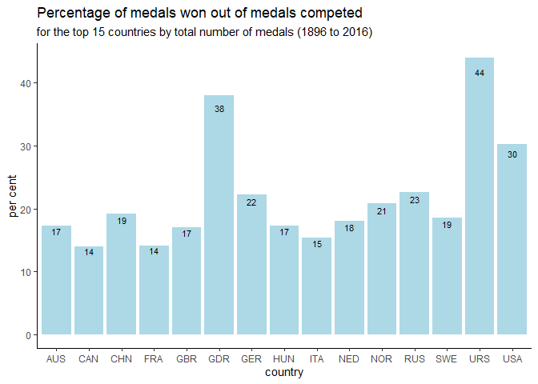
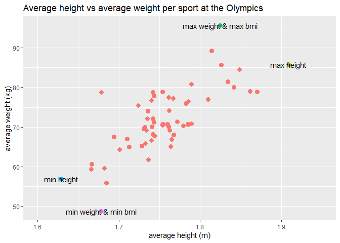
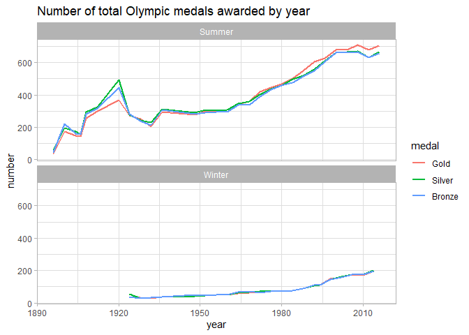

R Notebook
================

# FDS Final Project: Report \#4

This project looks at a dataset about athletes at the Olympic Games in 4
different sheets. I first import the data with the chunk below.

``` r
library(readxl)
athletes <- read_excel("../Report_4/olympics.xlsx", 
    sheet = "athletes")

country <- read_excel("../Report_4/olympics.xlsx", 
    sheet = "country")

games <- read_excel("../Report_4/olympics.xlsx", 
    sheet = "games")

medals <- read_excel("../Report_4/olympics.xlsx", 
    sheet = "medals")
```

As this chunck was quite long I load any additional libraries with the
chunck below. These are R packages that I need to use in the rest of the
project.

``` r
library(janitor)
library(tibble)
library(dplyr)
library(tidyr)
library(visdat)
library(ggplot2)
library(stringr)
library(infer)
library(knitr)
```

Next I will do a bit of data cleaning, including cleaning column names,
and renaming a few to avoid any further confusion. There will be more
data cleaning when needed later on.

``` r
games <-clean_names(games) %>% 
  rename(gm=games)
medals<-clean_names(medals) %>% 
  rename(id=athlete_id) %>% 
  rename(gm=games)
country<-clean_names(country) %>% 
  rename(id=athlete_id) %>% 
  rename(gm=games)
athletes<-clean_names(athletes)
```

Before getting started, I check what happened at the 1956 games in the
games data file. There are two different entries for the summer
Olympics, which were party held in Melbourne and party in Stockholm.

``` r
games %>% 
  filter(year=="1956")
```

    ## # A tibble: 3 x 4
    ##   gm           year season city             
    ##   <chr>       <dbl> <chr>  <chr>            
    ## 1 1956 Winter  1956 Winter Cortina d'Ampezzo
    ## 2 1956 Summer  1956 Summer Melbourne        
    ## 3 1956 Summer  1956 Summer Stockholm

This means I need to be careful not to lose this data when combining the
worksheets together. Wikipedia suggests that the 1956 Summer Olympics
was held in Melbourne, with the exception of the equestrian events,
which were held in Stockholm. For the purpose of the analysis I’ll
replace Stockholm with Melbourne for the year 1956 to avoid the double
counting.

``` r
games<- games %>% 
  filter(city!="Stockholm" | year!= 1956)
```

## Part 1. Have some athletes competed for different countries over time?

The answer is yes. I first combine the country and games worksheet to
have access to “noc” =country and “year” in the same dataset. Then I
create a vector of athlete id values (id) for which more than one
countries are listed over the years. For example id 116 competed for
both UAR and EGY. Some competed for as many as 4 different country codes
- as was the case for id 66953. The "more than one country id’s are
stored in the vector id\_more\_than\_1c.

``` r
oly1<- left_join(country, games) %>% 
  select(-gm)
```

    ## Joining, by = "gm"

``` r
id_more_than_1c <- oly1 %>% 
  distinct(id, noc) %>% 
  group_by(id) %>% 
  count(name="nr_delegations") %>% 
  filter(nr_delegations!=1) %>% 
  arrange(desc(nr_delegations)) %>% 
  pull(id)

oly1 %>% 
  filter(id %in% id_more_than_1c)
```

    ## # A tibble: 4,388 x 6
    ##       id   age noc    year season city    
    ##    <dbl> <dbl> <chr> <dbl> <chr>  <chr>   
    ##  1   116    28 UAR    1960 Summer Roma    
    ##  2   116    32 EGY    1964 Summer Tokyo   
    ##  3   193    21 EGY    1948 Summer London  
    ##  4   193    25 EGY    1952 Summer Helsinki
    ##  5   193    33 UAR    1960 Summer Roma    
    ##  6   195    24 EGY    1952 Summer Helsinki
    ##  7   195    32 UAR    1960 Summer Roma    
    ##  8   206    18 UAR    1960 Summer Roma    
    ##  9   206    22 EGY    1964 Summer Tokyo   
    ## 10   211    16 UAR    1960 Summer Roma    
    ## # ... with 4,378 more rows

## Part 2. Who are the ten athletes that took part in most games?

I first combine the athletes dataset with the previous country and games
(oly1) tibble. In this new “oly 2” dataset each athlete appears the
number of times he or she has competed, just like in “country” (in
athletes each id appeared only once). Then I create a tibble with the
list of top 10 names and the number of games in which they participated.

``` r
oly2<-left_join(athletes, oly1)
```

    ## Joining, by = "id"

``` r
oly2 %>% 
  count(name) %>% 
  arrange(desc(n)) %>% 
  top_n(10)
```

    ## Selecting by n

    ## # A tibble: 15 x 2
    ##    name                                n
    ##    <chr>                           <int>
    ##  1 Ian Millar                         10
    ##  2 Afanasijs Kuzmins                   9
    ##  3 Hubert Raudaschl                    9
    ##  4 Aleksandr Vladimirovich Popov       8
    ##  5 Chen Jing                           8
    ##  6 Durward Randolph Knowles            8
    ##  7 Francisco Boza Dibos                8
    ##  8 Josefa Idem-Guerrini                8
    ##  9 Lesley Allison Thompson-Willie      8
    ## 10 Li Na                               8
    ## 11 Nino Salukvadze (-Machavariani)     8
    ## 12 Paul Bert Elvstrm                   8
    ## 13 Piero D'Inzeo                       8
    ## 14 Raimondo D'Inzeo                    8
    ## 15 Rajmond Debevec                     8

The list of athletes that took part in most games includes Ian Millar
with 10 games, then Afanasijs Kuzmins and Hubert Raudaschl each with 9
games, followed by 12 other athletes with 8 games each. Thus the top 10
should include 15 athletes.

## Part 3. What athlete(s) kept a Gold medal for the longest time?

For this part I need to combine together the medal, athletes and games
tibbles, but with certain other considerations.

I first do some more data cleaning on the “medals” dataset. It seems
that some atheletes are listen more than once in this dataset,
especially for unknown art events. I look for distinct/unique
combinations of id, game, event and medal.

Then I tried to join oly2 with medals but this generated some further
double counting in the data and the total number of Gold medals
increased.

So I changed my strategy and joined medals with athetes and then with
games to create “oly\_new”, which worked better for my purpose.

One more clarification, keeping a Gold medal means I need to look for
consecutive years when someone had a Gold medal.

``` r
# To show "medals" dataset has repeat entries of atheletes per game and event.
medals %>% 
  count(id, gm, event, name="nr_games") %>% 
  arrange(desc(nr_games))
```

    ## # A tibble: 269,636 x 4
    ##        id gm         event                                         nr_games
    ##     <dbl> <chr>      <chr>                                            <int>
    ##  1  77710 1932 Summ~ Art Competitions Mixed Sculpturing, Unknown ~       43
    ##  2  83312 1948 Summ~ Art Competitions Mixed Painting, Unknown Eve~       25
    ##  3  12380 1932 Summ~ Art Competitions Mixed Painting, Unknown Eve~       17
    ##  4  74532 1932 Summ~ Art Competitions Mixed Painting, Unknown Eve~       17
    ##  5  86677 1928 Summ~ Art Competitions Mixed Painting, Drawings An~       17
    ##  6  28407 1932 Summ~ Art Competitions Mixed Painting, Unknown Eve~       16
    ##  7 134046 1928 Summ~ Art Competitions Mixed Painting, Paintings          16
    ##  8  44875 1928 Summ~ Art Competitions Mixed Architecture, Archite~       14
    ##  9  44875 1928 Summ~ Art Competitions Mixed Architecture, Designs~       14
    ## 10  14083 1924 Summ~ Art Competitions Mixed Sculpturing                  13
    ## # ... with 269,626 more rows

``` r
# An example of repeat entries.
medals %>% 
  filter(id==83312)
```

    ## # A tibble: 31 x 6
    ##       id gm        team       sport       event                       medal
    ##    <dbl> <chr>     <chr>      <chr>       <chr>                       <chr>
    ##  1 83312 1928 Sum~ Great Bri~ Art Compet~ Art Competitions Mixed Pai~ <NA> 
    ##  2 83312 1928 Sum~ Great Bri~ Art Compet~ Art Competitions Mixed Pai~ <NA> 
    ##  3 83312 1928 Sum~ Great Bri~ Art Compet~ Art Competitions Mixed Pai~ <NA> 
    ##  4 83312 1928 Sum~ Great Bri~ Art Compet~ Art Competitions Mixed Pai~ <NA> 
    ##  5 83312 1928 Sum~ Great Bri~ Art Compet~ Art Competitions Mixed Pai~ <NA> 
    ##  6 83312 1932 Sum~ Great Bri~ Art Compet~ Art Competitions Mixed Pai~ <NA> 
    ##  7 83312 1948 Sum~ Great Bri~ Art Compet~ Art Competitions Mixed Pai~ <NA> 
    ##  8 83312 1948 Sum~ Great Bri~ Art Compet~ Art Competitions Mixed Pai~ <NA> 
    ##  9 83312 1948 Sum~ Great Bri~ Art Compet~ Art Competitions Mixed Pai~ <NA> 
    ## 10 83312 1948 Sum~ Great Bri~ Art Compet~ Art Competitions Mixed Pai~ <NA> 
    ## # ... with 21 more rows

``` r
medals <-medals %>% 
  distinct(id, gm, event, sport, medal)

oly_new<- left_join(medals, athletes) %>% 
  left_join(games)
```

    ## Joining, by = "id"

    ## Joining, by = "gm"

``` r
q3 <- oly_new %>% 
  filter(medal=="Gold") %>% 
  group_by(id, event) %>% 
  mutate(prevyear=lag(year, default=0)) %>% 
  mutate(diffyear=year-prevyear) %>% 
  mutate(diff4=if_else(diffyear==4, 1, 0)) %>% 
  mutate(diffsum=cumsum(diff4)) %>% 
  select(-gm, -medal, -sport, -height, -weight, -sex, -city) %>% 
  arrange(desc(diffsum)) %>% 
  ungroup() %>% 
  top_n(1, diffsum) %>% 
  pull(name)
```

The answer is Aladr Gerevich (-Gerei). He was the only one to keep his
Gold medal for fencing for 4 consecutive years.

## Part 4. What country(ies) kept a Gold medal for the longest time?

To do this I finally join together all datasets, in the order of medals
with athletes, with games and with country into an oly\_all dataset,
which has no duplication problems (I checked).

The question refers to the country with the largest number of gold
medals for the same event per year (considering different athletes over
time), in consecutive competitions.

I had to create a function ff that resets cumsum() every time the value
0 is encoutered. This is because in the dataset there are series of
consecutive gold medals but with breaks in between. This ws not the case
for individual atheletes.

Kenya and the United States both share the record for keeping the gold
medal for 8 consecutive Olymping games ending in 2016. Kenya for
Athletics Men’s 3,000 metres Steeplechase and the United States for
Swimming Men’s 4 x 100 metres Medley Relay.

``` r
oly_all<- left_join(medals, athletes) %>% 
  left_join(games) %>% 
  left_join(country)
```

    ## Joining, by = "id"

    ## Joining, by = "gm"

    ## Joining, by = c("id", "gm")

``` r
ff = function(x)
{
    cs = cumsum(x)
    cs - cummax((x == 0) * cs)
}

oly_all %>% 
  select(noc, event, id, year, medal) %>% 
  filter(medal=="Gold") %>% 
  distinct(noc, event, year) %>%
  arrange(noc, event, year) %>% 
  group_by(noc, event) %>% 
  mutate(prevyear=lag(year, default = 0)) %>% 
  mutate(diffyear=year-prevyear) %>% 
  mutate(diff4=if_else(diffyear==4, 1, 0)) %>%
  mutate(diffsum=ff(diff4)) %>% 
  arrange(desc(diffsum)) %>%  
  ungroup() %>% 
  top_n(1)
```

    ## Selecting by diffsum

    ## # A tibble: 2 x 7
    ##   noc   event                          year prevyear diffyear diff4 diffsum
    ##   <chr> <chr>                         <dbl>    <dbl>    <dbl> <dbl>   <dbl>
    ## 1 KEN   Athletics Men's 3,000 metres~  2016     2012        4     1       8
    ## 2 USA   Swimming Men's 4 x 100 metre~  2016     2012        4     1       8

Just checking to see what the data looks like for one of the countries
with the largest number of gold medals by event.

``` r
oly_all %>% 
  filter(medal=="Gold", noc=="KEN", event=="Athletics Men's 3,000 metres Steeplechase") %>% 
  arrange(year)
```

    ## # A tibble: 11 x 14
    ##       id gm    event sport medal name  sex   height weight  year season
    ##    <dbl> <chr> <chr> <chr> <chr> <chr> <chr>  <dbl>  <dbl> <dbl> <chr> 
    ##  1 11864 1968~ Athl~ Athl~ Gold  Amos~ M        181     66  1968 Summer
    ##  2 58429 1972~ Athl~ Athl~ Gold  "Kip~ M        173     66  1972 Summer
    ##  3 62790 1984~ Athl~ Athl~ Gold  Juli~ M        172     64  1984 Summer
    ##  4 57573 1988~ Athl~ Athl~ Gold  Juli~ M        181     62  1988 Summer
    ##  5 11684 1992~ Athl~ Athl~ Gold  Matt~ M        172     62  1992 Summer
    ##  6 58959 1996~ Athl~ Athl~ Gold  Jose~ M        178     64  1996 Summer
    ##  7 62972 2000~ Athl~ Athl~ Gold  Reub~ M        170     55  2000 Summer
    ##  8 58614 2004~ Athl~ Athl~ Gold  Ezek~ M        167     52  2004 Summer
    ##  9 60623 2008~ Athl~ Athl~ Gold  Brim~ M        175     55  2008 Summer
    ## 10 58614 2012~ Athl~ Athl~ Gold  Ezek~ M        167     52  2012 Summer
    ## 11 60624 2016~ Athl~ Athl~ Gold  Cons~ M        167     58  2016 Summer
    ## # ... with 3 more variables: city <chr>, age <dbl>, noc <chr>

## Part 5. Who are the ten athletes that competed in the most events (some athletes take part in more than one event during games) ?

I first discovered that in the atheletes file there are a few athletes
that have the same name but different height, weight and id. For example
Ivan Ivanov. Thus the name is not a unique identifyer in this dataset,
so I use “id” instead.

The top 10 athletes who competed in most events are listed below,
starting with the gymnast Heikki Ilmari Savolainen of Finland who
competed 39 times over 5 years. The list of top 10 includes 12 as the
last three althletes listed all competed 30 times.

``` r
athletes %>% 
  count(name, sex, name="no_ids") %>% 
  arrange(desc(no_ids))
```

    ## # A tibble: 134,786 x 3
    ##    name           sex   no_ids
    ##    <chr>          <chr>  <int>
    ##  1 Ivan Ivanov    M          5
    ##  2 Lszl Szab      M          5
    ##  3 Wolfgang Mller M          5
    ##  4 Bla Nagy       M          4
    ##  5 Jos Gonzlez    M          4
    ##  6 Jzsef Kovcs    M          4
    ##  7 Jzsef Nagy     M          4
    ##  8 Kim Mi-Jeong   F          4
    ##  9 Kim Yun-Mi     F          4
    ## 10 Li Yang        M          4
    ## # ... with 134,776 more rows

``` r
# Showing one example where name is not a unique identifier.
athletes %>% 
  filter(name=="Ivan Ivanov")
```

    ## # A tibble: 5 x 5
    ##      id name        sex   height weight
    ##   <dbl> <chr>       <chr>  <dbl>  <dbl>
    ## 1 52802 Ivan Ivanov M        188     82
    ## 2 52805 Ivan Ivanov M        192    107
    ## 3 52808 Ivan Ivanov M        177     64
    ## 4 52810 Ivan Ivanov M        202    144
    ## 5 52812 Ivan Ivanov M        185     75

``` r
oly_all %>% 
  distinct(id, name, event, year, season) %>% 
  count(id, name, name="no_games") %>% 
  arrange(desc(no_games)) %>% 
  top_n(10)
```

    ## Selecting by no_games

    ## # A tibble: 12 x 3
    ##        id name                          no_games
    ##     <dbl> <chr>                            <int>
    ##  1 106296 Heikki Ilmari Savolainen            39
    ##  2 115354 "Joseph \"Josy\" Stoffel"           38
    ##  3 119591 Ioannis Theofilakis                 36
    ##  4  89187 Takashi Ono                         32
    ##  5 119590 Alexandros Theofilakis              32
    ##  6 129196 Andreas Wecker                      32
    ##  7  55047 "Alfred August \"Al\" Jochim"       31
    ##  8  76437 Michel Mathiot                      31
    ##  9 106156 "Johann \"Hans\" Sauter"            31
    ## 10  94406 Michael Fred Phelps, II             30
    ## 11 120051 Karl Tore William Thoresson         30
    ## 12 133279 Yordan Yovchev Yovchev              30

Just checking to see what the data looks like for the first one in the
list.

``` r
oly_all %>% 
  filter(name=="Heikki Ilmari Savolainen")
```

    ## # A tibble: 39 x 14
    ##        id gm    event sport medal name  sex   height weight  year season
    ##     <dbl> <chr> <chr> <chr> <chr> <chr> <chr>  <dbl>  <dbl> <dbl> <chr> 
    ##  1 106296 1928~ Gymn~ Gymn~ <NA>  Heik~ M        172     64  1928 Summer
    ##  2 106296 1928~ Gymn~ Gymn~ <NA>  Heik~ M        172     64  1928 Summer
    ##  3 106296 1928~ Gymn~ Gymn~ <NA>  Heik~ M        172     64  1928 Summer
    ##  4 106296 1928~ Gymn~ Gymn~ <NA>  Heik~ M        172     64  1928 Summer
    ##  5 106296 1928~ Gymn~ Gymn~ <NA>  Heik~ M        172     64  1928 Summer
    ##  6 106296 1928~ Gymn~ Gymn~ <NA>  Heik~ M        172     64  1928 Summer
    ##  7 106296 1928~ Gymn~ Gymn~ Bron~ Heik~ M        172     64  1928 Summer
    ##  8 106296 1932~ Gymn~ Gymn~ Bron~ Heik~ M        172     64  1932 Summer
    ##  9 106296 1932~ Gymn~ Gymn~ Bron~ Heik~ M        172     64  1932 Summer
    ## 10 106296 1932~ Gymn~ Gymn~ <NA>  Heik~ M        172     64  1932 Summer
    ## # ... with 29 more rows, and 3 more variables: city <chr>, age <dbl>,
    ## #   noc <chr>

## Part 6. Create a new table showing the number of medals per country (rows) and per year (column). Keep only the 15 countries with the most medals overall.

I first create a tibble in the exsiting format including the number of
medals (any) by country(noc), year and create a new variable for the sum
of all medals over all year (y\_all). Then I sort the data by year. Next
I create a wider pivot with the years as columns, as well as my y\_all
total medals variable used to filter only the top 15 countries. The
first three countries are USA, URS and GER.

Note to self. In the code below I added a parameter in the
pivot\_wider()function to set missing values to 0 (i.e. no medal).

``` r
medal_tib<- oly_all %>% 
  filter(!is.na(medal)) %>% 
  count(noc, year, name="freq") %>% 
  group_by(noc) %>% 
  mutate(y_all=(sum(freq))) %>% 
  arrange(year) %>% 
  pivot_wider(names_from = "year", values_from = "freq", values_fill = list(freq=0)) %>% 
  arrange(desc(y_all)) %>% 
  head(15) %>% 
  ungroup()

medal_tib %>% 
  select(noc, y_all, "2000", "2002", "2004", "2006", "2008", "2010", "2012", "2014", "2016") %>% 
  kable()
```

| noc | y\_all | 2000 | 2002 | 2004 | 2006 | 2008 | 2010 | 2012 | 2014 | 2016 |
| :-- | -----: | ---: | ---: | ---: | ---: | ---: | ---: | ---: | ---: | ---: |
| USA |   5637 |  242 |   84 |  263 |   52 |  317 |   97 |  248 |   64 |  264 |
| URS |   2503 |    0 |    0 |    0 |    0 |    0 |    0 |    0 |    0 |    0 |
| GER |   2165 |  118 |   61 |  149 |   54 |   99 |   54 |   94 |   36 |  159 |
| GBR |   2067 |   54 |    6 |   57 |    1 |   81 |    1 |  126 |   10 |  145 |
| FRA |   1767 |   66 |   15 |   53 |   15 |   77 |   14 |   82 |   18 |   96 |
| ITA |   1637 |   65 |   21 |  104 |   25 |   42 |    5 |   68 |   14 |   72 |
| SWE |   1536 |   32 |   26 |   12 |   64 |    7 |   18 |   22 |   51 |   28 |
| CAN |   1352 |   31 |   74 |   17 |   69 |   35 |   90 |   55 |   86 |   69 |
| AUS |   1320 |  183 |    2 |  157 |    2 |  149 |    3 |  114 |    3 |   82 |
| RUS |   1165 |  187 |   38 |  189 |   41 |  142 |   25 |  140 |   68 |  115 |
| HUN |   1135 |   53 |    0 |   40 |    0 |   27 |    0 |   26 |    0 |   22 |
| NED |   1040 |   79 |    8 |   77 |   13 |   61 |   11 |   69 |   29 |   47 |
| NOR |   1033 |   43 |   41 |    7 |   23 |   22 |   39 |   17 |   36 |   19 |
| GDR |   1005 |    0 |    0 |    0 |    0 |    0 |    0 |    0 |    0 |    0 |
| CHN |    989 |   79 |   16 |   94 |   13 |  184 |   19 |  125 |   12 |  113 |

## Part 7. Is there a relationship between country and the probability of winning a medal?

We know that some countries win more medals than others. In this part we
want to work out whether some countries win more medals simply because
they have more athletes competing for more events, or whether their
athletes are in fact performing better in general.

For this part, look only at the top 15 countries that you established in
part 6.

First, create a horizontal barchart listing for each of the fifteen
countries the percentage of medals won out of all medals competed for by
that country.

``` r
medal_tib <- medal_tib %>% 
  select(noc, y_all) %>% 
  arrange(noc)

countr_15 <- medal_tib %>% 
  pull(noc)

competed_tib<- oly_all %>% 
  filter(noc %in% countr_15) %>% 
  count(noc, year, name="competed") %>% 
  group_by(noc) %>% 
  mutate(y_comp=(sum(competed))) %>% 
  pivot_wider(names_from = "year", values_from = "competed") %>% 
  select(noc, y_comp) %>% 
  arrange(noc) %>% 
  bind_cols(medal_tib) %>% 
  mutate(success=y_all/y_comp*100)

competed_tib %>% 
  ggplot(mapping=aes(x=noc, y=success, label=success))+
  geom_bar(stat="identity", fill="light blue")+
  geom_text(aes(label = round(success, digits = 0)), size = 3, position = position_stack(vjust = 0.95), check_overlap = TRUE)+
  labs(title= "Percentage of medals won out of medals competed",
       subtitle = "for the top 15 countries by total number of medals (1896 to 2016)",
       x= "country",
       y= "per cent")+
  theme_classic()
```

<!-- -->

Run a Chi Square test to test the hypothesis: “There is no relationship
between country and whether they win a medal or not”.

To do tis I first transform the column medal into a factor variable that
takes on 0 for no medal and 1 for when a medal was won.

``` r
oly_all<- oly_all %>% 
  mutate(medal=replace(medal, !is.na(medal), 1)) %>% 
  mutate(medal=replace(medal, is.na(medal), 0)) %>% 
  mutate(medal=factor(medal, levels = c(0,1)))

# A contingency table
oly_all %>% 
  count(noc, medal, name="freq")
```

    ## # A tibble: 379 x 3
    ##    noc   medal  freq
    ##    <chr> <fct> <int>
    ##  1 AFG   0       124
    ##  2 AFG   1         2
    ##  3 AHO   0        78
    ##  4 AHO   1         1
    ##  5 ALB   0        70
    ##  6 ALG   0       534
    ##  7 ALG   1        17
    ##  8 AND   0       169
    ##  9 ANG   0       267
    ## 10 ANT   0       133
    ## # ... with 369 more rows

``` r
chisq_test(oly_all, formula = noc ~ medal)
```

    ## Warning in stats::chisq.test(table(x), ...): Chi-squared approximation may
    ## be incorrect

    ## # A tibble: 1 x 3
    ##   statistic chisq_df p_value
    ##       <dbl>    <int>   <dbl>
    ## 1    16606.      229       0

The result of the chi-squared test is highly significant as the p-value
is very low meaning that there is a significant relationship between
country and the possibility of winning a medal.

## Part 8

Create a scatterplot showing the average height and weight of
competitors per sport (one dot per sport). Add labels with the sport
names for:

    the largest average height
    the largest average weight
    the smallest average height
    the smallest average weight
    the largest average BMI
    the smallest average BMI

It might be that the same dot qualifies for multiple labels.

In the first part I deal with the missing data, I create the bmi
variable and join together the data. In the second part I create a new
tibble “variable” with the list of values to annotate on the chart. Then
I create a new variable “annot” inside the original dataset with the
labels needed for the data to annotate. I notice that maxweight
coincides with maxbmi and minweight coincides with minbmi. I correct the
“annot” code for this.

``` r
#I'll first have a look at how much data is missing
oly_all %>% 
  summarise(count=sum(is.na(height)))
```

    ## # A tibble: 1 x 1
    ##   count
    ##   <int>
    ## 1 58801

``` r
oly_all %>% 
  summarise(count=sum(is.na(weight)))
```

    ## # A tibble: 1 x 1
    ##   count
    ##   <int>
    ## 1 61514

``` r
aveweight<- oly_all %>% 
  group_by(sport) %>% 
  summarise(ave_height=mean(height/100, na.rm = TRUE),
            ave_weight=mean(weight, na.rm = TRUE)) %>% 
  arrange(sport) %>% 
  mutate(ave_height=replace(ave_height, is.na(ave_height), median(ave_height, na.rm=TRUE)), 
         ave_weight=replace(ave_weight, is.na(ave_weight), median(ave_weight, na.rm=TRUE)),
         bmi=ave_weight/ave_height^2)

values <- aveweight %>% 
  summarise(maxweight=max(ave_weight),
            minweight=min(ave_weight),
            maxheight=max(ave_height),
            minheight=min(ave_height),
            maxbmi=max(bmi),
            minbmi=min(bmi))

annot_aveweight<- aveweight %>% 
  mutate(annot=case_when(ave_weight==max(ave_weight)~"max weight & max bmi",
                         ave_weight==min(ave_weight)~"min weight & min bmi",
                         ave_height==max(ave_height)~"max height",
                         bmi==max(bmi)~"max bmi",
                         bmi==min(bmi)~"min bmi",
                         ave_height==min(ave_height)~"min height")) %>% 
  mutate(annot=replace(annot, is.na(annot), ""))
```

I had previously written “annot” with if\_else() because I though
case\_when() only takes conditions on one variable (weight, height or
bmi), but I was wrong.

``` r
# annot_aveweight <- aveweight %>% 
  #mutate(annot=if_else(
    #ave_weight==max(ave_weight, na.rm=TRUE), "maxweight", 
    #if_else(
      #ave_weight==min(ave_weight, na.rm=TRUE), "minweight", 
      #if_else(
        #ave_height==max(ave_height, na.rm=TRUE), "maxheight",
        #if_else(
          #ave_height==min(ave_height, na.rm=TRUE), "minheight",
          #if_else(
            #bmi == max(bmi, na.rm=TRUE), "maxbmi",
            #if_else(
              #bmi == min(bmi, na.rm=TRUE), "minbmi", "0")))))))
```

Below is the code for the scatter plot.

``` r
annot_aveweight %>% 
  ggplot(mapping = aes(x=ave_height, y=ave_weight))+
  geom_point(mapping = aes(color=annot, na.rm=TRUE), shape=16, size=3)+
  geom_text(aes(label=annot, na.rm=TRUE))+
  labs(title ="Average height vs average weight per sport at the Olympics",
       x="average height (m)",
       y="average weight (kg)")+
  theme(legend.position = "none")+
  scale_x_continuous(limits = c(1.6, 1.95))
```

    ## Warning: Ignoring unknown aesthetics: na.rm
    
    ## Warning: Ignoring unknown aesthetics: na.rm

<!-- -->
\#\# Part 9

Create a line plot showing the number of medals given by year (one line
for Gold, one line for Silver and one line for Bronze). Does it change
over time? Use facet to separate the medals at Summer games and Winter
games.

``` r
oly_new %>% 
  mutate(medal=replace(medal, is.na(medal), "")) %>% 
  filter(medal!="") %>%
  mutate(medal=factor(medal, labels=c("Gold", "Silver", "Bronze"))) %>%
  count(medal, year, season, name="freq") %>%   
  ggplot(mapping = aes(x=year, y=freq, color=medal))+
  geom_line(size=1)+
  facet_wrap(vars(season), ncol=1)+
  labs(title="Number of total Olympic medals awarded by year",
       y="number")+
  theme_light()
```

<!-- -->
