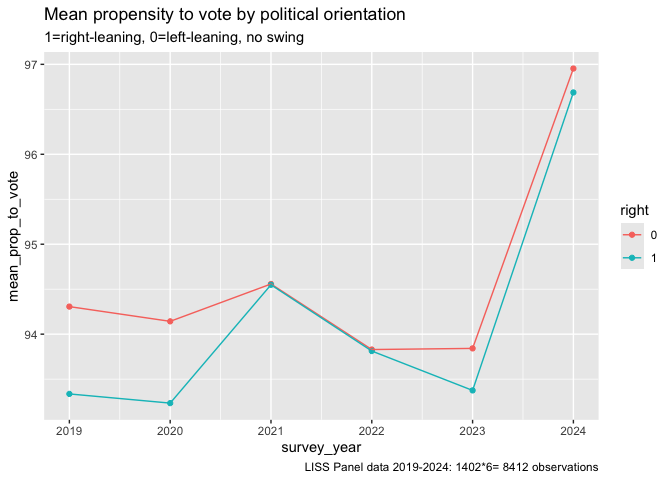

Difference in difference with LISS propensity to vote and political
orientation and IV on Ukraine war
================

## Read the data

We previously cleaned and joined the data in a csv balanced panel file.
Here we simply read in that data.

``` r
library(readr)
library(bacondecomp)
library(did)
library(eatATA)
library(haven)
library(lfe)
library(panelView)
library(tidyverse)

panel19_23_stacked <- read_csv("panel19_23_stacked.csv")
```

Balanced panel, 5 years of data.

``` r
panel19_23_stacked %>% 
  dplyr:: group_by(survey_year) %>% 
  dplyr:: summarise(count=n())
```

    ## # A tibble: 5 × 2
    ##   survey_year count
    ##         <dbl> <int>
    ## 1        2019  1658
    ## 2        2020  1658
    ## 3        2021  1658
    ## 4        2022  1658
    ## 5        2023  1658

Every year about 866 individuals from our panel are left-leaning and 792
are right-leaning.

``` r
panel19_23_stacked %>% 
  dplyr:: group_by(right) %>% 
  dplyr:: summarise(count=n()/5)
```

    ## # A tibble: 2 × 2
    ##   right count
    ##   <dbl> <dbl>
    ## 1     0   866
    ## 2     1   792

## Create treatment variable

In our case, we need to create a treatment variable which takes value 1
when year=2022 or 2023 and the individual is left-leaning
(i.e. right==0)

``` r
panel19_23_stacked <- panel19_23_stacked %>% 
  mutate(treatment_z = if_else((right==0 & survey_year>=2022), true= 1, false=0))
```

``` r
panel19_23_stacked %>% 
  head()
```

    ## # A tibble: 6 × 8
    ##    ...1 nomem_encr   age propensity_to_vote political_orientation survey_year
    ##   <dbl>      <dbl> <dbl>              <dbl>                 <dbl>       <dbl>
    ## 1     1     800009    63                 95                     1        2019
    ## 2     2     800009    64                 95                     2        2020
    ## 3     3     800009    65                100                     2        2021
    ## 4     4     800009    66                100                     2        2022
    ## 5     5     800009    67                 95                     2        2023
    ## 6     6     800015    56                100                     3        2019
    ## # ℹ 2 more variables: right <dbl>, treatment_z <dbl>

## Plotting the data

``` r
panel19_23_stacked %>% 
  group_by(right, survey_year) %>% 
  summarise(mean_prop_to_vote= (mean(propensity_to_vote))) %>% 
  mutate(right=as.factor(right)) %>% 
  ggplot(aes(x=survey_year, y=mean_prop_to_vote, color=right))+
  geom_point()+
  geom_line()+
  labs(title="Mean propensity to vote by political orientation",
       subtitle = "1=right-leaning, 0=left-leaning, no swing",
       caption="LISS Panel data 2019-2023: 1658 observations")
```

    ## `summarise()` has grouped output by 'right'. You can override using the
    ## `.groups` argument.

<!-- -->

``` r
panel19_23_stacked %>% 
  mutate(right=as.factor(right)) %>% 
  ggplot(aes(x=propensity_to_vote, y=right, color=right)) +
  geom_point()+
  geom_boxplot() +
  coord_flip() +
  facet_wrap(vars(survey_year)) +
  labs(title="Distribution of propensity to vote by political orientation",
       x="propensity to vote (0 to 100)",
       y="")
```

<!-- -->

## TSLS with IV=time of the Russia-Ukraine war for the left-leaning group

Now we estimate the first stage of our dif-in-dif model

``` r
dd_reg <- felm(political_orientation ~ treatment_z | survey_year + right, data=panel19_23_stacked)

summary(dd_reg)
```

    ## 
    ## Call:
    ##    felm(formula = political_orientation ~ treatment_z | survey_year +      right, data = panel19_23_stacked) 
    ## 
    ## Residuals:
    ##     Min      1Q  Median      3Q     Max 
    ## -2.4614 -0.4614 -0.3103  0.6865  2.7304 
    ## 
    ## Coefficients:
    ##             Estimate Std. Error t value Pr(>|t|)   
    ## treatment_z  0.15218    0.04897   3.108  0.00189 **
    ## ---
    ## Signif. codes:  0 '***' 0.001 '**' 0.01 '*' 0.05 '.' 0.1 ' ' 1
    ## 
    ## Residual standard error: 1.091 on 8283 degrees of freedom
    ## Multiple R-squared(full model): 0.7654   Adjusted R-squared: 0.7652 
    ## Multiple R-squared(proj model): 0.001165   Adjusted R-squared: 0.0004411 
    ## F-statistic(full model): 4503 on 6 and 8283 DF, p-value: < 2.2e-16 
    ## F-statistic(proj model): 9.658 on 1 and 8283 DF, p-value: 0.001892

We can see that it seems that the treatment coefficient is highly
significant. We’d have to run a parallel trends regression to see if the
parallel trends assumption holds and the estimators on lagged treatment
are within the confidence interval.

But for now let’s store the main_ATT_1 and the confidence interval
boundaries.

``` r
main_ATT_1= summary(dd_reg)$coefficients["treatment_z", "Estimate"]

ATT_1_CI_lower_boundary = abs(main_ATT_1 - qnorm(0.975)*summary(dd_reg)$coefficients["treatment_z", "Std. Error"])

ATT_1_CI_upper_boundary = abs(main_ATT_1 + qnorm(0.975)*summary(dd_reg)$coefficients["treatment_z", "Std. Error"])
```

``` r
c(main_ATT_1, ATT_1_CI_lower_boundary, ATT_1_CI_upper_boundary)
```

    ## [1] 0.15218437 0.05620435 0.24816440

For the second stage of our two-stage least-squares (TSLS) we need to
store the predicted values of political orientation from the first stage
model above (dd_reg). We’ll store them in a new variable called
pred_political_orientation.

``` r
panel19_23_stacked <- panel19_23_stacked %>% 
  mutate(pred_political_orientation = as.tibble(fitted(dd_reg)) %>% 
  pull(political_orientation))
```

    ## Warning: There was 1 warning in `mutate()`.
    ## ℹ In argument: `pred_political_orientation = as.tibble(fitted(dd_reg)) %>%
    ##   pull(political_orientation)`.
    ## Caused by warning:
    ## ! `as.tibble()` was deprecated in tibble 2.0.0.
    ## ℹ Please use `as_tibble()` instead.
    ## ℹ The signature and semantics have changed, see `?as_tibble`.

Just to get an idea of how predicted political_orientation and true
political orientation compare, we’ll make a scatterplot.

``` r
panel19_23_stacked %>% 
  mutate(right=as.factor(right)) %>% 
  ggplot(aes(x=political_orientation, y=pred_political_orientation, color=right)) +
  geom_point() +
  facet_wrap(vars(survey_year)) +
  labs(title="Comparison between political orientation and predicted political orientation")
```

<!-- -->

For the second stage, we regress the outcome (propensity to vote) on the
predicted political orientation, with fixed effects.

``` r
dd_reg_2 <- felm(propensity_to_vote ~ pred_political_orientation | survey_year + right, data=panel19_23_stacked)

summary(dd_reg_2)
```

    ## 
    ## Call:
    ##    felm(formula = propensity_to_vote ~ pred_political_orientation |      survey_year + right, data = panel19_23_stacked) 
    ## 
    ## Residuals:
    ##     Min      1Q  Median      3Q     Max 
    ## -93.767   4.233   6.020   6.550   6.875 
    ## 
    ## Coefficients:
    ##                            Estimate Std. Error t value Pr(>|t|)
    ## pred_political_orientation  -0.9824     4.5764  -0.215     0.83
    ## 
    ## Residual standard error: 15.52 on 8283 degrees of freedom
    ## Multiple R-squared(full model): 0.0009614   Adjusted R-squared: 0.0002377 
    ## Multiple R-squared(proj model): 5.563e-06   Adjusted R-squared: -0.0007188 
    ## F-statistic(full model):1.329 on 6 and 8283 DF, p-value: 0.2404 
    ## F-statistic(proj model): 0.04608 on 1 and 8283 DF, p-value: 0.83

Our LATE estimand is highly insignificant. We store the estimated values
and confidence intervals.

``` r
LATE= summary(dd_reg_2)$coefficients["pred_political_orientation", "Estimate"]

LATE_CI_lower_boundary = abs(LATE - qnorm(0.975)*summary(dd_reg_2)$coefficients["pred_political_orientation", "Std. Error"])

LATE_CI_upper_boundary = abs(LATE + qnorm(0.975)*summary(dd_reg_2)$coefficients["pred_political_orientation", "Std. Error"])

c(LATE, LATE_CI_lower_boundary, LATE_CI_upper_boundary)
```

    ## [1] -0.9823815  9.9519679  7.9872049

## Standard OLS estimation

We regress propensity to vote on political orientation, the treatment
variable (=1 after the crisis, for left-leaning people) and the
interaction term between treatment and political orientation.

Probably the relationship is endogenous, but just to be able to compare
results.

``` r
library(fixest)
```

    ## 
    ## Attaching package: 'fixest'

    ## The following object is masked from 'package:lfe':
    ## 
    ##     fepois

``` r
ols_reg <- feols(
  propensity_to_vote ~ political_orientation + treatment_z + political_orientation*treatment_z, # Regression formula
  data=panel19_23_stacked,
  vcov = "hc1" #--variance-covariance ratio, hc=heterochedasticity-consistent
)

summary(ols_reg)
```

    ## OLS estimation, Dep. Var.: propensity_to_vote
    ## Observations: 8,290
    ## Standard-errors: Heteroskedasticity-robust 
    ##                                    Estimate Std. Error   t value   Pr(>|t|)    
    ## (Intercept)                       95.372574   0.458465 208.02590  < 2.2e-16 ***
    ## political_orientation             -0.287696   0.076375  -3.76688 1.6645e-04 ***
    ## treatment_z                        6.064284   1.152067   5.26383 1.4462e-07 ***
    ## political_orientation:treatment_z -1.927416   0.341316  -5.64701 1.6865e-08 ***
    ## ---
    ## Signif. codes:  0 '***' 0.001 '**' 0.01 '*' 0.05 '.' 0.1 ' ' 1
    ## RMSE: 15.5   Adj. R2: 0.00695

Here we obtain a negative and significant coefficient. Increasing
political orientation by one unit (moving to the right) is associated
with 0.287 lower propensity to vote.

``` r
library(binsreg)

binscatter <- binsreg(panel19_23_stacked$propensity_to_vote, panel19_23_stacked$political_orientation)
```

    ## Warning in binsreg(panel19_23_stacked$propensity_to_vote,
    ## panel19_23_stacked$political_orientation): Too small effective sample size for
    ## bin selection. # of mass of points or clusters used and by option ignored.

    ## Warning in binsreg(panel19_23_stacked$propensity_to_vote,
    ## panel19_23_stacked$political_orientation): dots=c(0,0) used.

<!-- -->

``` r
binscatter$bins_plot +
  labs(y = "Propensity to vote", x = "Political orientation")
```

<!-- -->

Simple TSLS, no fixed, effects:

``` r
feols(
  propensity_to_vote ~ 1 | 0 | political_orientation ~ treatment_z, 
  data = panel19_23_stacked,
  vcov = "hc1"
)
```

    ## TSLS estimation - Dep. Var.: propensity_to_vote
    ##                   Endo.    : political_orientation
    ##                   Instr.   : treatment_z
    ## Second stage: Dep. Var.: propensity_to_vote
    ## Observations: 8,290
    ## Standard-errors: Heteroskedasticity-robust 
    ##                            Estimate Std. Error  t value  Pr(>|t|)    
    ## (Intercept)               93.964800   0.996340 94.31000 < 2.2e-16 ***
    ## fit_political_orientation -0.042973   0.185301 -0.23191   0.81661    
    ## ---
    ## Signif. codes:  0 '***' 0.001 '**' 0.01 '*' 0.05 '.' 0.1 ' ' 1
    ## RMSE: 15.5   Adj. R2: 4.852e-4
    ## F-test (1st stage), political_orientation: stat = 1,750.2    , p < 2.2e-16 , on 1 and 8,288 DoF.
    ##                                Wu-Hausman: stat =     3.62861, p = 0.056829, on 1 and 8,287 DoF.

Simple TSLS with fixed effects

``` r
feols(
  propensity_to_vote ~ 1 | survey_year + right | political_orientation ~ treatment_z, 
  data = panel19_23_stacked,
  vcov = "hc1"
)
```

    ## TSLS estimation - Dep. Var.: propensity_to_vote
    ##                   Endo.    : political_orientation
    ##                   Instr.   : treatment_z
    ## Second stage: Dep. Var.: propensity_to_vote
    ## Observations: 8,290
    ## Fixed-effects: survey_year: 5,  right: 2
    ## Standard-errors: Heteroskedasticity-robust 
    ##                            Estimate Std. Error   t value Pr(>|t|) 
    ## fit_political_orientation -0.982382    4.61778 -0.212739  0.83154 
    ## ---
    ## Signif. codes:  0 '***' 0.001 '**' 0.01 '*' 0.05 '.' 0.1 ' ' 1
    ## RMSE: 15.5     Adj. R2: 0.005244
    ##              Within R2: 0.005013
    ## F-test (1st stage), political_orientation: stat = 9.65772 , p = 0.001892, on 1 and 8,283 DoF.
    ##                                Wu-Hausman: stat = 2.838e-5, p = 0.995749, on 1 and 8,282 DoF.

And a Hasman test, which is highly significant, so we shoould not use
OLS results.

``` r
library(ivDiag)
```

    ## ## Tutorial: https://yiqingxu.org/packages/ivDiag/

``` r
eff_F(panel19_23_stacked, Y = "propensity_to_vote", D = "political_orientation", Z = "treatment_z")
```

    ## [1] 3428.807
