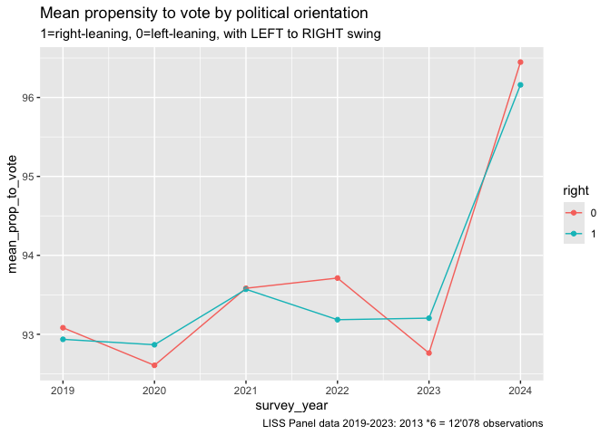

Difference in difference with LISS propensity to vote and political
orientation and IV on Ukraine war
================

## Read the data

We previously cleaned and joined the data in a csv balanced panel file.
Here we simply read in that data.

``` r
library(readr)
library(bacondecomp)
library(did)
library(eatATA)
library(haven)
library(lfe)
library(panelView)
library(tidyverse)
library(ivDiag)

panel19_24_stacked <- read_csv("panel19_24_stacked.csv")
```

Balanced panel, 6 years of data.

``` r
panel19_24_stacked %>% 
  dplyr:: group_by(survey_year) %>% 
  dplyr:: summarise(count=n())
```

    ## # A tibble: 6 × 2
    ##   survey_year count
    ##         <dbl> <int>
    ## 1        2019  1402
    ## 2        2020  1402
    ## 3        2021  1402
    ## 4        2022  1402
    ## 5        2023  1402
    ## 6        2024  1402

Every year about 849 individuals from our panel are left-leaning and 832
are right-leaning.

``` r
panel19_24_stacked %>% 
  dplyr:: group_by(right) %>% 
  dplyr:: summarise(count=n()/5)
```

    ## # A tibble: 2 × 2
    ##   right count
    ##   <dbl> <dbl>
    ## 1     0  850.
    ## 2     1  833.

## Create treatment variable

We hypothesize that the shock associated with the above-mentioned influx
has affected left-leaning individuals (our treatment group, post-war)
differently as compared to right-leaning individuals (our control
group); in particular we hypothesize that the crisis affected the
political orientation of the left-leaning group (and moved them to the
right) and through this channel also affected their propensity to vote.
The crisis made left-leaning voters become slightly more right-leaning
and slightly less prone to vote.

We do this by employing an IV Two Way Fixed Effect (TWFE) design using
the LISS panel data from 2019–2024.

In our case, we need to create a treatment variable - **treatment_23**-
which takes value 1 when year=2023 or 2024 and the individual is
left-leaning (i.e. right==0).

For this study, the anticipation of refugee arrivals was captured in the
2023 data and is reflected in the subsequent years. The effect of the
crisis had not yet taken center stage in 2022 at the time when the LISS
data was collected (Dec 2021-Mar 2022), with the war commencing end of
Feb 2022. Thus our instrument takes on value 1 when year=2023 or 2024
(not 2022) and the individual is left-leaning.

``` r
panel19_24_stacked <- panel19_24_stacked %>% 
  mutate(treatment_23_left =if_else((right==0 & survey_year>=2023), true= 1, false=0))
```

``` r
panel19_24_stacked %>% 
  head()
```

    ## # A tibble: 6 × 8
    ##    ...1 nomem_encr   age propensity_to_vote political_orientation survey_year
    ##   <dbl>      <dbl> <dbl>              <dbl>                 <dbl>       <dbl>
    ## 1     1     800009    63                 95                     1        2019
    ## 2     2     800009    64                 95                     2        2020
    ## 3     3     800009    65                100                     2        2021
    ## 4     4     800009    66                100                     2        2022
    ## 5     5     800009    67                 95                     2        2023
    ## 6     6     800009    68                100                     4        2024
    ## # ℹ 2 more variables: right <dbl>, treatment_23_left <dbl>

## Plotting the data

``` r
panel19_24_stacked %>% 
  dplyr:: group_by(right, survey_year) %>% 
  dplyr:: summarise(mean_prop_to_vote= (mean(propensity_to_vote))) %>% 
  dplyr:: mutate(right=as.factor(right)) %>% 
  ggplot(aes(x=survey_year, y=mean_prop_to_vote, color=right))+
  geom_point()+
  geom_line()+
  labs(title="Mean propensity to vote by political orientation",
       subtitle = "1=right-leaning, 0=left-leaning, no swing",
       caption="LISS Panel data 2019-2024: 1402*6= 8412 observations")
```

    ## `summarise()` has grouped output by 'right'. You can override using the
    ## `.groups` argument.

<!-- -->

``` r
panel19_24_stacked %>% 
  mutate(right=as.factor(right)) %>% 
  ggplot(aes(x=propensity_to_vote, y=right, color=right)) +
  geom_point()+
  geom_boxplot() +
  coord_flip() +
  facet_wrap(vars(survey_year)) +
  labs(title="Distribution of propensity to vote by political orientation",
       x="propensity to vote (0 to 100)",
       y="")
```

<!-- -->

## TSLS with IV=time of the Russia-Ukraine war for the left-leaning group

Now we estimate the first stage of our dif-in-dif model

``` r
dd_reg <- felm(political_orientation ~ treatment_23_left | survey_year + nomem_encr, data=panel19_24_stacked)

summary(dd_reg)
```

    ## 
    ## Call:
    ##    felm(formula = political_orientation ~ treatment_23_left | survey_year +      nomem_encr, data = panel19_24_stacked) 
    ## 
    ## Residuals:
    ##     Min      1Q  Median      3Q     Max 
    ## -3.2931 -0.3174  0.0125  0.3172  3.0159 
    ## 
    ## Coefficients:
    ##                   Estimate Std. Error t value Pr(>|t|)   
    ## treatment_23_left  0.08606    0.02761   3.117  0.00183 **
    ## ---
    ## Signif. codes:  0 '***' 0.001 '**' 0.01 '*' 0.05 '.' 0.1 ' ' 1
    ## 
    ## Residual standard error: 0.5968 on 7004 degrees of freedom
    ## Multiple R-squared(full model): 0.9436   Adjusted R-squared: 0.9323 
    ## Multiple R-squared(proj model): 0.001386   Adjusted R-squared: -0.1992 
    ## F-statistic(full model):83.36 on 1407 and 7004 DF, p-value: < 2.2e-16 
    ## F-statistic(proj model): 9.719 on 1 and 7004 DF, p-value: 0.001831

We can see that it seems that the treatment coefficient is highly
significant: the year 2023 increases (=turns to the right) the political
orientation of left-leaning people by 0.08 points on the 0 to 10 scale.

But for now let’s store the main_ATT_1 and the confidence interval
boundaries.

``` r
main_ATT_1= summary(dd_reg)$coefficients["treatment_23_left", "Estimate"]

ATT_1_CI_lower_boundary = abs(main_ATT_1 - qnorm(0.975)*summary(dd_reg)$coefficients["treatment_23_left", "Std. Error"])

ATT_1_CI_upper_boundary = abs(main_ATT_1 + qnorm(0.975)*summary(dd_reg)$coefficients["treatment_23_left", "Std. Error"])
```

``` r
c(main_ATT_1, ATT_1_CI_lower_boundary, ATT_1_CI_upper_boundary)
```

    ## [1] 0.08606254 0.03195475 0.14017032

## Event study: check the parallel trends assumption

We have to run an event study to see if the parallel trends assumption
holds and the estimators on lagged treatment are within the confidence
interval.

``` r
panel19_24_stacked <- panel19_24_stacked %>% 
  mutate(lag19=if_else((survey_year==2019 & right==0), true=1, false=0),
         lag20=if_else((survey_year==2020 & right==0), true=1, false=0),
         lag21=if_else((survey_year==2021 & right==0), true=1, false=0),
         lag22=if_else((survey_year==2022 & right==0), true=1, false=0),
         lead23=if_else((survey_year==2023 & right==0), true=1, false=0),
         lead24=if_else((survey_year==2024 & right==0), true=1, false=0))
```

``` r
event_study_reg <- felm(propensity_to_vote ~ lag19 + lag20 + lag21 + lag22 + lead23  | survey_year + nomem_encr, data=panel19_24_stacked)
```

``` r
summary(event_study_reg)
```

    ## 
    ## Call:
    ##    felm(formula = propensity_to_vote ~ lag19 + lag20 + lag21 + lag22 +      lead23 | survey_year + nomem_encr, data = panel19_24_stacked) 
    ## 
    ## Residuals:
    ##     Min      1Q  Median      3Q     Max 
    ## -78.814  -0.681   0.629   1.597  71.152 
    ## 
    ## Coefficients:
    ##        Estimate Std. Error t value Pr(>|t|)
    ## lag19    0.7047     0.8081   0.872    0.383
    ## lag20    0.6432     0.8081   0.796    0.426
    ## lag21   -0.2572     0.8081  -0.318    0.750
    ## lag22   -0.2497     0.8081  -0.309    0.757
    ## lead23   0.2011     0.8081   0.249    0.803
    ## 
    ## Residual standard error: 10.7 on 7000 degrees of freedom
    ## Multiple R-squared(full model): 0.5516   Adjusted R-squared: 0.4612 
    ## Multiple R-squared(proj model): 0.0003928   Adjusted R-squared: -0.2011 
    ## F-statistic(full model):6.103 on 1411 and 7000 DF, p-value: < 2.2e-16 
    ## F-statistic(proj model): 0.5502 on 5 and 7000 DF, p-value: 0.7383

``` r
plot_order <-c("lag19", "lag20", "lag21", "lag22", "lead23")

#Plotting results
leadslags_plot <- tibble(
  sd = summary(event_study_reg)$coefficients[, "Std. Error"],
  mean = coef(event_study_reg)[plot_order],
  label = plot_order
)

leadslags_plot
```

    ## # A tibble: 5 × 3
    ##      sd   mean label 
    ##   <dbl>  <dbl> <chr> 
    ## 1 0.808  0.705 lag19 
    ## 2 0.808  0.643 lag20 
    ## 3 0.808 -0.257 lag21 
    ## 4 0.808 -0.250 lag22 
    ## 5 0.808  0.201 lead23

``` r
leadslags_plot %>%
  ggplot(aes(x = label, y = mean,
             ymin = mean-qnorm(0.95)*sd,
             ymax = mean+qnorm(0.95)*sd)) +
  geom_hline(yintercept = ATT_1_CI_lower_boundary, color = "red") +
  geom_hline(yintercept = -ATT_1_CI_lower_boundary, color = "red") +
  geom_pointrange() +
  theme_minimal() +
  xlab("Years before the war") +
  ylab("Propensity to vote") +
  geom_hline(yintercept = 0,
             linetype = "dashed") +
  geom_vline(xintercept = 0,
             linetype = "dashed")
```

<!-- -->

This plot shows that we have a violation of the parallel trends
assumption.

For the second stage of our two-stage least-squares (TSLS) we need to
store the predicted values of political orientation from the first stage
model above (dd_reg). We’ll store them in a new variable called
pred_political_orientation.

``` r
panel19_24_stacked <- panel19_24_stacked %>% 
  mutate(pred_political_orientation = as.tibble(fitted(dd_reg)) %>% 
  pull(political_orientation))
```

Just to get an idea of how predicted political_orientation and true
political orientation compare, we’ll make a scatterplot.

``` r
panel19_24_stacked %>% 
  mutate(right=as.factor(right)) %>% 
  ggplot(aes(x=political_orientation, y=pred_political_orientation, color=right)) +
  geom_point() +
  facet_wrap(vars(survey_year)) +
  labs(title="Comparison between political orientation and predicted political orientation")
```

<!-- -->

For the second stage, we regress the outcome (propensity to vote) on the
predicted political orientation, with fixed effects.

``` r
dd_reg_2 <- felm(propensity_to_vote ~ pred_political_orientation | survey_year + nomem_encr, data=panel19_24_stacked)

summary(dd_reg_2)
```

    ## 
    ## Call:
    ##    felm(formula = propensity_to_vote ~ pred_political_orientation |      survey_year + nomem_encr, data = panel19_24_stacked) 
    ## 
    ## Residuals:
    ##     Min      1Q  Median      3Q     Max 
    ## -78.587  -0.731   0.585   1.510  71.102 
    ## 
    ## Coefficients:
    ##                            Estimate Std. Error t value Pr(>|t|)
    ## pred_political_orientation   -1.275      5.749  -0.222    0.825
    ## 
    ## Residual standard error: 10.7 on 7004 degrees of freedom
    ## Multiple R-squared(full model): 0.5514   Adjusted R-squared: 0.4613 
    ## Multiple R-squared(proj model): 7.02e-06   Adjusted R-squared: -0.2009 
    ## F-statistic(full model):6.119 on 1407 and 7004 DF, p-value: < 2.2e-16 
    ## F-statistic(proj model): 0.04917 on 1 and 7004 DF, p-value: 0.8245

Our LATE estimand of -1.275 is highly insignificant. Had the coefficient
been significant, this would mean that year 2023 reduced the propensity
to vote of the left-leaning group.

We store the estimated value and confidence intervals.

``` r
LATE= summary(dd_reg_2)$coefficients["pred_political_orientation", "Estimate"]

LATE_CI_lower_boundary = abs(LATE - qnorm(0.975)*summary(dd_reg_2)$coefficients["pred_political_orientation", "Std. Error"])

LATE_CI_upper_boundary = abs(LATE + qnorm(0.975)*summary(dd_reg_2)$coefficients["pred_political_orientation", "Std. Error"])

c(LATE, LATE_CI_lower_boundary, LATE_CI_upper_boundary)
```

    ## [1] -1.274789 12.543085  9.993508

## Standard OLS estimation

We regress propensity to vote on political orientation, the treatment
variable (=1 after the crisis, for left-leaning people) and the
interaction term between treatment and political orientation.

Probably the relationship is endogenous, but just to be able to compare
results.

``` r
library(fixest)
```

    ## 
    ## Attaching package: 'fixest'

    ## The following object is masked from 'package:lfe':
    ## 
    ##     fepois

``` r
ols_reg <- feols(
  propensity_to_vote ~ political_orientation, # Regression formula
  data=panel19_24_stacked,
  vcov = "hc1" #--variance-covariance ratio, hc=heterockedasticity-consistent
)

summary(ols_reg)
```

    ## OLS estimation, Dep. Var.: propensity_to_vote
    ## Observations: 8,412
    ## Standard-errors: Heteroskedasticity-robust 
    ##                       Estimate Std. Error   t value  Pr(>|t|)    
    ## (Intercept)           95.97665   0.349262 274.79820 < 2.2e-16 ***
    ## political_orientation -0.29711   0.061907  -4.79926  1.62e-06 ***
    ## ---
    ## Signif. codes:  0 '***' 0.001 '**' 0.01 '*' 0.05 '.' 0.1 ' ' 1
    ## RMSE: 14.6   Adj. R2: 0.002069

Here we obtain a negative and significant coefficient. Increasing
political orientation by one unit, i.e. moving to the right is
associated with 0.297 lower propensity to vote.

The Hausman test below helps compare the OLS results against the IV
regression and assesses the validity of our instrumental variables in
comarison to the OLS model.

``` r
library(ivDiag)

eff_F(panel19_24_stacked, Y = "propensity_to_vote", D = "political_orientation", Z = "treatment_23_left", FE = c("survey_year","nomem_encr"))
```

    ## [1] 9.5458

``` r
library(binsreg)

binscatter <- binsreg(panel19_24_stacked$propensity_to_vote, panel19_24_stacked$political_orientation)
```

    ## Warning in binsreg(panel19_24_stacked$propensity_to_vote,
    ## panel19_24_stacked$political_orientation): Too small effective sample size for
    ## bin selection. # of mass of points or clusters used and by option ignored.

    ## Warning in binsreg(panel19_24_stacked$propensity_to_vote,
    ## panel19_24_stacked$political_orientation): dots=c(0,0) used.

<!-- -->

``` r
binscatter$bins_plot +
  labs(y = "Propensity to vote", x = "Political orientation",
       title="The propensity to vote of people with moderate political views is lower")
```

<!-- -->

## Simple TSLS, no fixed-effects:

``` r
ddreg_tsls <- feols(
  propensity_to_vote ~ 1 | 0 | political_orientation ~ treatment_23_left, 
  data = panel19_24_stacked,
  vcov = "hc1"
)

ddreg_tsls
```

    ## TSLS estimation - Dep. Var.: propensity_to_vote
    ##                   Endo.    : political_orientation
    ##                   Instr.   : treatment_23_left
    ## Second stage: Dep. Var.: propensity_to_vote
    ## Observations: 8,412
    ## Standard-errors: Heteroskedasticity-robust 
    ##                            Estimate Std. Error   t value  Pr(>|t|)    
    ## (Intercept)               97.182932   0.913963 106.33141 < 2.2e-16 ***
    ## fit_political_orientation -0.522645   0.170590  -3.06374 0.0021928 ** 
    ## ---
    ## Signif. codes:  0 '***' 0.001 '**' 0.01 '*' 0.05 '.' 0.1 ' ' 1
    ## RMSE: 14.6   Adj. R2: 8.082e-4
    ## F-test (1st stage), political_orientation: stat = 1,410.9    , p < 2.2e-16 , on 1 and 8,410 DoF.
    ##                                Wu-Hausman: stat =     1.78247, p = 0.181882, on 1 and 8,409 DoF.

Anderson-Rubin confidence set.

``` r
ivres <-ivDiag(panel19_24_stacked, Y="propensity_to_vote", D="political_orientation", Z="treatment_23_left")
```

    ## Bootstrapping:

    ## Parallelising 1000 reps on 7 cores

    ## Bootstrap took16.189sec.

    ## AR Test Inversion...

    ## Parallelising on 7 cores

``` r
ivres$F_stat
```

    ##  F.standard    F.robust   F.cluster F.bootstrap F.effective 
    ##    1410.884    3185.494          NA    3137.807    3185.494

``` r
ivres$AR
```

    ## $Fstat
    ##         F       df1       df2         p 
    ##    9.2849    1.0000 8410.0000    0.0023 
    ## 
    ## $ci.print
    ## [1] "[-0.8536, -0.1883]"
    ## 
    ## $ci
    ## [1] -0.8536 -0.1883
    ## 
    ## $bounded
    ## [1] TRUE

We can also conduct a Hausman test to compare the fixed-effects model
against the random-effects model.

``` r
library(plm)
```

    ## 
    ## Attaching package: 'plm'

    ## The following objects are masked from 'package:dplyr':
    ## 
    ##     between, lag, lead

    ## The following object is masked from 'package:lfe':
    ## 
    ##     sargan

``` r
# Fixed effects model
fe_model_plm <- plm(propensity_to_vote ~ political_orientation, 
                    data = panel19_24_stacked, 
                    model = "within", 
                    index = c("nomem_encr", "survey_year"))

# Random effects model using plm
re_model <- plm(propensity_to_vote ~ political_orientation, 
                data = panel19_24_stacked, 
                model = "random", 
                index = c("nomem_encr", "survey_year"))

# Hausman test
hausman_test <- phtest(fe_model_plm, re_model)

# Print the results
print(hausman_test)
```

    ## 
    ##  Hausman Test
    ## 
    ## data:  propensity_to_vote ~ political_orientation
    ## chisq = 3.9789, df = 1, p-value = 0.04607
    ## alternative hypothesis: one model is inconsistent

p-value \< 0.05: Reject the null hypothesis. This indicates that the
random effects are correlated with the explanatory variables. Therefore,
the fixed effects model is preferred.

## TSLS with fixed effects

Here we obtain the exact same results as above when implementing TSLS in
two stages.

``` r
feols(
  propensity_to_vote ~ 1 | survey_year + nomem_encr | political_orientation ~ treatment_23_left, 
  data = panel19_24_stacked,
  vcov = "hc1"
)
```

    ## TSLS estimation - Dep. Var.: propensity_to_vote
    ##                   Endo.    : political_orientation
    ##                   Instr.   : treatment_23_left
    ## Second stage: Dep. Var.: propensity_to_vote
    ## Observations: 8,412
    ## Fixed-effects: survey_year: 6,  nomem_encr: 1,402
    ## Standard-errors: Heteroskedasticity-robust 
    ##                           Estimate Std. Error   t value Pr(>|t|) 
    ## fit_political_orientation -1.27479    5.72001 -0.222865  0.82365 
    ## ---
    ## Signif. codes:  0 '***' 0.001 '**' 0.01 '*' 0.05 '.' 0.1 ' ' 1
    ## RMSE: 9.78686     Adj. R2:  0.458313
    ##                 Within R2: -0.005553
    ## F-test (1st stage), political_orientation: stat = 9.71863 , p = 0.001831, on 1 and 7,004 DoF.
    ##                                Wu-Hausman: stat = 0.054071, p = 0.816132, on 1 and 7,003 DoF.

With the corresponding Anderson-Rubin test, which this time is highly
insignificant and the interval contains 0.

``` r
ivres_fe <- ivDiag(panel19_24_stacked, Y = "propensity_to_vote", D = "political_orientation", Z = "treatment_23_left", FE = c("survey_year","nomem_encr"))
```

    ## Bootstrapping:

    ## Parallelising 1000 reps on 7 cores

    ## Bootstrap took50.835sec.

    ## AR Test Inversion...

    ## Parallelising on 7 cores

``` r
ivres_fe$F_stat
```

    ##  F.standard    F.robust   F.cluster F.bootstrap F.effective 
    ##      9.7186      9.5458          NA      8.4241      9.5458

``` r
ivres_fe$AR
```

    ## $Fstat
    ##         F       df1       df2         p 
    ##    0.0601    1.0000 8410.0000    0.8064 
    ## 
    ## $ci.print
    ## [1] "[-14.5452, 10.5084]"
    ## 
    ## $ci
    ## [1] -14.5452  10.5084
    ## 
    ## $bounded
    ## [1] TRUE

TSLS with fixed effects and accounting for baseline age.

``` r
panel19_24_stacked <- panel19_24_stacked %>% 
  mutate(age_baseline = case_when(survey_year==2019 ~ age,
                                  survey_year==2020 ~ 0, #age-1,
                                  survey_year==2021 ~ 0, #age-2,
                                  survey_year==2022 ~ 0, #age-3,
                                  survey_year==2023 ~ 0, #age-4,
                                  survey_year==2024 ~ 0)) #age-5))

feols(
  propensity_to_vote ~ 1 + age_baseline | survey_year + nomem_encr | political_orientation ~ treatment_23_left + age_baseline, 
  data = panel19_24_stacked,
  vcov = "hc1"
)
```

    ## The instrument 'age_baseline' has been removed because of collinearity (see $collin.var).

    ## TSLS estimation - Dep. Var.: propensity_to_vote
    ##                   Endo.    : political_orientation
    ##                   Instr.   : treatment_23_left, age_baseline
    ## Second stage: Dep. Var.: propensity_to_vote
    ## Observations: 8,412
    ## Fixed-effects: survey_year: 6,  nomem_encr: 1,402
    ## Standard-errors: Heteroskedasticity-robust 
    ##                            Estimate Std. Error   t value Pr(>|t|) 
    ## fit_political_orientation -1.103233   5.715146 -0.193037  0.84694 
    ## age_baseline               0.033083   0.025945  1.275109  0.20231 
    ## ... 1 variable was removed because of collinearity (age_baseline)
    ## ---
    ## Signif. codes:  0 '***' 0.001 '**' 0.01 '*' 0.05 '.' 0.1 ' ' 1
    ## RMSE: 9.77851     Adj. R2:  0.459159
    ##                 Within R2: -0.003838
    ## F-test (1st stage), political_orientation: stat = 4.84736 , p = 0.007875, on 2 and 7,003 DoF.
    ##                                Wu-Hausman: stat = 0.041058, p = 0.839433, on 1 and 7,002 DoF.
    ##                                    Sargan: stat = 0       , p = 1       , on 1 DoF.

## Panel with swingers (from left to right)

We redo the same exercise as above, but allowing for swingers from LEFT
to RIGHT at any point during the 5 years.

``` r
panel_swingers <- read_csv("panel_swing_stacked_19_24.csv")
```

``` r
panel_swingers <- panel_swingers %>% 
  mutate(treatment_23_left =if_else((right==0 & survey_year>=2023), true= 1, false=0))
```

``` r
panel_swingers %>% 
  dplyr:: group_by(right, survey_year) %>% 
  dplyr:: summarise(mean_prop_to_vote= (mean(propensity_to_vote))) %>% 
  dplyr:: mutate(right=as.factor(right)) %>% 
  ggplot(aes(x=survey_year, y=mean_prop_to_vote, color=right))+
  geom_point()+
  geom_line()+
  labs(title="Mean propensity to vote by political orientation",
       subtitle = "1=right-leaning, 0=left-leaning, with LEFT to RIGHT swing",
       caption="LISS Panel data 2019-2023: 2013 *6 = 12'078 observations")
```

    ## `summarise()` has grouped output by 'right'. You can override using the
    ## `.groups` argument.

<!-- -->

TSLS with fixed effects

``` r
feols(
  propensity_to_vote ~ 1 | survey_year + nomem_encr | political_orientation ~ treatment_23_left, 
  data = panel_swingers,
  vcov = "hc1"
)
```

    ## TSLS estimation - Dep. Var.: propensity_to_vote
    ##                   Endo.    : political_orientation
    ##                   Instr.   : treatment_23_left
    ## Second stage: Dep. Var.: propensity_to_vote
    ## Observations: 12,078
    ## Fixed-effects: survey_year: 6,  nomem_encr: 2,013
    ## Standard-errors: Heteroskedasticity-robust 
    ##                           Estimate Std. Error  t value Pr(>|t|) 
    ## fit_political_orientation 0.209946   0.636539 0.329824  0.74154 
    ## ---
    ## Signif. codes:  0 '***' 0.001 '**' 0.01 '*' 0.05 '.' 0.1 ' ' 1
    ## RMSE: 10.1     Adj. R2: 0.482041
    ##              Within R2: 1.037e-4
    ## F-test (1st stage), political_orientation: stat = 419.2     , p < 2.2e-16 , on 1 and 10,059 DoF.
    ##                                Wu-Hausman: stat =   0.009795, p = 0.921165, on 1 and 10,058 DoF.

The estimated coefficient is still insignificant, but this time it is
positive.

Below we perform the Anderson-Rubin test, including fixed-effects this
time.

``` r
ivDiag(panel_swingers, Y = "propensity_to_vote", D = "political_orientation", Z = "treatment_23_left", FE = c("survey_year","nomem_encr"))
```

    ## Bootstrapping:

    ## Parallelising 1000 reps on 7 cores

    ## Bootstrap took52.504sec.

    ## AR Test Inversion...

    ## Parallelising on 7 cores

    ## $est_ols
    ##            Coef     SE      t CI 2.5% CI 97.5% p.value
    ## Analytic 0.1469 0.1356 1.0836 -0.1188   0.4127  0.2786
    ## Boot.c   0.1469 0.1366 1.0757 -0.1265   0.4209  0.3020
    ## Boot.t   0.1469 0.1356 1.0836 -0.1144   0.4083  0.2580
    ## 
    ## $est_2sls
    ##            Coef     SE      t CI 2.5% CI 97.5% p.value
    ## Analytic 0.2099 0.6365 0.3298 -1.0377   1.4576  0.7415
    ## Boot.c   0.2099 0.6897 0.3044 -1.1334   1.5470  0.7840
    ## Boot.t   0.2099 0.6365 0.3298 -1.0377   1.4576  0.7520
    ## 
    ## $AR
    ## $AR$Fstat
    ##          F        df1        df2          p 
    ##     0.1306     1.0000 12076.0000     0.7178 
    ## 
    ## $AR$ci.print
    ## [1] "[-0.9231, 1.3430]"
    ## 
    ## $AR$ci
    ## [1] -0.9231  1.3430
    ## 
    ## $AR$bounded
    ## [1] TRUE
    ## 
    ## 
    ## $F_stat
    ##  F.standard    F.robust   F.cluster F.bootstrap F.effective 
    ##    419.2041    385.4416          NA    332.1724    385.4416 
    ## 
    ## $rho
    ## [1] 0.2
    ## 
    ## $tF
    ##        F       cF     Coef       SE        t   CI2.5%  CI97.5%  p-value 
    ## 385.4416   1.9600   0.2099   0.6365   0.3298  -1.0377   1.4576   0.7415 
    ## 
    ## $est_rf
    ##                      Coef     SE p.value   SE.b CI.b2.5% CI.b97.5% p.value.b
    ## treatment_23_left -0.1344 0.4074  0.7416 0.4391   -0.978    0.7365     0.784
    ## 
    ## $est_fs
    ##                    Coef     SE p.value   SE.b CI.b2.5% CI.b97.5% p.value.b
    ## treatment_23_left -0.64 0.0326       0 0.0351   -0.708    -0.569         0
    ## 
    ## $p_iv
    ## [1] 1
    ## 
    ## $N
    ## [1] 12078
    ## 
    ## $N_cl
    ## NULL
    ## 
    ## $df
    ## [1] 10059
    ## 
    ## $nvalues
    ##      propensity_to_vote political_orientation treatment_23_left
    ## [1,]                 41                    10                 2
    ## 
    ## attr(,"class")
    ## [1] "ivDiag"

## Panel with swingers and using “age” as a covariate (conditional parallel trends)

We can add age because it did not change with the Ukraine-Russian war,
but we will model it as a quadratic function.

In the results from the code below we can see that age as a control
variable is multi-collinear.

``` r
feols(
  propensity_to_vote ~ 1 + age | survey_year + nomem_encr | political_orientation ~ treatment_23_left + age, 
  data = panel_swingers,
  vcov = "hc1"
)
```

    ## The instrument 'age' has been removed because of collinearity (see $collin.var).

    ## TSLS estimation - Dep. Var.: propensity_to_vote
    ##                   Endo.    : political_orientation
    ##                   Instr.   : treatment_23_left, age
    ## Second stage: Dep. Var.: propensity_to_vote
    ## Observations: 12,078
    ## Fixed-effects: survey_year: 6,  nomem_encr: 2,013
    ## Standard-errors: Heteroskedasticity-robust 
    ##                           Estimate Std. Error  t value Pr(>|t|) 
    ## fit_political_orientation 0.215644   0.635359 0.339405  0.73431 
    ## age                       0.069489   0.074881 0.927984  0.35344 
    ## ... 1 variable was removed because of collinearity (age)
    ## ---
    ## Signif. codes:  0 '***' 0.001 '**' 0.01 '*' 0.05 '.' 0.1 ' ' 1
    ## RMSE: 10.1     Adj. R2: 0.481993
    ##              Within R2: 1.089e-4
    ## F-test (1st stage), political_orientation: stat = 210.6      , p < 2.2e-16 , on 2 and 10,058 DoF.
    ##                                Wu-Hausman: stat =   0.011873 , p = 0.913232, on 1 and 10,057 DoF.
    ##                                    Sargan: stat =  -2.682e-12, p = 1       , on 1 DoF.

Now let’s try with a quadratic age control. Similar results age^2 is
also multi-collinear.

``` r
feols(
  propensity_to_vote ~ 1 + age^2 | survey_year + nomem_encr | political_orientation ~ treatment_23_left + age^2, 
  data = panel_swingers,
  vcov = "hc1"
)
```

    ## The instrument 'I(age^2)' has been removed because of collinearity (see $collin.var).

    ## TSLS estimation - Dep. Var.: propensity_to_vote
    ##                   Endo.    : political_orientation
    ##                   Instr.   : treatment_23_left, I(age^2)
    ## Second stage: Dep. Var.: propensity_to_vote
    ## Observations: 12,078
    ## Fixed-effects: survey_year: 6,  nomem_encr: 2,013
    ## Standard-errors: Heteroskedasticity-robust 
    ##                            Estimate Std. Error   t value Pr(>|t|) 
    ## fit_political_orientation  0.180225   0.633025  0.284704  0.77588 
    ## I(age^2)                  -0.001384   0.001004 -1.377846  0.16828 
    ## ... 1 variable was removed because of collinearity (I(age^2))
    ## ---
    ## Signif. codes:  0 '***' 0.001 '**' 0.01 '*' 0.05 '.' 0.1 ' ' 1
    ## RMSE: 10.1     Adj. R2: 0.482076
    ##              Within R2: 2.696e-4
    ## F-test (1st stage), political_orientation: stat = 211.2    , p < 2.2e-16 , on 2 and 10,058 DoF.
    ##                                Wu-Hausman: stat =   0.00236, p = 0.961252, on 1 and 10,057 DoF.
    ##                                    Sargan: stat =   0      , p = 1       , on 1 DoF.

We build age as a baseline measure only - so that it only measures age
in the baseline year and is 0 otherwise.

``` r
panel_swingers <- panel_swingers %>% 
  mutate(age_baseline = case_when(survey_year==2019 ~ age,
                                  survey_year==2020 ~ 0, #age-1,
                                  survey_year==2021 ~ 0, #age-2,
                                  survey_year==2022 ~ 0, #age-3,
                                  survey_year==2023 ~ 0, #age-4,
                                  survey_year==2024 ~ 0)) #age-5))

panel_swingers %>% 
  head()
```

    ## # A tibble: 6 × 9
    ##    ...1 nomem_encr   age propensity_to_vote political_orientation survey_year
    ##   <dbl>      <dbl> <dbl>              <dbl>                 <dbl>       <dbl>
    ## 1     1     800204    76                 50                     3        2019
    ## 2     2     800204    77                 90                     2        2020
    ## 3     3     800204    78                 80                     7        2021
    ## 4     4     800204    79                 70                     5        2022
    ## 5     5     800204    80                 80                     3        2023
    ## 6     6     800204    81                 80                     3        2024
    ## # ℹ 3 more variables: right <dbl>, treatment_23_left <dbl>, age_baseline <dbl>

Now use age_baseline as a covariate for our two-stage least squared
regression with fixed effects. This does not solve the problem of
multi-collinearity.

``` r
feols(
  propensity_to_vote ~ 1 + age_baseline | survey_year + nomem_encr | political_orientation ~ treatment_23_left + age_baseline, 
  data = panel_swingers,
  vcov = "hc1"
)
```

    ## The instrument 'age_baseline' has been removed because of collinearity (see $collin.var).

    ## TSLS estimation - Dep. Var.: propensity_to_vote
    ##                   Endo.    : political_orientation
    ##                   Instr.   : treatment_23_left, age_baseline
    ## Second stage: Dep. Var.: propensity_to_vote
    ## Observations: 12,078
    ## Fixed-effects: survey_year: 6,  nomem_encr: 2,013
    ## Standard-errors: Heteroskedasticity-robust 
    ##                           Estimate Std. Error  t value Pr(>|t|) 
    ## fit_political_orientation 0.197324   0.636016 0.310250  0.75638 
    ## age_baseline              0.028161   0.020895 1.347758  0.17777 
    ## ... 1 variable was removed because of collinearity (age_baseline)
    ## ---
    ## Signif. codes:  0 '***' 0.001 '**' 0.01 '*' 0.05 '.' 0.1 ' ' 1
    ## RMSE: 10.1     Adj. R2: 0.482126
    ##              Within R2: 3.668e-4
    ## F-test (1st stage), political_orientation: stat = 209.6      , p < 2.2e-16 , on 2 and 10,058 DoF.
    ##                                Wu-Hausman: stat =   0.006255 , p = 0.936962, on 1 and 10,057 DoF.
    ##                                    Sargan: stat =   2.682e-12, p = 0.999999, on 1 DoF.
