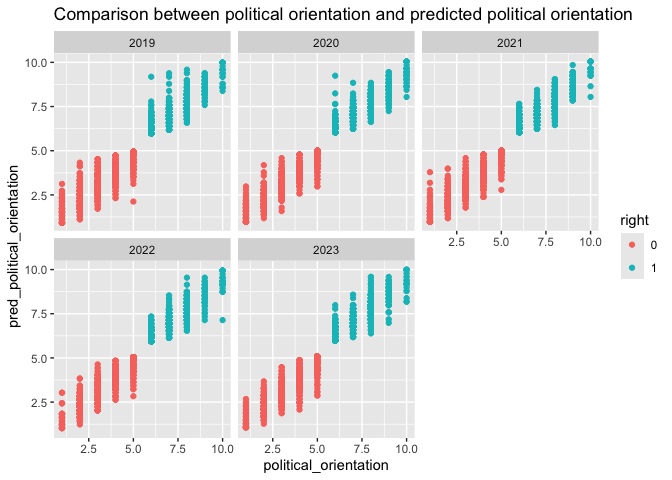

Difference in difference with LISS propensity to vote and political
orientation and IV on Ukraine war
================

## Read the data

We previously cleaned and joined the data in a csv balanced panel file.
Here we simply read in that data.

``` r
library(readr)
library(bacondecomp)
library(did)
library(eatATA)
library(haven)
library(lfe)
library(panelView)
library(tidyverse)

panel19_23_stacked <- read_csv("panel19_23_stacked.csv")
```

Balanced panel, 5 years of data.

``` r
panel19_23_stacked %>% 
  dplyr:: group_by(survey_year) %>% 
  dplyr:: summarise(count=n())
```

    ## # A tibble: 5 × 2
    ##   survey_year count
    ##         <dbl> <int>
    ## 1        2019  1658
    ## 2        2020  1658
    ## 3        2021  1658
    ## 4        2022  1658
    ## 5        2023  1658

Every year about 866 individuals from our panel are left-leaning and 792
are right-leaning.

``` r
panel19_23_stacked %>% 
  dplyr:: group_by(right) %>% 
  dplyr:: summarise(count=n()/5)
```

    ## # A tibble: 2 × 2
    ##   right count
    ##   <dbl> <dbl>
    ## 1     0   866
    ## 2     1   792

## Create treatment variable

In our case, we need to create a treatment variable - **treatment_z**-
which takes value 1 when year=2022 or 2023 and the individual is
left-leaning (i.e. right==0).

Another possibility is that the effect of the crisis had not yet take
center stage in 2022 at the time when the LISS data was collected (Dec
2021-Mar 2022), with the war commencing enf of Feb 2022. Thus another
instrument we could try is treatment instrument **treatment_23** which
takes value 1 when year=2023 (not 2022) and the individual is
left-leaning.

In addition, political orientation is encoded on a 0 to 10 scale. We
rescale it to 1 to 11 (to avoid having zeros).

``` r
panel19_23_stacked <- panel19_23_stacked %>% 
  mutate(treatment_z = if_else((right==0 & survey_year>=2022), true= 1, false=0)) %>% 
  mutate(treatment_23 =if_else((right==0 & survey_year==2023), true= 1, false=0)) %>% 
  mutate(political_orientation=political_orientation+1)
```

``` r
panel19_23_stacked %>% 
  head()
```

    ## # A tibble: 6 × 9
    ##    ...1 nomem_encr   age propensity_to_vote political_orientation survey_year
    ##   <dbl>      <dbl> <dbl>              <dbl>                 <dbl>       <dbl>
    ## 1     1     800009    63                 95                     2        2019
    ## 2     2     800009    64                 95                     3        2020
    ## 3     3     800009    65                100                     3        2021
    ## 4     4     800009    66                100                     3        2022
    ## 5     5     800009    67                 95                     3        2023
    ## 6     6     800015    56                100                     4        2019
    ## # ℹ 3 more variables: right <dbl>, treatment_z <dbl>, treatment_23 <dbl>

## Plotting the data

``` r
panel19_23_stacked %>% 
  dplyr:: group_by(right, survey_year) %>% 
  dplyr:: summarise(mean_prop_to_vote= (mean(propensity_to_vote))) %>% 
  dplyr:: mutate(right=as.factor(right)) %>% 
  ggplot(aes(x=survey_year, y=mean_prop_to_vote, color=right))+
  geom_point()+
  geom_line()+
  labs(title="Mean propensity to vote by political orientation",
       subtitle = "1=right-leaning, 0=left-leaning, no swing",
       caption="LISS Panel data 2019-2023: 1658 observations")
```

    ## `summarise()` has grouped output by 'right'. You can override using the
    ## `.groups` argument.

<!-- -->

``` r
panel19_23_stacked %>% 
  mutate(right=as.factor(right)) %>% 
  ggplot(aes(x=propensity_to_vote, y=right, color=right)) +
  geom_point()+
  geom_boxplot() +
  coord_flip() +
  facet_wrap(vars(survey_year)) +
  labs(title="Distribution of propensity to vote by political orientation",
       x="propensity to vote (0 to 100)",
       y="")
```

<!-- -->

## TSLS with IV=time of the Russia-Ukraine war for the left-leaning group

Now we estimate the first stage of our dif-in-dif model

``` r
dd_reg <- felm(political_orientation ~ treatment_z | survey_year + nomem_encr, data=panel19_23_stacked)

summary(dd_reg)
```

    ## 
    ## Call:
    ##    felm(formula = political_orientation ~ treatment_z | survey_year +      nomem_encr, data = panel19_23_stacked) 
    ## 
    ## Residuals:
    ##     Min      1Q  Median      3Q     Max 
    ## -3.2435 -0.2752  0.0144  0.2759  2.8759 
    ## 
    ## Coefficients:
    ##             Estimate Std. Error t value Pr(>|t|)    
    ## treatment_z  0.15218    0.02666   5.708  1.2e-08 ***
    ## ---
    ## Signif. codes:  0 '***' 0.001 '**' 0.01 '*' 0.05 '.' 0.1 ' ' 1
    ## 
    ## Residual standard error: 0.5941 on 6627 degrees of freedom
    ## Multiple R-squared(full model): 0.9443   Adjusted R-squared: 0.9304 
    ## Multiple R-squared(proj model): 0.004892   Adjusted R-squared: -0.2447 
    ## F-statistic(full model):67.66 on 1662 and 6627 DF, p-value: < 2.2e-16 
    ## F-statistic(proj model): 32.58 on 1 and 6627 DF, p-value: 1.196e-08

We can see that it seems that the treatment coefficient is highly
significant. We’d have to run a parallel trends regression to see if the
parallel trends assumption holds and the estimators on lagged treatment
are within the confidence interval.

But for now let’s store the main_ATT_1 and the confidence interval
boundaries.

``` r
main_ATT_1= summary(dd_reg)$coefficients["treatment_z", "Estimate"]

ATT_1_CI_lower_boundary = abs(main_ATT_1 - qnorm(0.975)*summary(dd_reg)$coefficients["treatment_z", "Std. Error"])

ATT_1_CI_upper_boundary = abs(main_ATT_1 + qnorm(0.975)*summary(dd_reg)$coefficients["treatment_z", "Std. Error"])
```

``` r
c(main_ATT_1, ATT_1_CI_lower_boundary, ATT_1_CI_upper_boundary)
```

    ## [1] 0.15218437 0.09992452 0.20444422

For the second stage of our two-stage least-squares (TSLS) we need to
store the predicted values of political orientation from the first stage
model above (dd_reg). We’ll store them in a new variable called
pred_political_orientation.

``` r
panel19_23_stacked <- panel19_23_stacked %>% 
  mutate(pred_political_orientation = as.tibble(fitted(dd_reg)) %>% 
  pull(political_orientation))
```

    ## Warning: There was 1 warning in `mutate()`.
    ## ℹ In argument: `pred_political_orientation = as.tibble(fitted(dd_reg)) %>%
    ##   pull(political_orientation)`.
    ## Caused by warning:
    ## ! `as.tibble()` was deprecated in tibble 2.0.0.
    ## ℹ Please use `as_tibble()` instead.
    ## ℹ The signature and semantics have changed, see `?as_tibble`.

Just to get an idea of how predicted political_orientation and true
political orientation compare, we’ll make a scatterplot.

``` r
panel19_23_stacked %>% 
  mutate(right=as.factor(right)) %>% 
  ggplot(aes(x=political_orientation, y=pred_political_orientation, color=right)) +
  geom_point() +
  facet_wrap(vars(survey_year)) +
  labs(title="Comparison between political orientation and predicted political orientation")
```

<!-- -->

For the second stage, we regress the outcome (propensity to vote) on the
predicted political orientation, with fixed effects.

``` r
dd_reg_2 <- felm(propensity_to_vote ~ pred_political_orientation | survey_year + nomem_encr, data=panel19_23_stacked)

summary(dd_reg_2)
```

    ## 
    ## Call:
    ##    felm(formula = propensity_to_vote ~ pred_political_orientation |      survey_year + nomem_encr, data = panel19_23_stacked) 
    ## 
    ## Residuals:
    ##     Min      1Q  Median      3Q     Max 
    ## -76.035  -0.673   0.165   1.180  55.821 
    ## 
    ## Coefficients:
    ##                            Estimate Std. Error t value Pr(>|t|)
    ## pred_political_orientation  -0.9874     3.2642  -0.303    0.762
    ## 
    ## Residual standard error: 11.07 on 6627 degrees of freedom
    ## Multiple R-squared(full model): 0.5934   Adjusted R-squared: 0.4914 
    ## Multiple R-squared(proj model): 1.381e-05   Adjusted R-squared: -0.2508 
    ## F-statistic(full model):5.818 on 1662 and 6627 DF, p-value: < 2.2e-16 
    ## F-statistic(proj model): 0.09151 on 1 and 6627 DF, p-value: 0.7623

Our LATE estimand is highly insignificant. We store the estimated values
and confidence intervals.

``` r
LATE= summary(dd_reg_2)$coefficients["pred_political_orientation", "Estimate"]

LATE_CI_lower_boundary = abs(LATE - qnorm(0.975)*summary(dd_reg_2)$coefficients["pred_political_orientation", "Std. Error"])

LATE_CI_upper_boundary = abs(LATE + qnorm(0.975)*summary(dd_reg_2)$coefficients["pred_political_orientation", "Std. Error"])

c(LATE, LATE_CI_lower_boundary, LATE_CI_upper_boundary)
```

    ## [1] -0.987440  7.385149  5.410269

## Standard OLS estimation

We regress propensity to vote on political orientation, the treatment
variable (=1 after the crisis, for left-leaning people) and the
interaction term between treatment and political orientation.

Probably the relationship is endogenous, but just to be able to compare
results.

``` r
library(fixest)
```

    ## 
    ## Attaching package: 'fixest'

    ## The following object is masked from 'package:lfe':
    ## 
    ##     fepois

``` r
ols_reg <- feols(
  propensity_to_vote ~ political_orientation, # Regression formula
  data=panel19_23_stacked,
  vcov = "hc1" #--variance-covariance ratio, hc=heterochedasticity-consistent
)

summary(ols_reg)
```

    ## OLS estimation, Dep. Var.: propensity_to_vote
    ## Observations: 8,290
    ## Standard-errors: Heteroskedasticity-robust 
    ##                        Estimate Std. Error   t value   Pr(>|t|)    
    ## (Intercept)           95.972762   0.437545 219.34363  < 2.2e-16 ***
    ## political_orientation -0.356362   0.067875  -5.25027 1.5564e-07 ***
    ## ---
    ## Signif. codes:  0 '***' 0.001 '**' 0.01 '*' 0.05 '.' 0.1 ' ' 1
    ## RMSE: 15.5   Adj. R2: 0.002553

Here we obtain a negative and significant coefficient. Increasing
political orientation by one unit = moving to the right is associated
with 0.356 lower propensity to vote.

``` r
library(binsreg)

binscatter <- binsreg(panel19_23_stacked$propensity_to_vote, panel19_23_stacked$political_orientation)
```

    ## Warning in binsreg(panel19_23_stacked$propensity_to_vote,
    ## panel19_23_stacked$political_orientation): Too small effective sample size for
    ## bin selection. # of mass of points or clusters used and by option ignored.

    ## Warning in binsreg(panel19_23_stacked$propensity_to_vote,
    ## panel19_23_stacked$political_orientation): dots=c(0,0) used.

<!-- -->

``` r
binscatter$bins_plot +
  labs(y = "Propensity to vote", x = "Political orientation")
```

<!-- -->

Simple TSLS, no fixed, effects:

``` r
feols(
  propensity_to_vote ~ 1 | 0 | political_orientation ~ treatment_z, 
  data = panel19_23_stacked,
  vcov = "hc1"
)
```

    ## TSLS estimation - Dep. Var.: propensity_to_vote
    ##                   Endo.    : political_orientation
    ##                   Instr.   : treatment_z
    ## Second stage: Dep. Var.: propensity_to_vote
    ## Observations: 8,290
    ## Standard-errors: Heteroskedasticity-robust 
    ##                            Estimate Std. Error   t value  Pr(>|t|)    
    ## (Intercept)               94.007187   1.179341 79.711640 < 2.2e-16 ***
    ## fit_political_orientation -0.042841   0.185301 -0.231197   0.81717    
    ## ---
    ## Signif. codes:  0 '***' 0.001 '**' 0.01 '*' 0.05 '.' 0.1 ' ' 1
    ## RMSE: 15.5   Adj. R2: 4.836e-4
    ## F-test (1st stage), political_orientation: stat = 1,750.2    , p < 2.2e-16 , on 1 and 8,288 DoF.
    ##                                Wu-Hausman: stat =     3.63248, p = 0.056697, on 1 and 8,287 DoF.

TSLS with fixed effects. Here we obtain the exact same results as above
when implementing TSLS in two stages.

``` r
feols(
  propensity_to_vote ~ 1 | survey_year + nomem_encr | political_orientation ~ treatment_z, 
  data = panel19_23_stacked,
  vcov = "hc1"
)
```

    ## TSLS estimation - Dep. Var.: propensity_to_vote
    ##                   Endo.    : political_orientation
    ##                   Instr.   : treatment_z
    ## Second stage: Dep. Var.: propensity_to_vote
    ## Observations: 8,290
    ## Fixed-effects: survey_year: 5,  nomem_encr: 1,658
    ## Standard-errors: Heteroskedasticity-robust 
    ##                           Estimate Std. Error   t value Pr(>|t|) 
    ## fit_political_orientation -0.98744    3.32016 -0.297408  0.76616 
    ## ---
    ## Signif. codes:  0 '***' 0.001 '**' 0.01 '*' 0.05 '.' 0.1 ' ' 1
    ## RMSE: 9.90739     Adj. R2:  0.490177
    ##                 Within R2: -0.002345
    ## F-test (1st stage), political_orientation: stat = 32.6    , p = 1.196e-8, on 1 and 6,627 DoF.
    ##                                Wu-Hausman: stat =  0.07705, p = 0.781345, on 1 and 6,626 DoF.

And a Hasman test, which is highly significant, so we shoould not use
OLS results.

``` r
library(ivDiag)
```

    ## ## Tutorial: https://yiqingxu.org/packages/ivDiag/

``` r
eff_F(panel19_23_stacked, Y = "propensity_to_vote", D = "political_orientation", Z = "treatment_z")
```

    ## [1] 3428.807

## Repeating TSLS for treatment_23 (if we assume the crisis is only apparent in the 2023 data)

Another possibility is that the effect of the crisis had not yet take
center stage in 2022 at the time when the LISS data was collected (Dec
2021-Mar 2022), with the war commencing enf of Feb 2022. Thus another
instrument we could try is treatment instrument **treatment_23** which
takes value 1 when year=2023 (not 2022) and the individual is
left-leaning.

``` r
feols(
  propensity_to_vote ~ 1 | survey_year + nomem_encr | political_orientation ~ treatment_23, 
  data = panel19_23_stacked,
  vcov = "hc1"
)
```

    ## TSLS estimation - Dep. Var.: propensity_to_vote
    ##                   Endo.    : political_orientation
    ##                   Instr.   : treatment_23
    ## Second stage: Dep. Var.: propensity_to_vote
    ## Observations: 8,290
    ## Fixed-effects: survey_year: 5,  nomem_encr: 1,658
    ## Standard-errors: Heteroskedasticity-robust 
    ##                           Estimate Std. Error   t value Pr(>|t|) 
    ## fit_political_orientation -1.68129    3.05966 -0.549503  0.58268 
    ## ---
    ## Signif. codes:  0 '***' 0.001 '**' 0.01 '*' 0.05 '.' 0.1 ' ' 1
    ## RMSE: 9.93219     Adj. R2:  0.487621
    ##                 Within R2: -0.007371
    ## F-test (1st stage), political_orientation: stat = 38.7     , p = 5.15e-10, on 1 and 6,627 DoF.
    ##                                Wu-Hausman: stat =  0.286263, p = 0.592643, on 1 and 6,626 DoF.

The coefficient estimate increases and the p-value improves, but the
conclusion does not change. We cannot reject the null hypothesis that
there is no difference in the impact the Ukraine-Russian was had on
left-leaning as compared to right-leaning Dutch voters.

And a Hausman test, which still is highly significant, so we should not
use the OLS results, which are also reported below for completeness.

``` r
eff_F(panel19_23_stacked, Y = "propensity_to_vote", D = "political_orientation", Z = "treatment_23")
```

    ## [1] 1744.044
