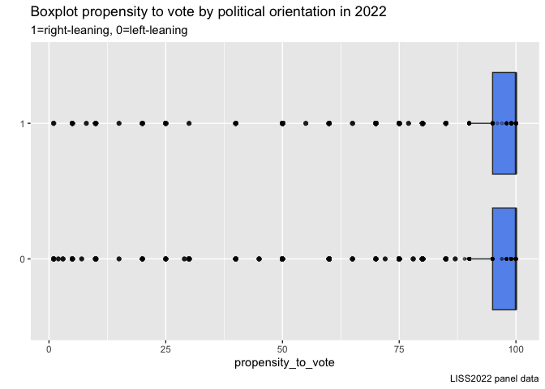
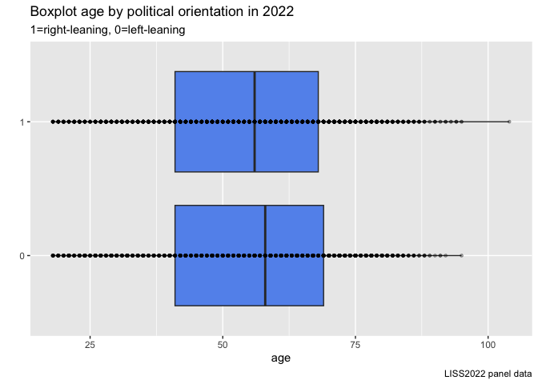
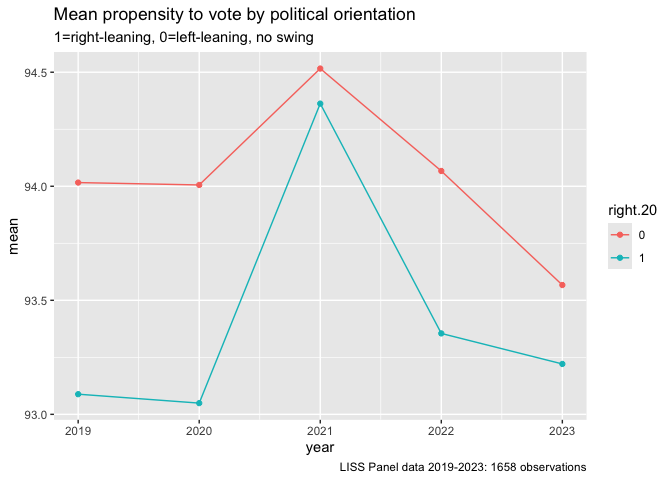
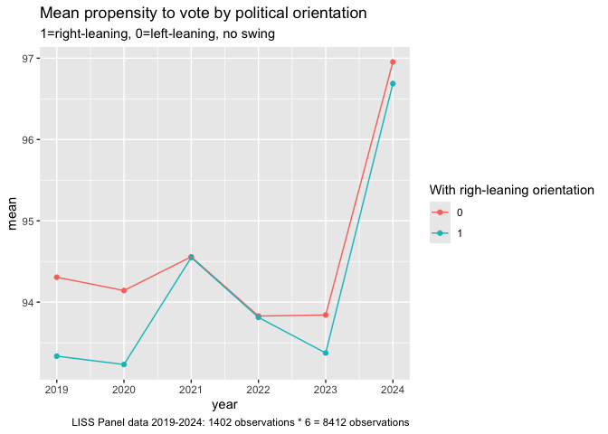
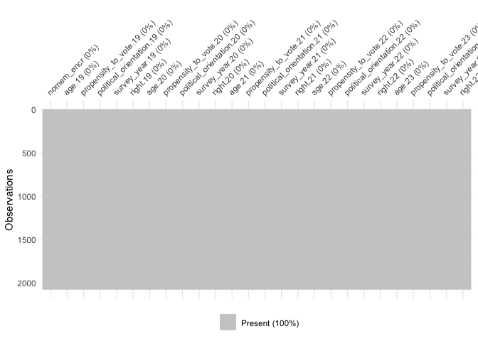
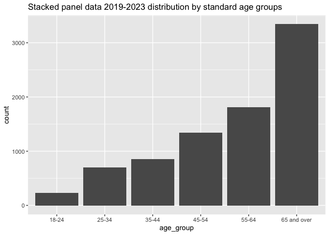
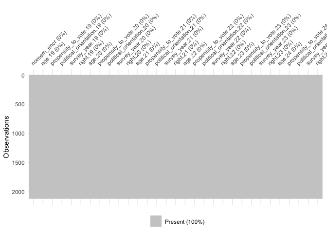

LISS data, LISS Core Study, the Politics and Values Section
================
Diana Korka

# Code for preparing LISS panel data for an analysis of propensity to vote and political views

## Reading and cleaning the data

Loading the necessary packages.

``` r
library(readr)
library(dplyr)
library(ggplot2)
library(visdat)
library(tidyr)
library(tibble)
library(ggthemes)
library(haven)
library(stringr)
```

With the code below we read panel data year by year, starting with 2023
and until 2019 and keep only the variables of interest: propensity to
vote and political orientation. The data cleaning for the set of
covariates is done separately as data comes from a different file.

We also keep age, as this is included in the Politics and Values Section
and may be useful as a covariate.

We start with the 2023 panel data and then apply the same
transformations to the 2022-2019 data.

### Data transformation step by step for 2023 panel data

``` r
data23 <- read_delim("~/Documents/Amsterdam/rfile/cv23o_EN_1.0p.csv", 
    delim = ";", escape_double = FALSE, trim_ws = TRUE)
```

Checking how many rows and columns there are in the original dataset.

``` r
dim(data23)
```

    ## [1] 6221  221

Keep only the few variables of interest:

nomem_encr Number of household member encrypted

cv23o_m1 Year and month of the field work period - part 3

cv23o160 Preloaded variable: age – part 2

cv23o243 If parliamentary elections were held today, what is the percent
chance that you will vote?

cv23o101 Where would you place yourself on the scale below, where 0
means left and 10 means right? Since there are 10 answer possibilities,
we will recode this as LEFT=0 for values from 0 to 5 (including), and
RIGHT=1 for values from 6 to 10.

``` r
data23_cleaned <- data23 %>% 
  select(nomem_encr, cv23o_m3, cv23o160, cv23o243, cv23o101)
```

Below some descriptive statistics of the 2023 panel data, the variables
of interest.

Notice that some observations encoded with -9 are impossible and for the
propensity to vote there are 525 missing values. Similarly for political
orientation there are 421 missing values.

We have no choice but to drop these from our sample.

``` r
data23_cleaned %>% 
  summary()
```

    ##    nomem_encr        cv23o_m3         cv23o160        cv23o243     
    ##  Min.   :800001   Min.   :    -9   Min.   :-9.00   Min.   : -9.00  
    ##  1st Qu.:824679   1st Qu.:202302   1st Qu.:35.00   1st Qu.: 80.00  
    ##  Median :849996   Median :202302   Median :54.00   Median :100.00  
    ##  Mean   :850158   Mean   :187863   Mean   :49.69   Mean   : 81.03  
    ##  3rd Qu.:875777   3rd Qu.:202302   3rd Qu.:68.00   3rd Qu.:100.00  
    ##  Max.   :899946   Max.   :202303   Max.   :96.00   Max.   :100.00  
    ##                                                    NA's   :525     
    ##     cv23o101     
    ##  Min.   :-9.000  
    ##  1st Qu.: 3.000  
    ##  Median : 5.000  
    ##  Mean   : 3.474  
    ##  3rd Qu.: 7.000  
    ##  Max.   :10.000  
    ##  NA's   :421

We notice some data entry points are erroneous: -9 min value for several
variables. And there are missing values as well for propensity to vote
and for political orientation (right-left).

Since we cannot impute data from another source on propensity to vote or
political orientation, we need to remve the rows where either one of
these variables has missing data.

Below are the rows that will be dropped conditional of missing data for
either voting propensity or political orientation. A total of 545
samples.

``` r
data23_cleaned %>% 
  filter(is.na(cv23o101) | is.na(cv23o243)) %>% 
  dim()
```

    ## [1] 545   5

Dropping the missing values.

``` r
data23_cleaned <-data23_cleaned %>% 
  drop_na(cv23o101, cv23o243)
```

The next data cleaning step is to remove values below 0 for voting
propensity and political orientation as these are not possible and must
be erroneous data. With the code below we see that we loose another 753
observations. This data cannot be inferred from other alternative
information and has to be dropped as well.

``` r
data23_cleaned %>% 
  filter(cv23o243<0 | cv23o101<0) %>% 
  dim()
```

    ## [1] 753   5

``` r
data23_cleaned <- data23_cleaned %>% 
  filter(cv23o243>0 & cv23o101>0)
```

Now our descriptive statistics look as show below:

``` r
data23_cleaned <- data23_cleaned %>% 
  select(nomem_encr, cv23o160, cv23o243, cv23o101) %>% 
  mutate(survey_year=2023) %>% 
  dplyr:: rename(age=cv23o160, propensity_to_vote=cv23o243, political_orientation=cv23o101)


data23_cleaned %>% 
  summary()
```

    ##    nomem_encr          age        propensity_to_vote political_orientation
    ##  Min.   :800001   Min.   :18.00   Min.   :  1.00     Min.   : 1.000       
    ##  1st Qu.:824688   1st Qu.:41.00   1st Qu.: 90.00     1st Qu.: 4.000       
    ##  Median :850631   Median :58.00   Median :100.00     Median : 5.000       
    ##  Mean   :850296   Mean   :55.22   Mean   : 90.34     Mean   : 5.268       
    ##  3rd Qu.:875860   3rd Qu.:69.00   3rd Qu.:100.00     3rd Qu.: 7.000       
    ##  Max.   :899946   Max.   :96.00   Max.   :100.00     Max.   :10.000       
    ##   survey_year  
    ##  Min.   :2023  
    ##  1st Qu.:2023  
    ##  Median :2023  
    ##  Mean   :2023  
    ##  3rd Qu.:2023  
    ##  Max.   :2023

### Visualizing the data distributions

And a quick visualisation of our data before recoding.

``` r
data23_cleaned %>% 
  ggplot(aes(x=political_orientation, y=propensity_to_vote)) +
  geom_point()
```

<!-- -->

Also check how our variables are distributed.

Below is the distribution of political orientation.

``` r
data23_cleaned %>% 
  ggplot(aes(political_orientation)) +
  geom_histogram(stat="count", fill="cornflowerblue")+
  scale_x_continuous(breaks=1:10, labels=1:10)+
  geom_vline(xintercept=5.5)+
  labs(title = "Histogram of political orientation in 2023",
       caption="LISS2023 panel data")
```

    ## Warning in geom_histogram(stat = "count", fill = "cornflowerblue"): Ignoring
    ## unknown parameters: `binwidth`, `bins`, and `pad`

<!-- -->

Propensity to vote is highly skewed, with many values around 100.

``` r
bins=round(sqrt(nrow(data23_cleaned)))

data23_cleaned %>% 
  ggplot(aes(propensity_to_vote)) +
  geom_histogram(aes(y=after_stat(density)), bins = bins, fill="cornflowerblue") +
  geom_density()+
  labs(title = "Histogram of propensity to vote in 2023",
       caption="LISS2023 panel data")
```

<!-- -->

``` r
data23_cleaned %>% 
  ggplot(aes(x="", y=propensity_to_vote)) +
  geom_boxplot(fill="cornflowerblue")+
  coord_flip()+
  geom_point(size=1, alpha=0.3)+
  labs(title = "Boxplot propensity to vote in 2023",
       caption="LISS2023 panel data")
```

<!-- -->

### Recoding political values

Below we recode the political orientation data such that LEFT=0 for
values from 0 to 5 (including), and RIGHT=1 for values from 6 to 10 –\>
into a new variable called **right**.

``` r
data23_cleaned <- data23_cleaned %>% 
  mutate(right=case_when(political_orientation<=5 ~ 0, TRUE ~ 1)) %>% 
  mutate(right=as.factor(right))
```

Check how propensity to vote varies by the newly created **right**
variable.

``` r
data23_cleaned %>% 
  ggplot(aes(x=right, y=propensity_to_vote))+
  geom_boxplot(fill="cornflowerblue")+
  coord_flip()+
  geom_point(size=1, alpha=0.3)+
  labs(title = "Boxplot propensity to vote by political orientation in 2023",
       subtitle = "1=right-leaning, 0=left-leaning",
       x="",
       caption="LISS2023 panel data")
```

<!-- -->

``` r
data23_cleaned %>% 
  ggplot(aes(propensity_to_vote)) +
  geom_histogram(aes(y=after_stat(density)),
                 bins=bins, fill="cornflowerblue") +
  geom_density() +
  facet_wrap(vars(right))+
  labs(title="Propensity to vote distribution by political orientation",
       subtitle="0=left, 1=right",
       caption="LISS 2023 panel data")
```

<!-- -->

Descriptive statistics

``` r
data23_cleaned %>% 
  group_by(right) %>% 
  dplyr:: summarise(counts=n(),
            mean_political_orientation = mean(political_orientation),
            median_political_orientation=median(political_orientation),
            sd_political_orientation=sd(political_orientation),
            mean_propensity_to_vote= mean(propensity_to_vote),
            median_propensity_to_vote= median(propensity_to_vote),
            sd_propensity_to_vote=sd(propensity_to_vote)) %>% 
  t()
```

    ##                              [,1]       [,2]      
    ## right                        "0"        "1"       
    ## counts                       "2548"     "2097"    
    ## mean_political_orientation   "3.743328" "7.121602"
    ## median_political_orientation "4"        "7"       
    ## sd_political_orientation     "1.239979" "1.024972"
    ## mean_propensity_to_vote      "90.13148" "90.59514"
    ## median_propensity_to_vote    "100"      "100"     
    ## sd_propensity_to_vote        "20.61004" "19.69160"

Right-leaning voters are slightly more moderate in political orientation
(7 vs 4) and have sightly lower variance in this variable. They also
have slightly higher propensity to vote and slightly lower variance in
it.

Quick check on one covariate: How does political orientation vary by
age?

``` r
data23_cleaned %>% 
  ggplot(aes(x=right, y=age))+
  geom_boxplot(fill="cornflowerblue")+
  coord_flip()+
  geom_point(size=1, alpha=0.3)+
  labs(title = "Boxplot age by political orientation in 2023",
       subtitle = "1=right-leaning, 0=left-leaning",
       x="",
       caption="LISS2023 panel data")
```

<!-- -->

And descriptive statistics: we have similar mean, median age and
standard deviation of age across the two groups: left and right-leaning
individuals.

``` r
data23_cleaned %>% 
  group_by(right) %>% 
  dplyr:: summarise(mean_age = mean(age),
            median_age=median(age),
            sd_age=sd(age)) %>% 
  t()
```

    ##            [,1]       [,2]      
    ## right      "0"        "1"       
    ## mean_age   "55.27708" "55.16023"
    ## median_age "59"       "57"      
    ## sd_age     "17.62323" "17.59752"

### Reading and transforming 2022 data below

``` r
data22 <- read_delim("~/Documents/Amsterdam/rfile/cv22n_EN_1.0p.csv", 
    delim = ";", escape_double = FALSE, trim_ws = TRUE)
```

``` r
data22_cleaned <- data22 %>% 
  select(nomem_encr, cv22n160, cv22n243, cv22n101) %>% 
  drop_na(cv22n101, cv22n243) %>% 
  filter(cv22n243>0 & cv22n101>0) %>% 
  mutate(survey_year=2022) %>% 
  dplyr:: rename(age=cv22n160, propensity_to_vote=cv22n243, political_orientation=cv22n101) %>% 
  mutate(right=case_when(political_orientation<=5 ~ 0, TRUE ~ 1)) %>% 
  mutate(right=as.factor(right))
```

### Descriptive statistics and visualisations for the 2022 data

``` r
data22_cleaned %>% 
  summary()
```

    ##    nomem_encr          age         propensity_to_vote political_orientation
    ##  Min.   :800009   Min.   : 18.00   Min.   :  1.00     Min.   : 1.00        
    ##  1st Qu.:825251   1st Qu.: 41.00   1st Qu.: 95.00     1st Qu.: 4.00        
    ##  Median :850390   Median : 57.00   Median :100.00     Median : 5.00        
    ##  Mean   :850389   Mean   : 54.62   Mean   : 91.36     Mean   : 5.28        
    ##  3rd Qu.:875863   3rd Qu.: 69.00   3rd Qu.:100.00     3rd Qu.: 7.00        
    ##  Max.   :899946   Max.   :104.00   Max.   :100.00     Max.   :10.00        
    ##   survey_year   right   
    ##  Min.   :2022   0:2271  
    ##  1st Qu.:2022   1:1912  
    ##  Median :2022           
    ##  Mean   :2022           
    ##  3rd Qu.:2022           
    ##  Max.   :2022

Quickly checking if the same rough distribution holds in 2022

``` r
data22_cleaned %>% 
  ggplot(aes(x=right, y=propensity_to_vote))+
  geom_boxplot(fill="cornflowerblue")+
  coord_flip()+
  geom_point(size=1, alpha=0.3)+
  labs(title = "Boxplot propensity to vote by political orientation in 2022",
       subtitle = "1=right-leaning, 0=left-leaning",
       x="",
       caption="LISS2022 panel data")
```

<!-- -->

``` r
data22_cleaned %>% 
  group_by(right) %>% 
  dplyr:: summarise(mean_political_orientation = mean(political_orientation),
            median_political_orientation=median(political_orientation),
            sd_political_orientation=sd(political_orientation),
            mean_propensity_to_vote= mean(propensity_to_vote),
            median_propensity_to_vote= median(propensity_to_vote),
            sd_propensity_to_vote=sd(propensity_to_vote)) %>% 
  t()
```

    ##                              [,1]       [,2]      
    ## right                        "0"        "1"       
    ## mean_political_orientation   "3.719066" "7.134414"
    ## median_political_orientation "4"        "7"       
    ## sd_political_orientation     "1.251741" "1.022626"
    ## mean_propensity_to_vote      "91.02598" "91.75889"
    ## median_propensity_to_vote    "100"      "100"     
    ## sd_propensity_to_vote        "19.68386" "18.76219"

``` r
data22_cleaned %>% 
  ggplot(aes(x=right, y=age))+
  geom_boxplot(fill="cornflowerblue")+
  coord_flip()+
  geom_point(size=1, alpha=0.3)+
  labs(title = "Boxplot age by political orientation in 2022",
       subtitle = "1=right-leaning, 0=left-leaning",
       x="",
       caption="LISS2022 panel data")
```

<!-- -->

``` r
data22_cleaned %>% 
  group_by(right) %>% 
  dplyr:: summarise(mean_age = mean(age),
            median_age=median(age),
            sd_age=sd(age)) %>% 
  t()
```

    ##            [,1]       [,2]      
    ## right      "0"        "1"       
    ## mean_age   "54.93527" "54.25209"
    ## median_age "58"       "56"      
    ## sd_age     "17.79857" "17.73071"

## Joining together 2022 and 2023 data

We join the data by the encrypted number of household (which is a unique
number in each dataset). We remove samples with missing data on
propensity to vote and political orientation. We obtain 3361 samples.

``` r
data22_cleaned %>% 
  inner_join(data23_cleaned, by=c("nomem_encr"), suffix=c(".22", ".23")) %>% 
  dim()
```

    ## [1] 3361   11

How many respondents have changed their political orientation from 2022
to 2023: 447.

``` r
data22_cleaned %>% 
  left_join(data23_cleaned, by=c("nomem_encr"), suffix=c(".22", ".23")) %>% 
  drop_na(propensity_to_vote.23, political_orientation.23) %>% 
  filter(right.22!=right.23) %>% 
  dim()
```

    ## [1] 447  11

228 swinged from left to right and 219 from right to left.

``` r
data22_cleaned %>% 
  left_join(data23_cleaned, by=c("nomem_encr"), suffix=c(".22", ".23")) %>% 
  drop_na(propensity_to_vote.23, political_orientation.23) %>% 
  filter(right.22!=right.23) %>% 
  group_by(right.22, right.23) %>% 
  dplyr:: summarise(number=n())
```

    ## `summarise()` has grouped output by 'right.22'. You can override using the
    ## `.groups` argument.

    ## # A tibble: 2 × 3
    ## # Groups:   right.22 [2]
    ##   right.22 right.23 number
    ##   <fct>    <fct>     <int>
    ## 1 0        1           228
    ## 2 1        0           219

We need to discard respondents who swinged for the purpose of our
analysis. So we are left with 2914 respondents.

``` r
data22_23 <- data22_cleaned %>% 
  inner_join(data23_cleaned, by=c("nomem_encr"), suffix=c(".22", ".23")) %>% 
  filter(right.22==right.23)
```

``` r
dim(data22_23)
```

    ## [1] 2914   11

Descriptive statistics for the joined data for 2 years only

``` r
data22_23 %>% 
  group_by(right.22) %>% 
  summarise(mean_prop_vote_22= mean(propensity_to_vote.22),
            sd_prop_vote_22=sd(propensity_to_vote.22),
            mean_prop_vote_23=mean(propensity_to_vote.23),
            sd_prop_vote_23=sd(propensity_to_vote.23))
```

    ## # A tibble: 2 × 5
    ##   right.22 mean_prop_vote_22 sd_prop_vote_22 mean_prop_vote_23 sd_prop_vote_23
    ##   <fct>                <dbl>           <dbl>             <dbl>           <dbl>
    ## 1 0                     92.8            17.4              91.5            19.2
    ## 2 1                     93.1            16.8              91.8            18.2

### Reading data and applying the same transformations to the 2019, 2020 and 2021 panels

``` r
data21 <- read_dta("cv21m_EN_1.0p.dta")
data20 <- read_dta("cv20l_EN_1.0p.dta")
data19 <- read_dta("cv19k_EN_1.0p.dta")
```

``` r
data21_cleaned <- data21 %>% 
  select(nomem_encr, cv21m160, cv21m243, cv21m101) %>% 
  drop_na(cv21m101, cv21m243) %>% 
  filter(cv21m243>0 & cv21m101>0) %>% 
  mutate(survey_year.21=2021) %>% 
  dplyr:: rename(age.21=cv21m160, propensity_to_vote.21=cv21m243, political_orientation.21=cv21m101) %>% 
  mutate(right.21=case_when(political_orientation.21<=5 ~ 0, TRUE ~ 1)) %>% 
  mutate(right.21=as.factor(right.21))
```

``` r
data20_cleaned <- data20 %>% 
  select(nomem_encr, cv20l160, cv20l243, cv20l101) %>% 
  drop_na(cv20l101, cv20l243) %>% 
  filter(cv20l243>0 & cv20l101>0) %>% 
  mutate(survey_year.20=2020) %>% 
  dplyr::rename(age.20=cv20l160, propensity_to_vote.20=cv20l243, political_orientation.20=cv20l101) %>% 
  mutate(right.20=case_when(political_orientation.20<=5 ~ 0, TRUE ~ 1)) %>% 
  mutate(right.20=as.factor(right.20))
```

``` r
data19_cleaned <- data19 %>% 
  select(nomem_encr, cv19k160, cv19k243, cv19k101) %>% 
  drop_na(cv19k101, cv19k243) %>% 
  filter(cv19k243>0 & cv19k101>0) %>% 
  mutate(survey_year.19=2019) %>% 
  dplyr::rename(age.19=cv19k160, propensity_to_vote.19=cv19k243, political_orientation.19=cv19k101) %>% 
  mutate(right.19=case_when(political_orientation.19<=5 ~ 0, TRUE ~ 1)) %>% 
  mutate(right.19=as.factor(right.19))
```

### Joining together datasets for all 5 years

``` r
library(plyr)
```

    ## ------------------------------------------------------------------------------

    ## You have loaded plyr after dplyr - this is likely to cause problems.
    ## If you need functions from both plyr and dplyr, please load plyr first, then dplyr:
    ## library(plyr); library(dplyr)

    ## ------------------------------------------------------------------------------

    ## 
    ## Attaching package: 'plyr'

    ## The following objects are masked from 'package:dplyr':
    ## 
    ##     arrange, count, desc, failwith, id, mutate, rename, summarise,
    ##     summarize

``` r
panel_19_23 <- join_all(list(data19_cleaned, data20_cleaned, data21_cleaned, data22_23), 
         by='nomem_encr', type='inner') 
```

``` r
nrow(panel_19_23)
```

    ## [1] 2078

In the 2019 data there is an error in the reported propensity to vote
data 999, which is not contained in the 0-100 scale. Same situation for
political_orientation.

``` r
panel_19_23 %>% 
  filter(propensity_to_vote.19==999)
```

    ##   nomem_encr age.19 propensity_to_vote.19 political_orientation.19
    ## 1     801205     63                   999                        4
    ## 2     886367     38                   999                        5
    ##   survey_year.19 right.19 age.20 propensity_to_vote.20 political_orientation.20
    ## 1           2019        0     64                   100                        4
    ## 2           2019        0     39                   100                        2
    ##   survey_year.20 right.20 age.21 propensity_to_vote.21 political_orientation.21
    ## 1           2020        0     65                   100                        4
    ## 2           2020        0     40                   100                        3
    ##   survey_year.21 right.21 age.22 propensity_to_vote.22 political_orientation.22
    ## 1           2021        0     66                   100                        4
    ## 2           2021        0     41                   100                        4
    ##   survey_year.22 right.22 age.23 propensity_to_vote.23 political_orientation.23
    ## 1           2022        0     67                   100                        4
    ## 2           2022        0     42                   100                        4
    ##   survey_year.23 right.23
    ## 1           2023        0
    ## 2           2023        0

We see that for these people political orientation was 100 over all the
following 4 years, so we use the 2020 value.

``` r
panel_19_23 <- panel_19_23 %>% 
  mutate(propensity_to_vote.19=if_else(propensity_to_vote.19==999, true=propensity_to_vote.20, false=propensity_to_vote.19)) 
```

And now checking for 999 values in political orientation: there are 47
observations for which this was encoded as 999. Not to loose any further
data, for these 47 people we will use the political orientation score
reported in 2020. If over the following years they swing from left to
right, they will be dropped from the analysis.

``` r
panel_19_23 %>% 
  filter(political_orientation.19==999) %>% 
  dim()
```

    ## [1] 47 26

``` r
panel_19_23 <- panel_19_23 %>% 
  mutate(political_orientation.19=if_else(political_orientation.19==999, 
                                          true=political_orientation.20, false=political_orientation.19),
         right.19=case_when(political_orientation.19<=5 ~ 0, TRUE ~ 1)) %>% 
  mutate(right.19=as.factor(right.19))
```

``` r
panel_19_23 %>% 
  dim()
```

    ## [1] 2078   26

We try to filter out anyone who swinged left-right and vice-versa over
the entire period. And we are left with 1658 observations.

``` r
panel_19_23 %>% 
  filter(right.22==right.21) %>% 
  filter(right.21==right.20) %>% 
  filter(right.20==right.19) %>% 
  dim()
```

    ## [1] 1658   26

Descriptive statistics for the panel data.

``` r
panel_19_23 %>% 
  filter(right.22==right.21) %>% 
  filter(right.21==right.20) %>% 
  filter(right.20==right.19) %>% 
  group_by(right.20) %>% 
  dplyr:: summarise(mean_prop_vote_19= mean(propensity_to_vote.19),
                    mean_prop_vote_20= mean(propensity_to_vote.20),
            mean_prop_vote_21=mean(propensity_to_vote.21),
            mean_prop_vote_22= mean(propensity_to_vote.22),
            mean_prop_vote_23=mean(propensity_to_vote.23),
            sd_prop_vote_19=sd(propensity_to_vote.19),
            sd_prop_vote_20=sd(propensity_to_vote.20),
            sd_prop_vote_21=sd(propensity_to_vote.21),
            sd_prop_vote_22=sd(propensity_to_vote.22),
            sd_prop_vote_23=sd(propensity_to_vote.23)) %>% 
  ungroup()
```

    ## # A tibble: 2 × 11
    ##   right.20 mean_prop_vote_19 mean_prop_vote_20 mean_prop_vote_21
    ##   <fct>                <dbl>             <dbl>             <dbl>
    ## 1 0                     94.0              94.0              94.5
    ## 2 1                     93.1              93.0              94.4
    ## # ℹ 7 more variables: mean_prop_vote_22 <dbl>, mean_prop_vote_23 <dbl>,
    ## #   sd_prop_vote_19 <dbl>, sd_prop_vote_20 <dbl>, sd_prop_vote_21 <dbl>,
    ## #   sd_prop_vote_22 <dbl>, sd_prop_vote_23 <dbl>

Below plotting the summary data from above in a line chart.

``` r
panel_19_23 %>% 
  filter(right.22==right.21) %>% 
  filter(right.21==right.20) %>% 
  filter(right.20==right.19) %>% 
  group_by(right.20) %>% 
  dplyr:: summarise(m2019= mean(propensity_to_vote.19),
                    m2020= mean(propensity_to_vote.20),
            m2021=mean(propensity_to_vote.21),
            m2022= mean(propensity_to_vote.22),
            m2023=mean(propensity_to_vote.23)) %>% 
  ungroup() %>% 
  pivot_longer(cols=c(-right.20),
               names_to="year",
               values_to="mean") %>% 
  mutate(year=str_remove(year, "m")) %>% 
  mutate(year=as.numeric(year)) %>% 
  ggplot(aes(x=year, y=mean, color=right.20))+
  geom_point()+
  geom_line()+
  labs(title="Mean propensity to vote by political orientation",
       subtitle = "1=right-leaning, 0=left-leaning, no swing",
       caption="LISS Panel data 2019-2023: 1658 observations")
```

<!-- -->

Frequency counts by control and treatment group: in our 2019-2023 panel,
792 respondents were left-leaning and 866 were right-leaning.

``` r
panel_19_23 %>% 
  filter(right.22==right.21) %>% 
  filter(right.21==right.20) %>% 
  filter(right.20==right.19) %>% 
  group_by(right.20) %>% 
  dplyr:: summarise(count=n()) %>% 
  ungroup()
```

    ## # A tibble: 2 × 2
    ##   right.20 count
    ##   <fct>    <int>
    ## 1 0          866
    ## 2 1          792

### Visualizing the data

Transforming the data into a longer tibble for visualisation (yearly
data stacked).

``` r
panel19_23_stacked <- panel_19_23 %>% 
  filter(right.22==right.21) %>% 
  filter(right.21==right.20) %>% 
  filter(right.20==right.19)  %>% 
    mutate(right.19=as.numeric(right.19),
         right.20=as.numeric(right.20),
         right.21=as.numeric(right.21),
         right.22=as.numeric(right.22),
         right.23=as.numeric(right.23))%>% 
  pivot_longer(col=c(-nomem_encr), names_to="metrics", values_to = "values") %>% 
  mutate(year=str_sub(metrics, start=-2),
         metrics=str_remove(metrics, ".\\d\\d")) %>% 
  pivot_wider(names_from = metrics, values_from = values) %>% 
  select(-year) %>% 
  mutate(right=if_else(right==1, true=0, false=1)) %>% 
  mutate(right=as.factor(right))
```

And checking distributions.

``` r
panel19_23_stacked %>% 
  ggplot(aes(x=right, y=propensity_to_vote))+
  geom_boxplot(fill="cornflowerblue")+
  coord_flip()+
  geom_point(size=1, alpha=0.3)+
  labs(title = "Boxplot propensity to vote by political orientation for 2019-2023",
       subtitle = "1=right-leaning, 0=left-leaning",
       x="",
       caption="LISS2019-2023 panel data")
```

<!-- -->

And descriptive statistics

``` r
panel19_23_stacked %>% 
  group_by(right) %>% 
  dplyr:: summarise(counts=n(),
            mean_political_orientation = mean(political_orientation),
            median_political_orientation=median(political_orientation),
            sd_political_orientation=sd(political_orientation),
            mean_propensity_to_vote= mean(propensity_to_vote),
            median_propensity_to_vote= median(propensity_to_vote),
            sd_propensity_to_vote=sd(propensity_to_vote)) %>% 
  t()
```

    ##                              [,1]        [,2]       
    ## right                        "0"         "1"        
    ## counts                       "4330"      "3960"     
    ## mean_political_orientation   "3.386143"  "7.328535" 
    ## median_political_orientation "3"         "7"        
    ## sd_political_orientation     "1.2040941" "0.9537916"
    ## mean_propensity_to_vote      "94.03441"  "93.41515" 
    ## median_propensity_to_vote    "100"       "100"      
    ## sd_propensity_to_vote        "15.37564"  "15.67016"

And by age: left-leaning voters are a bit older.

``` r
panel19_23_stacked %>% 
  group_by(right) %>% 
  dplyr:: summarise(mean_age = mean(age),
            median_age=median(age),
            sd_age=sd(age)) %>% 
  t()
```

    ##            [,1]       [,2]      
    ## right      "0"        "1"       
    ## mean_age   "58.35935" "56.79040"
    ## median_age "62"       "58"      
    ## sd_age     "15.24085" "16.43357"

``` r
panel19_23_stacked %>% 
  group_by(right, survey_year) %>% 
  dplyr:: summarise(mean_age = mean(age),
            median_age=median(age),
            sd_age=sd(age)) %>% 
  t()
```

    ## `summarise()` has grouped output by 'right'. You can override using the
    ## `.groups` argument.

    ##             [,1]       [,2]       [,3]       [,4]       [,5]       [,6]      
    ## right       "0"        "0"        "0"        "0"        "0"        "1"       
    ## survey_year "2019"     "2020"     "2021"     "2022"     "2023"     "2019"    
    ## mean_age    "56.26790" "57.41224" "58.34296" "59.35566" "60.41801" "54.72096"
    ## median_age  "60"       "61"       "62"       "63"       "64"       "56"      
    ## sd_age      "15.18479" "15.17253" "15.18225" "15.17948" "15.17485" "16.39406"
    ##             [,7]       [,8]       [,9]       [,10]     
    ## right       "1"        "1"        "1"        "1"       
    ## survey_year "2020"     "2021"     "2022"     "2023"    
    ## mean_age    "55.84217" "56.79040" "57.79798" "58.80051"
    ## median_age  "57"       "58"       "59"       "60"      
    ## sd_age      "16.39421" "16.39791" "16.39369" "16.31704"

We have no missing data in our 2019-2023 panel.

``` r
panel_19_23 %>% 
  vis_miss()
```

<!-- -->

Try to create age groups and see the distribution by political
orientation.

``` r
panel19_23_stacked %>% 
  mutate(age_group =case_when(age<25 ~ "18-24",
                              age<35 ~ "25-34",
                              age<45 ~ "35-44",
                              age<55 ~"45-54",
                              age<65 ~"55-64",
                              TRUE ~"65 and over")) %>% 
  group_by(age_group, right, survey_year) %>% 
  dplyr::summarise(count=n(),
                   mean_prop_vote=mean(propensity_to_vote),
                   median_prop_vote=median(propensity_to_vote))
```

    ## `summarise()` has grouped output by 'age_group', 'right'. You can override
    ## using the `.groups` argument.

    ## # A tibble: 60 × 6
    ## # Groups:   age_group, right [12]
    ##    age_group right survey_year count mean_prop_vote median_prop_vote
    ##    <chr>     <fct> <dbl+lbl>   <int>          <dbl>            <dbl>
    ##  1 18-24     0     2019           38           86.4             99.5
    ##  2 18-24     0     2020           32           90.2             99  
    ##  3 18-24     0     2021           23           90.3             99  
    ##  4 18-24     0     2022           19           93.6            100  
    ##  5 18-24     0     2023           12           87.2             98.5
    ##  6 18-24     1     2019           30           89.3            100  
    ##  7 18-24     1     2020           25           90.4            100  
    ##  8 18-24     1     2021           20           93.9             99  
    ##  9 18-24     1     2022           19           87.7             99  
    ## 10 18-24     1     2023           16           88.2             92.5
    ## # ℹ 50 more rows

We notice that the standard age groups of younger people are less well
represented in our panel.

``` r
panel19_23_stacked %>% 
  mutate(survey_year=as.factor(survey_year)) %>% 
  mutate(age_group =case_when(age<25 ~ "18-24",
                              age<35 ~ "25-34",
                              age<45 ~ "35-44",
                              age<55 ~"45-54",
                              age<65 ~"55-64",
                              TRUE ~"65 and over")) %>% 
  group_by(age_group, right) %>% 
  dplyr::summarise(count=n(),
                   mean_prop_vote=mean(propensity_to_vote),
                   median_prop_vote=median(propensity_to_vote)) %>% 
  ggplot(aes(x=age_group, y=count)) +
  geom_col() +
  labs(title="Stacked panel data 2019-2023 distribution by standard age groups")
```

    ## `summarise()` has grouped output by 'age_group'. You can override using the
    ## `.groups` argument.

<!-- -->

So we will regroup data into 3 segments that are more equally
represented across the panel.

``` r
panel19_23_stacked %>% 
  mutate(survey_year=as.factor(survey_year)) %>% 
  mutate(age_group =case_when(age<45 ~ "18-44",
                              age<65 ~"45-64",
                              TRUE ~"65 and over")) %>% 
  group_by(age_group, right, survey_year) %>% 
  dplyr::summarise(count=n(),
                   mean_prop_vote=mean(propensity_to_vote),
                   median_prop_vote=median(propensity_to_vote)) %>% 
  ggplot(aes(x=age_group, y=count, fill=right)) +
  geom_col()+
  facet_wrap(vars(survey_year)) +
  labs(title="Distribution of age groups over time",
       subtitle="counts of individuals from the 2019-2023 panel",
       caption="LISS balanced panel data 2019-2023: 1658 individuals in total")
```

    ## `summarise()` has grouped output by 'age_group', 'right'. You can override
    ## using the `.groups` argument.

<!-- -->

## Panel dataset that includes voters who swinged from left to right

We previously excluded from our panel any voter who swinged right-left
or vice-versa at any point over the 5 years.

Now we are interested to keep any voters who swinged from left to right.
But still remove the ones who swinged from right to left.

This is what we do with the code below. First we join together the 5
years such that we keep a balanced dataset (only individual present in
the data for all 5 years are kept).

``` r
# fixing some column names
data22_cleaned <- data22_cleaned %>% 
  dplyr:: rename(age.22=age, 
         propensity_to_vote.22=propensity_to_vote, 
         political_orientation.22=political_orientation, 
         survey_year.22=survey_year, 
         right.22=right)

data23_cleaned <- data23_cleaned %>% 
  dplyr:: rename(age.23=age, 
         propensity_to_vote.23=propensity_to_vote, 
         political_orientation.23=political_orientation, 
         survey_year.23=survey_year, 
         right.23=right)
```

``` r
library(plyr)

panel_swing_19_23 <- join_all(list(data19_cleaned, data20_cleaned, data21_cleaned, data22_cleaned, data23_cleaned), 
         by='nomem_encr', type='inner') 

nrow(panel_swing_19_23)
```

    ## [1] 2372

We know we need to correct some 2019 values encoded as “999” for both
propensity to vote and political orientation.

``` r
panel_swing_19_23 <- panel_swing_19_23 %>% 
  mutate(propensity_to_vote.19= if_else(propensity_to_vote.19==999, true=propensity_to_vote.20, false=propensity_to_vote.19) ) # in 2019 prop to vote encoded at 999, use 2020 value (2 voters), they both had 100 prop to vote over the next 4 years
```

``` r
panel_swing_19_23 <- panel_swing_19_23 %>% 
  mutate(political_orientation.19= if_else(political_orientation.19==999, true=political_orientation.20, false=political_orientation.19) ) %>% # if 2019 pol_orient encoded 999, use 2020 value
  mutate(right.19=case_when(political_orientation.19<=5 ~ 0, TRUE ~ 1)) %>% # recalculate right dummy
  mutate(right.19=as.factor(right.19)) # set it as a factor
```

Voters in our panel who did not swing at all over the entire period:
1658

``` r
panel_swing_19_23 %>% 
  filter(right.23==right.22) %>% 
  filter(right.22==right.21) %>% 
  filter(right.21==right.20) %>% 
  filter(right.20==right.19) %>% 
  dim()
```

    ## [1] 1658   26

Voters who swang from left (0) to right (1) over the entire period: 566

``` r
panel_swing_19_23 %>% 
  filter((right.19==0 & right.20==1) | (right.20==0 & right.21==1) | (right.21==0 & right.22==1) | (right.22==0 & right.23==1)) %>% 
  dim()
```

    ## [1] 566  26

We can also check that among those who swang left to right, nobody
retraced steps back to left.

``` r
panel_swing_19_23 %>% 
  filter((right.19==0 & right.20==1) | (right.20==0 & right.21==1) | (right.21==0 & right.22==1) | (right.22==0 & right.23==1)) %>% 
  filter(! (right.19==1 & right.20==0) | ! (right.20==1 & right.21==0) | ! (right.21==1 & right.22==0) | ! (right.22==1 & right.23==0)) %>% 
  dim()
```

    ## [1] 566  26

Voters who swang from right to left over the entire period: 563

``` r
panel_swing_19_23 %>% 
  filter((right.19==1 & right.20==0) | (right.20==1 & right.21==0) | (right.21==1 & right.22==0) | (right.22==1 & right.23==0)) %>% 
  dim()
```

    ## [1] 563  26

Building a balanced panel in which we keep only people who swang from
left to right: 1658 who did not swing + 566 who swang left to right =
2224

``` r
dplyr:: bind_rows(panel_swing_19_23 %>% 
  filter((right.19==0 & right.20==1) | 
           (right.20==0 & right.21==1) | 
           (right.21==0 & right.22==1) | 
           (right.22==0 & right.23==1)), # swingers left to right
  panel_swing_19_23 %>% 
  filter(right.23==right.22) %>% 
  filter(right.22==right.21) %>% 
  filter(right.21==right.20) %>% 
  filter(right.20==right.19) # non-swingers
  ) %>% 
  dim()
```

    ## [1] 2224   26

``` r
panel_swing_19_23 <- dplyr:: bind_rows(panel_swing_19_23 %>% 
  filter((right.19==0 & right.20==1) | 
           (right.20==0 & right.21==1) | 
           (right.21==0 & right.22==1) | 
           (right.22==0 & right.23==1)), # swingers left to right
  panel_swing_19_23 %>% 
  filter(right.23==right.22) %>% 
  filter(right.22==right.21) %>% 
  filter(right.21==right.20) %>% 
  filter(right.20==right.19) # non-swingers
  )
```

Turn the data into a stacked tibble.

``` r
panel_swing_stacked_19_23 <- panel_swing_19_23 %>% 
  mutate(right.19=as.numeric(right.19),
         right.20=as.numeric(right.20),
         right.21=as.numeric(right.21),
         right.22=as.numeric(right.22),
         right.23=as.numeric(right.23))%>% 
  pivot_longer(col=c(-nomem_encr), names_to="metrics", values_to = "values") %>% 
  mutate(year=str_sub(metrics, start=-2),
         metrics=str_remove(metrics, ".\\d\\d")) %>% 
  pivot_wider(names_from = metrics, values_from = values) %>% 
  select(-year) %>% 
  mutate(right=if_else(right==1, true=0, false=1)) %>% 
  mutate(right=as.factor(right))
```

Just checking some descriptive stats for the new panel:

``` r
panel_swing_stacked_19_23 %>% 
  group_by(right, survey_year) %>% 
  dplyr:: summarise(counts=n(),
            mean_political_orientation = mean(political_orientation),
            median_political_orientation=median(political_orientation),
            sd_political_orientation=sd(political_orientation),
            mean_propensity_to_vote= mean(propensity_to_vote),
            median_propensity_to_vote= median(propensity_to_vote),
            sd_propensity_to_vote=sd(propensity_to_vote)) %>% 
  t()
```

    ## `summarise()` has grouped output by 'right'. You can override using the
    ## `.groups` argument.

    ##                              [,1]        [,2]        [,3]        [,4]       
    ## right                        "0"         "0"         "0"         "0"        
    ## survey_year                  "2019"      "2020"      "2021"      "2022"     
    ## counts                       "1215"      "1185"      "1127"      "1136"     
    ## mean_political_orientation   "3.564609"  "3.635443"  "3.647737"  "3.623239" 
    ## median_political_orientation "4"         "4"         "4"         "4"        
    ## sd_political_orientation     "1.2545398" "1.2528722" "1.2094770" "1.2147212"
    ## mean_propensity_to_vote      "93.08230"  "92.66920"  "93.52795"  "93.60387" 
    ## median_propensity_to_vote    "100"       "100"       "100"       "100"      
    ## sd_propensity_to_vote        "16.49107"  "16.72230"  "15.87123"  "15.96030" 
    ##                              [,5]        [,6]        [,7]        [,8]       
    ## right                        "0"         "1"         "1"         "1"        
    ## survey_year                  "2023"      "2019"      "2020"      "2021"     
    ## counts                       "1087"      "1009"      "1039"      "1097"     
    ## mean_political_orientation   "3.678013"  "7.156591"  "7.209817"  "7.134913" 
    ## median_political_orientation "4"         "7"         "7"         "7"        
    ## sd_political_orientation     "1.1694801" "0.9570430" "1.0425716" "0.9815975"
    ## mean_propensity_to_vote      "92.78749"  "92.52825"  "92.63811"  "93.35552" 
    ## median_propensity_to_vote    "100"       "100"       "100"       "100"      
    ## sd_propensity_to_vote        "17.06196"  "17.14971"  "16.92588"  "15.15159" 
    ##                              [,9]        [,10]      
    ## right                        "1"         "1"        
    ## survey_year                  "2022"      "2023"     
    ## counts                       "1088"      "1137"     
    ## mean_political_orientation   "7.118566"  "7.087071" 
    ## median_political_orientation "7"         "7"        
    ## sd_political_orientation     "0.9561234" "0.9624920"
    ## mean_propensity_to_vote      "92.76011"  "92.68426" 
    ## median_propensity_to_vote    "100"       "100"      
    ## sd_propensity_to_vote        "16.88678"  "16.66994"

Showing panel is balanced.

``` r
panel_swing_stacked_19_23 %>% 
  group_by(survey_year) %>% 
  dplyr:: summarise(counts=n())
```

    ## # A tibble: 5 × 2
    ##   survey_year counts
    ##   <dbl+lbl>    <int>
    ## 1 2019          2224
    ## 2 2020          2224
    ## 3 2021          2224
    ## 4 2022          2224
    ## 5 2023          2224

I’ll export the datasets to a csv file for the analysis.

``` r
#write.csv(panel_19_23, "panel_19_23.csv")
```

``` r
#write.csv(panel19_23_stacked, "panel19_23_stacked.csv")
```

``` r
#write.csv(panel_swing_stacked_19_23, "panel_swing_stacked_19_23.csv")
```
