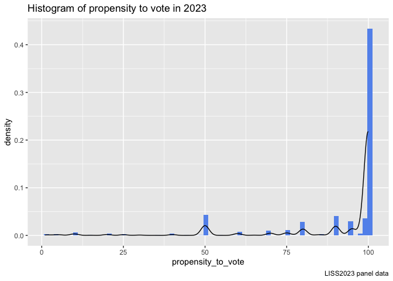

LISS data, LISS Core Study, the Politics and Values Section
================

# Code for preparing LISS panel data for an analysis of propensity to vote and political views

## Reading and cleaning the data

Loading the necessary packages.

``` r
library(readr)
library(dplyr)
library(ggplot2)
library(visdat)
library(tidyr)
library(tibble)
library(ggthemes)
library(haven)
library(stringr)
```

With the code below we read panel data year by year, starting with 2023
and keep only the variables of interest.

``` r
data23 <- read_delim("~/Documents/Amsterdam/rfile/cv23o_EN_1.0p.csv", 
    delim = ";", escape_double = FALSE, trim_ws = TRUE)
```

Just checking how many rows and columns.

``` r
dim(data23)
```

    ## [1] 6221  221

Keep only the few variables of interest:

nomem_encr Number of household member encrypted

cv23o_m1 Year and month of the field work period - part 1

cv23o_m2 Year and month of the field work period - part 2

cv23o_m3 Year and month of the field work period - part 3

cv23o160 Preloaded variable: age – part 2

cv23o242 Which version of the voting questions was presented? – part 2

cv23o243 If parliamentary elections were held today, what is the percent
chance that you will vote?

cv23o261 What is the percent chance that you will vote for: I don’t know

cv23o262 What is the percent chance that you will vote for: I prefer not
to say

cv23o101 Where would you place yourself on the scale below, where 0
means left and 10 means right? Since there are 10 answer possibilities,
we will recode this as LEFT=0 for values from 0 to 5 (including), and
RIGHT=1 for values from 6 to 10.

``` r
data23_cleaned <- data23 %>% 
  select(nomem_encr, cv23o_m1, cv23o_m2, cv23o_m3, cv23o160, cv23o242, cv23o243, cv23o261, cv23o262, cv23o101)
```

Below some descriptive statistics of the 2023 panel data, the variables
of interest. Notice that some observations encoded with -9 are
impossible and for the propensity to vote there are 525 missing values.
Similarly for political orientation there are 421 missing values. We
have to choice but to drop these from our sample.

``` r
data23_cleaned %>% 
  summary()
```

    ##    nomem_encr        cv23o_m1         cv23o_m2         cv23o_m3     
    ##  Min.   :800001   Min.   :    -9   Min.   :    -9   Min.   :    -9  
    ##  1st Qu.:824679   1st Qu.:202212   1st Qu.:202301   1st Qu.:202302  
    ##  Median :849996   Median :202212   Median :202301   Median :202302  
    ##  Mean   :850158   Mean   :191233   Mean   :189358   Mean   :187863  
    ##  3rd Qu.:875777   3rd Qu.:202212   3rd Qu.:202301   3rd Qu.:202302  
    ##  Max.   :899946   Max.   :202301   Max.   :202302   Max.   :202303  
    ##                                                                     
    ##     cv23o160        cv23o242          cv23o243         cv23o261    
    ##  Min.   :-9.00   Min.   :-9.0000   Min.   : -9.00   Min.   :0.000  
    ##  1st Qu.:35.00   1st Qu.: 1.0000   1st Qu.: 80.00   1st Qu.:0.000  
    ##  Median :54.00   Median : 1.0000   Median :100.00   Median :0.000  
    ##  Mean   :49.69   Mean   : 0.8258   Mean   : 81.03   Mean   :0.148  
    ##  3rd Qu.:68.00   3rd Qu.: 2.0000   3rd Qu.:100.00   3rd Qu.:0.000  
    ##  Max.   :96.00   Max.   : 2.0000   Max.   :100.00   Max.   :1.000  
    ##                                    NA's   :525      NA's   :3453   
    ##     cv23o262       cv23o101     
    ##  Min.   :0.00   Min.   :-9.000  
    ##  1st Qu.:0.00   1st Qu.: 3.000  
    ##  Median :0.00   Median : 5.000  
    ##  Mean   :0.03   Mean   : 3.474  
    ##  3rd Qu.:0.00   3rd Qu.: 7.000  
    ##  Max.   :1.00   Max.   :10.000  
    ##  NA's   :3453   NA's   :421

Below are the rows that will be dropped conditional of massing data for
either voting propensity or political orientation. A total of 545
samples.

``` r
data23_cleaned %>% 
  filter(is.na(cv23o101) | is.na(cv23o243)) %>% 
  dim()
```

    ## [1] 545  10

Dropping the missing values.

``` r
data23_cleaned <-data23_cleaned %>% 
  drop_na(cv23o101, cv23o243)
```

The next data cleaning step is to remove values below 0 for voting
propensity and political orientation as these are not possible and must
be erroneous data. With the code below we see that we loose another 753
observations. This data cannot be inferred from other alternative
information and has to be dropped as well.

``` r
data23_cleaned %>% 
  filter(cv23o243<0 | cv23o101<0) %>% 
  dim()
```

    ## [1] 753  10

``` r
data23_cleaned <- data23_cleaned %>% 
  filter(cv23o243>0 & cv23o101>0)
```

Now our descriptive statistics look as show below:

``` r
data23_cleaned <- data23_cleaned %>% 
  select(nomem_encr, cv23o160, cv23o243, cv23o101) %>% 
  mutate(survey_year=2023) %>% 
  dplyr:: rename(age=cv23o160, propensity_to_vote=cv23o243, political_orientation=cv23o101)


data23_cleaned %>% 
  summary()
```

    ##    nomem_encr          age        propensity_to_vote political_orientation
    ##  Min.   :800001   Min.   :18.00   Min.   :  1.00     Min.   : 1.000       
    ##  1st Qu.:824688   1st Qu.:41.00   1st Qu.: 90.00     1st Qu.: 4.000       
    ##  Median :850631   Median :58.00   Median :100.00     Median : 5.000       
    ##  Mean   :850296   Mean   :55.22   Mean   : 90.34     Mean   : 5.268       
    ##  3rd Qu.:875860   3rd Qu.:69.00   3rd Qu.:100.00     3rd Qu.: 7.000       
    ##  Max.   :899946   Max.   :96.00   Max.   :100.00     Max.   :10.000       
    ##   survey_year  
    ##  Min.   :2023  
    ##  1st Qu.:2023  
    ##  Median :2023  
    ##  Mean   :2023  
    ##  3rd Qu.:2023  
    ##  Max.   :2023

And a quick visualisation of our data before recoding.

``` r
data23_cleaned %>% 
  ggplot(aes(x=political_orientation, y=propensity_to_vote)) +
  geom_point()
```

<!-- -->

Also check how our dependent and independent variables are distributed.

``` r
data23_cleaned %>% 
  ggplot(aes(political_orientation)) +
  geom_histogram(stat="count", fill="cornflowerblue")+
  scale_x_continuous(breaks=1:10, labels=1:10)+
  geom_vline(xintercept=5.5)+
  labs(title = "Histogram of political orientation in 2023",
       caption="LISS2023 panel data")
```

    ## Warning in geom_histogram(stat = "count", fill = "cornflowerblue"): Ignoring
    ## unknown parameters: `binwidth`, `bins`, and `pad`

<!-- -->

``` r
bins=round(sqrt(nrow(data23_cleaned)))

data23_cleaned %>% 
  ggplot(aes(propensity_to_vote)) +
  geom_histogram(aes(y=after_stat(density)), bins = bins, fill="cornflowerblue") +
  geom_density()+
  labs(title = "Histogram of propensity to vote in 2023",
       caption="LISS2023 panel data")
```

<!-- -->

``` r
data23_cleaned %>% 
  ggplot(aes(x="", y=propensity_to_vote)) +
  geom_boxplot(fill="cornflowerblue")+
  coord_flip()+
  geom_point(size=1, alpha=0.3)+
  labs(title = "Boxplot propensity to vote in 2023",
       caption="LISS2023 panel data")
```

<!-- -->

Below we recode the political orientation data such that LEFT=0 for
values from 0 to 5 (including), and RIGHT=1 for values from 6 to 10.

``` r
data23_cleaned <- data23_cleaned %>% 
  mutate(right=case_when(political_orientation<=5 ~ 0, TRUE ~ 1)) %>% 
  mutate(right=as.factor(right))
```

Check how propensity to vote varies by the newly created right variable.

``` r
data23_cleaned %>% 
  ggplot(aes(x=right, y=propensity_to_vote))+
  geom_boxplot(fill="cornflowerblue")+
  coord_flip()+
  geom_point(size=1, alpha=0.3)+
  labs(title = "Boxplot propensity to vote by political orientation in 2023",
       subtitle = "1=right-leaning, 0=left-leaning",
       x="",
       caption="LISS2023 panel data")
```

<!-- -->

``` r
data23_cleaned %>% 
  ggplot(aes(propensity_to_vote)) +
  geom_histogram(aes(y=after_stat(density)),
                 bins=bins, fill="cornflowerblue") +
  geom_density() +
  facet_wrap(vars(right))
```

<!-- -->

``` r
data23_cleaned %>% 
  group_by(right) %>% 
  dplyr:: summarise(mean_political_orientation = mean(political_orientation),
            median_political_orientation=median(political_orientation),
            sd_political_orientation=sd(political_orientation),
            mean_propensity_to_vote= mean(propensity_to_vote),
            median_propensity_to_vote= median(propensity_to_vote),
            sd_propensity_to_vote=sd(propensity_to_vote)) %>% 
  t()
```

    ##                              [,1]       [,2]      
    ## right                        "0"        "1"       
    ## mean_political_orientation   "3.743328" "7.121602"
    ## median_political_orientation "4"        "7"       
    ## sd_political_orientation     "1.239979" "1.024972"
    ## mean_propensity_to_vote      "90.13148" "90.59514"
    ## median_propensity_to_vote    "100"      "100"     
    ## sd_propensity_to_vote        "20.61004" "19.69160"

Right-leaning voters are slightly more moderate in political orientation
(7 vs 4) and have sightly lower variance in this variable. They also
have slightly higher propensity to vote and slightly lower variance in
it.

Quick check: How does political orientation vary by age?

``` r
data23_cleaned %>% 
  ggplot(aes(x=right, y=age))+
  geom_boxplot(fill="cornflowerblue")+
  coord_flip()+
  geom_point(size=1, alpha=0.3)+
  labs(title = "Boxplot age by political orientation in 2023",
       subtitle = "1=right-leaning, 0=left-leaning",
       x="",
       caption="LISS2023 panel data")
```

<!-- -->

## Now we apply the same transformation to 2022 data below

``` r
data22 <- read_delim("~/Documents/Amsterdam/rfile/cv22n_EN_1.0p.csv", 
    delim = ";", escape_double = FALSE, trim_ws = TRUE)
```

``` r
data22_cleaned <- data22 %>% 
  select(nomem_encr, cv22n160, cv22n243, cv22n101) %>% 
  drop_na(cv22n101, cv22n243) %>% 
  filter(cv22n243>0 & cv22n101>0) %>% 
  mutate(survey_year=2022) %>% 
  dplyr:: rename(age=cv22n160, propensity_to_vote=cv22n243, political_orientation=cv22n101) %>% 
  mutate(right=case_when(political_orientation<=5 ~ 0, TRUE ~ 1)) %>% 
  mutate(right=as.factor(right))
```

Descriptive statistics for the 2022 data.

``` r
data22_cleaned %>% 
  summary()
```

    ##    nomem_encr          age         propensity_to_vote political_orientation
    ##  Min.   :800009   Min.   : 18.00   Min.   :  1.00     Min.   : 1.00        
    ##  1st Qu.:825251   1st Qu.: 41.00   1st Qu.: 95.00     1st Qu.: 4.00        
    ##  Median :850390   Median : 57.00   Median :100.00     Median : 5.00        
    ##  Mean   :850389   Mean   : 54.62   Mean   : 91.36     Mean   : 5.28        
    ##  3rd Qu.:875863   3rd Qu.: 69.00   3rd Qu.:100.00     3rd Qu.: 7.00        
    ##  Max.   :899946   Max.   :104.00   Max.   :100.00     Max.   :10.00        
    ##   survey_year   right   
    ##  Min.   :2022   0:2271  
    ##  1st Qu.:2022   1:1912  
    ##  Median :2022           
    ##  Mean   :2022           
    ##  3rd Qu.:2022           
    ##  Max.   :2022

Quickly checking if the same rough distribution holds in 2022

``` r
data22_cleaned %>% 
  ggplot(aes(x=right, y=propensity_to_vote))+
  geom_boxplot(fill="cornflowerblue")+
  coord_flip()+
  geom_point(size=1, alpha=0.3)+
  labs(title = "Boxplot propensity to vote by political orientation in 2022",
       subtitle = "1=right-leaning, 0=left-leaning",
       x="",
       caption="LISS2022 panel data")
```

<!-- -->

``` r
data22_cleaned %>% 
  group_by(right) %>% 
  dplyr:: summarise(mean_political_orientation = mean(political_orientation),
            median_political_orientation=median(political_orientation),
            sd_political_orientation=sd(political_orientation),
            mean_propensity_to_vote= mean(propensity_to_vote),
            median_propensity_to_vote= median(propensity_to_vote),
            sd_propensity_to_vote=sd(propensity_to_vote)) %>% 
  t()
```

    ##                              [,1]       [,2]      
    ## right                        "0"        "1"       
    ## mean_political_orientation   "3.719066" "7.134414"
    ## median_political_orientation "4"        "7"       
    ## sd_political_orientation     "1.251741" "1.022626"
    ## mean_propensity_to_vote      "91.02598" "91.75889"
    ## median_propensity_to_vote    "100"      "100"     
    ## sd_propensity_to_vote        "19.68386" "18.76219"

``` r
data22_cleaned %>% 
  ggplot(aes(x=right, y=age))+
  geom_boxplot(fill="cornflowerblue")+
  coord_flip()+
  geom_point(size=1, alpha=0.3)+
  labs(title = "Boxplot age by political orientation in 2023",
       subtitle = "1=right-leaning, 0=left-leaning",
       x="",
       caption="LISS2023 panel data")
```

<!-- -->

## Joining together 2022 and 2023 data

We join the data by the encrypted number of household (which is a unique
number in each dataset). We remove samples with missing data on
propensity to vote and political orientation. We obtain 3361 samples.

``` r
data22_cleaned %>% 
  left_join(data23_cleaned, by=c("nomem_encr"), suffix=c(".22", ".23")) %>% 
  drop_na(propensity_to_vote.23, political_orientation.23) 
```

    ## # A tibble: 3,361 × 11
    ##    nomem_encr age.22 propensity_to_vote.22 political_orientatio…¹ survey_year.22
    ##         <dbl>  <dbl>                 <dbl>                  <dbl>          <dbl>
    ##  1     800009     66                   100                      2           2022
    ##  2     800015     59                   100                      4           2022
    ##  3     800161     51                   100                      4           2022
    ##  4     800170     63                   100                      9           2022
    ##  5     800186     82                    90                      6           2022
    ##  6     800204     79                    70                      5           2022
    ##  7     800216     63                   100                      6           2022
    ##  8     800228     69                   100                      4           2022
    ##  9     800360     69                   100                      7           2022
    ## 10     800392     59                    90                      8           2022
    ## # ℹ 3,351 more rows
    ## # ℹ abbreviated name: ¹​political_orientation.22
    ## # ℹ 6 more variables: right.22 <fct>, age.23 <dbl>,
    ## #   propensity_to_vote.23 <dbl>, political_orientation.23 <dbl>,
    ## #   survey_year.23 <dbl>, right.23 <fct>

How many respondents have changed their political orientation from 2022
to 2023: 447.

``` r
data22_cleaned %>% 
  left_join(data23_cleaned, by=c("nomem_encr"), suffix=c(".22", ".23")) %>% 
  drop_na(propensity_to_vote.23, political_orientation.23) %>% 
  filter(right.22!=right.23)
```

    ## # A tibble: 447 × 11
    ##    nomem_encr age.22 propensity_to_vote.22 political_orientatio…¹ survey_year.22
    ##         <dbl>  <dbl>                 <dbl>                  <dbl>          <dbl>
    ##  1     800497     78                    95                      6           2022
    ##  2     800900     26                   100                      5           2022
    ##  3     801278     74                   100                      6           2022
    ##  4     801452     27                    99                      6           2022
    ##  5     801467     72                   100                      6           2022
    ##  6     801556     88                   100                      7           2022
    ##  7     801818     35                   100                      7           2022
    ##  8     801876     53                   100                      5           2022
    ##  9     802098     30                   100                      5           2022
    ## 10     802281     57                    50                      5           2022
    ## # ℹ 437 more rows
    ## # ℹ abbreviated name: ¹​political_orientation.22
    ## # ℹ 6 more variables: right.22 <fct>, age.23 <dbl>,
    ## #   propensity_to_vote.23 <dbl>, political_orientation.23 <dbl>,
    ## #   survey_year.23 <dbl>, right.23 <fct>

228 swinged from left to right and 219 from right to left.

``` r
data22_cleaned %>% 
  left_join(data23_cleaned, by=c("nomem_encr"), suffix=c(".22", ".23")) %>% 
  drop_na(propensity_to_vote.23, political_orientation.23) %>% 
  filter(right.22!=right.23) %>% 
  group_by(right.22, right.23) %>% 
  dplyr:: summarise(number=n())
```

    ## `summarise()` has grouped output by 'right.22'. You can override using the
    ## `.groups` argument.

    ## # A tibble: 2 × 3
    ## # Groups:   right.22 [2]
    ##   right.22 right.23 number
    ##   <fct>    <fct>     <int>
    ## 1 0        1           228
    ## 2 1        0           219

We need to discard respondents who swinged for the purpose of our
analysis. So we are left with 2914 respondents.

``` r
data22_23 <- data22_cleaned %>% 
  left_join(data23_cleaned, by=c("nomem_encr"), suffix=c(".22", ".23")) %>% 
  drop_na(propensity_to_vote.23, political_orientation.23) %>% 
  filter(right.22==right.23)
```

``` r
data22_23 %>% 
  group_by(right.22) %>% 
  summarise(mean_prop_vote_22= mean(propensity_to_vote.22),
            sd_prop_vote_22=sd(propensity_to_vote.22),
            mean_prop_vote_23=mean(propensity_to_vote.23),
            sd_prop_vote_23=sd(propensity_to_vote.23))
```

    ## # A tibble: 2 × 5
    ##   right.22 mean_prop_vote_22 sd_prop_vote_22 mean_prop_vote_23 sd_prop_vote_23
    ##   <fct>                <dbl>           <dbl>             <dbl>           <dbl>
    ## 1 0                     92.8            17.4              91.5            19.2
    ## 2 1                     93.1            16.8              91.8            18.2

## Reading data and apply the same transformation to 2021, 2020, 2019 panels

``` r
data21 <- read_dta("cv21m_EN_1.0p.dta")
data20 <- read_dta("cv20l_EN_1.0p.dta")
data19 <- read_dta("cv19k_EN_1.0p.dta")
```

``` r
data21_cleaned <- data21 %>% 
  select(nomem_encr, cv21m160, cv21m243, cv21m101) %>% 
  drop_na(cv21m101, cv21m243) %>% 
  filter(cv21m243>0 & cv21m101>0) %>% 
  mutate(survey_year.21=2021) %>% 
  dplyr:: rename(age.21=cv21m160, propensity_to_vote.21=cv21m243, political_orientation.21=cv21m101) %>% 
  mutate(right.21=case_when(political_orientation.21<=5 ~ 0, TRUE ~ 1)) %>% 
  mutate(right.21=as.factor(right.21))
```

``` r
data20_cleaned <- data20 %>% 
  select(nomem_encr, cv20l160, cv20l243, cv20l101) %>% 
  drop_na(cv20l101, cv20l243) %>% 
  filter(cv20l243>0 & cv20l101>0) %>% 
  mutate(survey_year.20=2020) %>% 
  dplyr::rename(age.20=cv20l160, propensity_to_vote.20=cv20l243, political_orientation.20=cv20l101) %>% 
  mutate(right.20=case_when(political_orientation.20<=5 ~ 0, TRUE ~ 1)) %>% 
  mutate(right.20=as.factor(right.20))
```

``` r
data19_cleaned <- data19 %>% 
  select(nomem_encr, cv19k160, cv19k243, cv19k101) %>% 
  drop_na(cv19k101, cv19k243) %>% 
  filter(cv19k243>0 & cv19k101>0) %>% 
  mutate(survey_year.19=2019) %>% 
  dplyr::rename(age.19=cv19k160, propensity_to_vote.19=cv19k243, political_orientation.19=cv19k101) %>% 
  mutate(right.19=case_when(political_orientation.19<=5 ~ 0, TRUE ~ 1)) %>% 
  mutate(right.19=as.factor(right.19))
```

## Joining together all dataset for all 5 years

``` r
library(plyr)
```

    ## ------------------------------------------------------------------------------

    ## You have loaded plyr after dplyr - this is likely to cause problems.
    ## If you need functions from both plyr and dplyr, please load plyr first, then dplyr:
    ## library(plyr); library(dplyr)

    ## ------------------------------------------------------------------------------

    ## 
    ## Attaching package: 'plyr'

    ## The following objects are masked from 'package:dplyr':
    ## 
    ##     arrange, count, desc, failwith, id, mutate, rename, summarise,
    ##     summarize

``` r
panel_19_23 <- join_all(list(data19_cleaned, data20_cleaned, data21_cleaned, data22_23), 
         by='nomem_encr', type='left') %>% 
  drop_na(propensity_to_vote.23, political_orientation.23,
          propensity_to_vote.22, political_orientation.22,
          propensity_to_vote.21, political_orientation.21,
          propensity_to_vote.20, political_orientation.20) 
```

``` r
nrow(panel_19_23)
```

    ## [1] 2078

We try to filter out anyone who swinged left-right and vice-versa over
the entire period. And we are left with 1633 observations.

``` r
panel_19_23 %>% 
  filter(right.22==right.21) %>% 
  filter(right.21==right.20) %>% 
  filter(right.20==right.19) %>% 
  dim()
```

    ## [1] 1633   26

``` r
panel_19_23 %>% 
  filter(right.22==right.21) %>% 
  filter(right.21==right.20) %>% 
  filter(right.20==right.19) %>% 
  group_by(right.19) %>% 
  dplyr:: summarise(mean_prop_vote_19= mean(propensity_to_vote.19),
                    mean_prop_vote_20= mean(propensity_to_vote.20),
            mean_prop_vote_21=mean(propensity_to_vote.21),
            mean_prop_vote_22= mean(propensity_to_vote.22),
            mean_prop_vote_23=mean(propensity_to_vote.23),
            sd_prop_vote_19=sd(propensity_to_vote.19),
            sd_prop_vote_20=sd(propensity_to_vote.20),
            sd_prop_vote_21=sd(propensity_to_vote.21),
            sd_prop_vote_22=sd(propensity_to_vote.22),
            sd_prop_vote_23=sd(propensity_to_vote.23))
```

    ## # A tibble: 2 × 11
    ##   right.19 mean_prop_vote_19 mean_prop_vote_20 mean_prop_vote_21
    ##   <fct>                <dbl>             <dbl>             <dbl>
    ## 1 0                     96.5              94.4              94.6
    ## 2 1                     93.1              93.0              94.4
    ## # ℹ 7 more variables: mean_prop_vote_22 <dbl>, mean_prop_vote_23 <dbl>,
    ## #   sd_prop_vote_19 <dbl>, sd_prop_vote_20 <dbl>, sd_prop_vote_21 <dbl>,
    ## #   sd_prop_vote_22 <dbl>, sd_prop_vote_23 <dbl>

``` r
panel_19_23 %>% 
  filter(right.22==right.21) %>% 
  filter(right.21==right.20) %>% 
  filter(right.20==right.19) %>% 
  group_by(right.19) %>% 
  dplyr:: summarise(m2019= mean(propensity_to_vote.19),
                    m2020= mean(propensity_to_vote.20),
            m2021=mean(propensity_to_vote.21),
            m2022= mean(propensity_to_vote.22),
            m2023=mean(propensity_to_vote.23)) %>% 
  pivot_longer(cols=c(-right.19),
               names_to="year",
               values_to="mean") %>% 
  mutate(year=str_remove(year, "m")) %>% 
  mutate(year=as.numeric(year)) %>% 
  ggplot(aes(x=year, y=mean, color=right.19))+
  geom_point()+
  geom_line()+
  labs(title="Mean propensity to vote by political orientation",
       subtitle = "1=right-leaning, 0=left-leaning, no swing",
       caption="LISS Panel data 2019-2023: 1633 observations")
```

<!-- -->

In our panel 2019-2023, 841 respondents were left-leaning and 792 were
right leaning.

``` r
panel_19_23 %>% 
  filter(right.22==right.21) %>% 
  filter(right.21==right.20) %>% 
  filter(right.20==right.19) %>% 
  group_by(right.19) %>% 
  dplyr:: summarise(count=n())
```

    ## # A tibble: 2 × 2
    ##   right.19 count
    ##   <fct>    <int>
    ## 1 0          841
    ## 2 1          792
